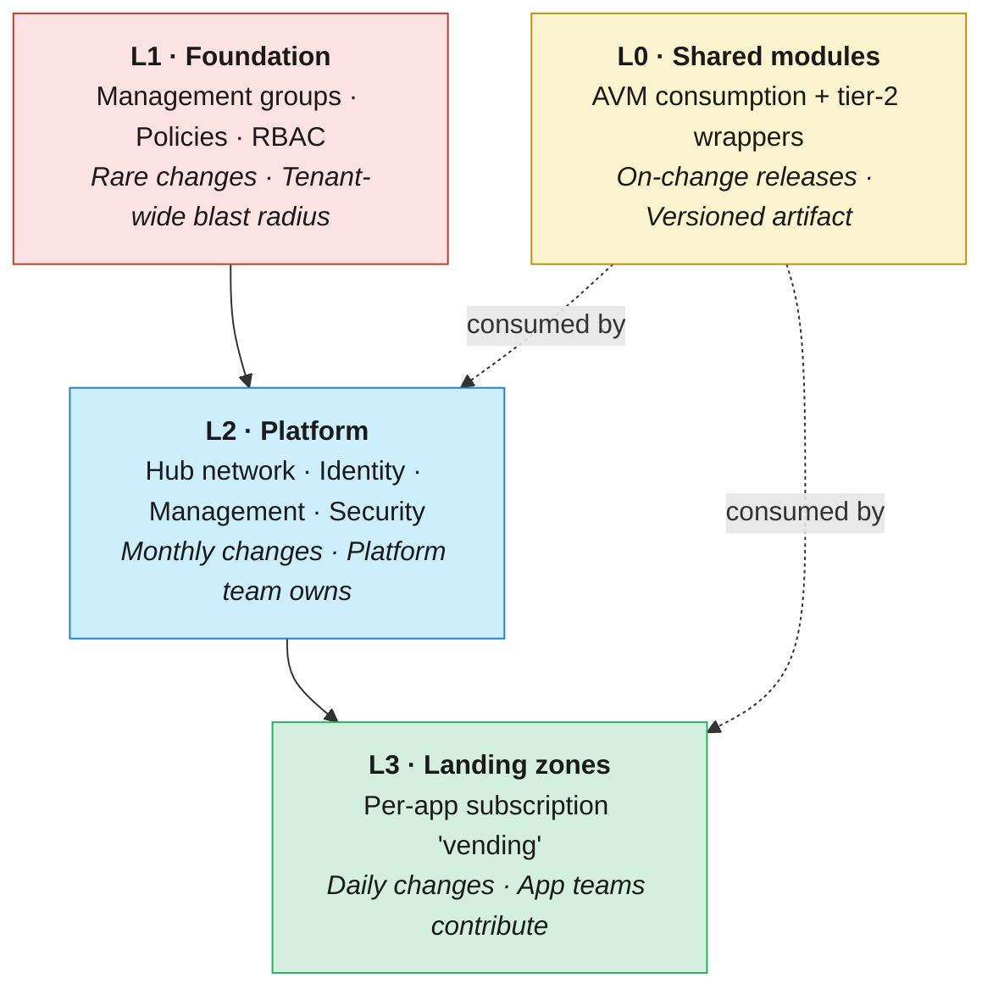

# 01 · Repository topology — monorepo vs multi‑repo

> **Decision:** how many Git repositories will host your ALZ IaC, and what
> belongs in each?

[← Back to index](../README.md) · Next → [02 IaC tooling](02-iac-tooling.md)

Every team starting a Landing Zone eventually faces the same paralysing question: one repository for everything, or one per team? The answer shapes your permissions model, your pipeline architecture, your module versioning strategy, and who gets paged when the foundation breaks at midnight. Get it wrong early and the refactoring tax compounds quietly until one day you are coordinating 60 pull requests to bump a VPN module. This chapter maps out the three realistic topologies, names their failure modes honestly, and gives you a decision framework you can use in your next design review.

---

## How we got here

In the early 2010s, when "infrastructure as code" still mostly meant Chef
cookbooks and Puppet manifests, the natural home was a single SVN or Git
repo per project. Then the **microservices wave** of 2014–2017 cargo‑culted
the same fragmentation onto infrastructure: every service got its own
repo, its own Terraform state, its own pipeline. Within a couple of years,
"how do I bump the VPC module across 80 repos?" became a recurring
LinkedIn post. By the late 2010s the pendulum swung the other way as
Google, Facebook, and Microsoft published essays on the productivity
benefits of monorepos backed by purpose‑built tooling (Bazel, Buck,
Source Depot). For IaC specifically, the Terraform community discovered
that **Git submodules don't fix the problem** and that **module registries
do** (Terraform Registry, then private registries, then OCI). Today most

> 📘 **Key terms**
>
> **ALZ (Azure Landing Zone)** — a pre‑configured Azure environment (management groups, subscriptions, policies, networking) that follows Microsoft's Cloud Adoption Framework and is ready to host workloads securely at scale.
>
> **IaC (Infrastructure as Code)** — the practice of defining cloud infrastructure in declarative or imperative code files (Terraform, Bicep, Pulumi) rather than manual portal clicks, enabling version control, review, and automation.
>
> **SVN (Subversion)** — a centralised version‑control system that predated Git's dominance.
>
> **Cargo‑culting** — blindly copying a practice from another context without understanding why it worked there.
>
> **Git submodules** — a Git feature that embeds one repository inside another; notoriously difficult to manage and a common source of checkout confusion.
>
> **Module registries** — hosted catalogues (e.g. Terraform Registry, Azure Container Registry) that distribute versioned IaC modules, replacing error‑prone Git‑source references.
>
> **OCI (Open Container Initiative)** — a standard for container image formats and registries, increasingly used to distribute non‑container artefacts such as IaC modules.
mature ALZ implementations live in a *small number* of carefully chosen
repos — neither a single behemoth nor an unmanageable swarm — and that's
the option this chapter recommends.

## Why this is the first decision you make

Repository topology drives almost every other choice in this guide:
permissions, pipelines, branching, module versioning, and even who is on call
for what. Get it wrong and you will spend the next two years either drowning
in cross‑repo PRs or watching a single broken pipeline freeze the entire
estate.

Two extreme positions exist, with a sensible middle ground:

| Option | One‑liner |
|--------|-----------|
| **Pure monorepo** | One repo holds management groups, policies, platform, and every application landing zone. |
| **Pure multi‑repo** | Every workload, module, and platform component lives in its own repo. |
| **Layered "few‑repo" (recommended)** | A small, fixed number of repos aligned to ownership boundaries. |

---

## The three layers of an ALZ estate

Almost every ALZ implementation has these natural layers. Whether each is a
folder or a repo is the question:



L0 sits to the side: it's not a deployment layer at all but a *library*
that L2 and L3 consume by version.

With those layers in mind, we can evaluate what each topology looks like in practice — and more importantly, where each one quietly breaks down.

---

## Option A — Pure monorepo

**Layout sketch**

```
alz/
├── foundation/        # mgmt groups, policy assignments
├── platform/
│   ├── connectivity/  # hub VNets, ER, firewall
│   ├── identity/
│   └── management/    # log analytics, automation
├── landingzones/
│   ├── corp-app01/
│   └── online-app42/
├── modules/           # local module library
└── .github/workflows/
```

### ✅ Pros
* **Atomic cross‑layer changes.** "Add a new region" can be one PR that
  touches policy, hub, and a workload simultaneously.
* **Single source of truth** for naming conventions, tags, module versions.
* **Easy refactoring** with codebase‑wide search/replace and IDE rename.
* **One pipeline framework** to maintain.

### ❌ Cons
> 📘 **CODEOWNERS** — a file (`.github/CODEOWNERS`) that maps file‑path patterns to GitHub teams or users who must approve PRs touching those paths. Only enforced when branch protection requires CODEOWNERS review.

* **Permissions are coarse.** GitHub repo roles apply to the whole repo;
  fine‑grained access requires CODEOWNERS + branch protection gymnastics.
> 📘 **Blast radius** — the scope of damage a single failure can cause. In IaC, this is typically defined by what resources a single `terraform apply` or deployment stack can touch. Smaller blast radius means a mistake affects fewer resources.

* **Pipeline scaling.** A naive workflow that runs `terraform plan` on the
> 📘 **Path filters & matrix builds** — path filters trigger a pipeline only when files in specific directories change, avoiding unnecessary runs. Matrix builds run multiple jobs in parallel (e.g. one per environment or workload), allowing a single workflow to plan/apply many targets concurrently.

  whole repo on every PR becomes unusable past ~50 workloads. You **must**
  invest in path filters and matrix builds early.
* **Blast radius psychology.** Engineers see the foundation code next to their
  app code and either get scared to commit or, worse, don't.
* **Single CODEOWNERS becomes a 500‑line file** that nobody reviews.

### When it works
Small estates (<10 application landing zones), one platform team, no strict
separation of duties between platform and application teams.

For anything larger — or any team that has received a polite request to "please add just 20 more workloads this quarter" — the monorepo cracks start to show. The other extreme makes the ownership tradeoffs explicit.

---

## Option B — Pure multi‑repo

Every workload, every module, every policy set in its own repo.

### ✅ Pros
* **Crystal‑clear ownership** — repo = team = on‑call rotation.
* **Independent release cadence.** Workload A deploys 10× a day; the
  foundation deploys quarterly. Each gets the cadence it needs.
* **Smallest possible blast radius** per pipeline run.
* **Simple permissions** — GitHub team → repo mapping is 1:1.

### ❌ Cons
* **Cross‑cutting changes are nightmarish.** Bumping a module version across
  60 repos = 60 PRs, 60 reviews, 60 pipeline runs (Renovate/Dependabot helps,
  doesn't eliminate).
* **Drift between repos.** Conventions, pipeline templates, even tool versions
  diverge. You end up needing a "templates" repo + scaffolding tool
  (cookiecutter, Backstage, `gh repo template`) just to keep them aligned.
* **Discoverability suffers.** New engineers ask "where is X?" constantly.

### When it works
Very large estates (100+ landing zones), strong platform engineering investment
in a self‑service portal/scaffolding (Backstage, internal CLI), strict
regulatory separation between teams.

Most organisations don't fit neatly into either extreme, which is precisely why the third option exists — it trades the cleanness of the two poles for something more pragmatic and, in practice, more durable.

---

## Option C — Layered "few‑repo" (recommended default)

The pragmatic compromise. **Three to five repos**, aligned to the natural
ownership boundaries:

| Repo | Owner | Cadence | Typical blast radius |
|------|-------|---------|----------------------|
| `alz-foundation` | Cloud governance | Quarterly | Tenant |
| `alz-platform` | Platform engineering | Weekly | Platform subs |
| `alz-modules` | Platform engineering | On change (semver) | None (artifact only) |
| `alz-landingzones` *or* one repo per business unit | App teams + platform reviewers | Daily | One subscription |
| `alz-policies` (optional) | Security/governance | Weekly | Tenant policy |

### ✅ Pros
* Ownership boundaries match real‑world team boundaries.
* Each repo has a *coherent* CODEOWNERS, branch protection, and approval
  policy.
* Module repo can publish to a registry (ACR / Terraform Cloud / private
  registry) and consumers pin versions — see
  [03 modules & registries](03-modules-and-registries.md).
* Foundation repo can require *much* stricter controls (mandatory pair review,
  manual approval, change‑advisory ticket reference) without slowing daily
  workload deployments.

### ❌ Cons
* Cross‑repo refactors still require coordination — but they are rare by
  construction (foundation rarely changes).
* Need a shared **pipeline template repo** (`alz-pipeline-templates`) or
  reusable workflows so the four repos don't drift in their CI definitions.

### When it works
**This is the right answer for ~80 % of enterprise ALZ implementations.**

> ⚖️ **The debate — monorepo vs few‑repo for IaC**
>
> The recommendation above ("layered few‑repo for ~80 % of enterprises")
> reflects the mainstream ALZ guidance, but informed practitioners
> disagree.
>
> **The monorepo case:** Major tech companies (Google, Meta) operate
> massive monorepos successfully. Their argument: a single source of
> truth eliminates version‑skew between layers, makes cross‑cutting
> refactors atomic, and improves discoverability ("everything is `grep`‑able
> in one place"). With CODEOWNERS, path‑scoped branch rules, and mature
> CI (path filters + matrix builds), monorepos can enforce ownership
> boundaries nearly as well as separate repos — without the coordination
> overhead of 60 PRs for a module bump. Terragrunt and Nx/Turborepo make
> monorepos practical even at scale.
>
> **The few‑repo case:** In regulated enterprises, repo‑level access
> control is simpler to audit than path‑level CODEOWNERS. Independent
> release cadences (foundation = quarterly, workloads = daily) are
> naturally expressed by separate repos with separate pipelines. The
> psychological effect matters too: an app engineer who can see and
> accidentally edit foundation code is a risk no CODEOWNERS file fully
> mitigates.
>
> **Where the industry stands (2026):** Most Azure‑focused guidance
> (CAF, ALZ accelerators) defaults to few‑repo. Most Terraform‑community
> guidance defaults to either monorepo + Terragrunt or multi‑repo +
> registry. Neither is wrong — the choice hinges more on your team's Git
> maturity and regulatory posture than on any inherent technical
> superiority.

If you're still uncertain which model best fits your situation, the questions below will cut through the ambiguity in short order.

---

## Decision framework

Ask these questions in order:

1. **How many teams will commit to IaC?**
   * 1 team → monorepo is fine.
   * 2–10 teams → layered few‑repo.
   * 10+ teams → layered few‑repo with one landing‑zone repo per business unit,
     or full multi‑repo if you have the platform investment.

2. **What is your regulatory posture?**
   * If auditors require separation of duties between *who can change policy*
     and *who can deploy workloads* → at minimum split foundation/policy from
     workloads.

3. **Do you have a self‑service developer portal?**
   * Yes (Backstage, internal CLI) → multi‑repo becomes viable.
   * No → stay layered; the discovery cost of multi‑repo is too high.

4. **What is the deployment frequency of each layer?**
   * Wildly different cadences → split repos. Putting a quarterly‑changing
     foundation in the same pipeline trigger as daily workloads is friction.

---

## When ownership boundaries blur — cross‑team resources

Option C assumes clean ownership: the platform team owns the platform repo,
app teams own their landing zones. Reality is messier. Some Azure resources
sit at the boundary between platform and application, and no repo split
eliminates the tension entirely.

Two recurring examples illustrate the pattern:

### NSGs — app‑owned resource, platform‑mandated rules

Network Security Groups live in the application landing zone subscription. The
app team knows which ports their workload needs. But the central security team
mandates baseline rules: no `*`‑to‑`*` inbound, required deny‑all at the
bottom, specific allowed sources for management traffic.

**Recommended pattern: app ownership + policy guardrails.**

* The **app team owns the NSG code** in their landing zone folder and submits
  PRs for rule changes.
* **Azure Policy** (owned by the security team in the policies repo) denies
  non‑compliant rules at deploy time — e.g. a `deny` policy that rejects
  NSG rules with `sourceAddressPrefix: *` and `access: Allow`.
* The NSG *module* (in `alz-modules`) bakes in mandatory baseline rules by
  default and exposes only constrained inputs for app‑specific additions.

This keeps the blast radius narrow (app team can only affect their own
subscription) while the security team governs the guardrails, not the
individual rules.

> 📘 For legitimate exceptions (a legacy app that genuinely needs a broad rule
> temporarily), use an **Azure Policy exemption** with an expiry date, linked
> to a reviewed and approved security ticket — never an ad‑hoc NSG edit.

### Azure Firewall rules — platform‑owned resource, app‑sourced knowledge

The Azure Firewall sits in the connectivity subscription. The platform team
owns the firewall configuration. But the *knowledge* of which TCP/UDP flows
each application needs lives with the app teams — and platform engineers
can't write rules they don't understand.

**Recommended pattern: PR‑based request flow with optional data‑driven automation.**

**Level 1 — PR‑based requests** (works for any team size):

* App teams submit a PR to the **platform repo** adding their required
  firewall rules (a new `.tfvars` block, a YAML manifest, or a Terraform
  `locals` entry).
* `CODEOWNERS` requires platform team review before merge.
* The platform pipeline applies the change to the firewall.
* The app team describes *intent* ("app01 needs HTTPS egress to
  `api.contoso.com`"); the platform team translates to firewall syntax and
  validates against policy.

**Level 2 — data‑driven automation** (scales to many teams):

* Each app team maintains a **firewall request manifest** (YAML/JSON) in
  their *own* repo, with a versioned schema:

```yaml
# alz-landingzones/corp/app01/firewall-requests.yaml
schema_version: "1"
rules:
  - name: app01-to-api
    direction: outbound
    protocol: TCP
    destination: api.contoso.com
    port: 443
    justification: "REST API dependency — see ADR-012"
```

* A **platform pipeline** reads manifests from all app repos, validates
  against policy (no overly broad rules, no blocked destinations), generates
  firewall rule collections, and applies them.
* The app team owns the intent; the platform team owns the implementation
  and remains the final enforcement point.

### Decision heuristic

| Scenario | Who owns the code | Who governs |
|----------|-------------------|-------------|
| NSGs / UDRs in app subscriptions | App team | Policy (security team) |
| Shared modules with safe defaults | Platform team (module) | Module API contract |
| Central firewall / WAF rules | Platform team (via PR or automation) | CODEOWNERS review |
| DNS records in central DNS zone | Platform team (via PR) or app team (with DNS sharding) | CODEOWNERS review / zone‑level RBAC |

The common thread: **separate ownership of intent from ownership of
implementation**, and enforce the boundary with policy, CODEOWNERS, or
both.

### DNS sharding — reducing blast radius for central DNS

Private DNS zones in a hub subscription are a classic ownership bottleneck:
every app team needs records, but a single zone like
`privatelink.blob.core.windows.net` is a shared, high‑blast‑radius resource.
One bad PR can break name resolution for every workload in the estate.

**DNS sharding** splits the problem by delegating ownership at the zone or
sub‑zone level:

* **Zone‑per‑workload for private endpoints.** Instead of one monolithic
  `privatelink.*.core.windows.net` zone, create per‑workload zones
  (or use Azure policy to auto‑register into the correct zone). Each zone
  has its own RBAC, its own state/stack, and its own blast radius.
* **Sub‑zone delegation for app‑owned records.** Delegate
  `app01.internal.contoso.com` to the app team's subscription. The platform
  team owns `internal.contoso.com` and the NS delegation; the app team
  manages records in their delegated zone autonomously.
* **Separate state/stack per DNS zone.** Even without delegation, putting
  each zone in its own Terraform state or Deployment Stack means a bad
  `apply` affects only one zone, not all of DNS.

The tradeoff is more zones to manage and more VNet links to maintain. For
estates with fewer than ~10 workloads, a single zone with PR‑based
governance is simpler. Beyond that, sharding pays for itself in reduced
coordination cost and smaller blast radius.

See also [11 manageability](11-manageability.md) for the CODEOWNERS
and governance mechanics.

---

## Anti‑patterns

* ❌ **One mega‑repo with one giant Terraform state.** A single
  `terraform apply` that touches every subscription. The blast radius of a
  bad commit is the entire estate. See
  [07 state management](07-state-management.md).
* ❌ **One repo per resource group.** Granularity gone mad — you'll spend
  more time on repo plumbing than on infrastructure.
* ❌ **"Modules" folder duplicated across 40 repos.** Promote to a shared
  module repo + registry the moment you have *any* duplication.
* ❌ **Mixing application code (Helm charts, app source) in the IaC repo.**
  Different release cadence, different reviewers, different security model.

---

## Reference layouts

### Recommended starter layout (`alz-platform`)

```
alz-platform/
├── README.md
├── CODEOWNERS
├── docs/                    # ADRs, diagrams
├── envs/
│   ├── prod/
│   │   ├── connectivity/
│   │   ├── identity/
│   │   └── management/
│   └── nonprod/
│       └── ...
├── modules/                 # thin wrappers around AVM
├── policies/                # custom policy definitions (if any)
├── scripts/
└── .github/
    ├── workflows/
    └── CODEOWNERS
```

### Recommended starter layout (`alz-landingzones`)

```
alz-landingzones/
├── README.md
├── CODEOWNERS               # per-folder ownership
├── _shared/                 # naming, tagging modules
├── corp/
│   ├── app01-prod/
│   ├── app01-nonprod/
│   └── app02-prod/
├── online/
│   └── ...
└── .github/workflows/
```

`CODEOWNERS` uses path globs so each landing zone has its own approvers:

```
/corp/app01-* @org/team-app01
/corp/app02-* @org/team-app02
/_shared/     @org/platform-engineering
```

---

With topology decided and the reference layouts in hand, you have the structural skeleton of your ALZ estate. The remaining chapters layer in the details — what language to write in those repos, how to version the modules, how to promote code between environments, and how to keep it all secure. The very next question, tackled in Chapter 02, is which IaC engine those repos will use: a deceptively straightforward choice that carries long-term operational consequences worth thinking through carefully.

## References

* Microsoft, *CAF — Landing zones implementation options*:
  <https://learn.microsoft.com/azure/cloud-adoption-framework/ready/landing-zone/implementation-options>
* Microsoft, *ALZ Bicep — recommended repo structure*:
  <https://github.com/Azure/ALZ-Bicep/wiki>
* Hashicorp, *Recommended Terraform code structure*:
  <https://developer.hashicorp.com/terraform/cloud-docs/recommended-practices>
* GitHub, *Monorepo vs polyrepo*:
  <https://github.blog/engineering/architecture-optimization/monorepo-vs-polyrepo/>

---

[← Back to index](../README.md) · Next → [02 IaC tooling](02-iac-tooling.md)
