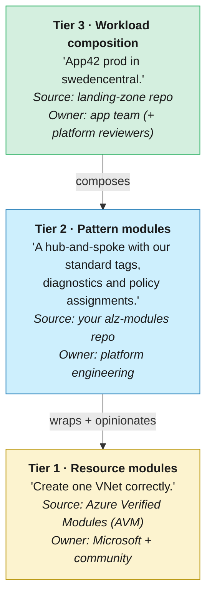

# 03 · Modules & registries — composition, versioning, distribution

> **Decision:** where do reusable modules live, how are they versioned, and
> how do consumers pin to a known‑good revision?

[← 02 IaC tooling](02-iac-tooling.md) · [Index](../README.md) · [04 Branching & environments →](04-branching-and-environments.md)

Sooner or later every IaC team writes the same storage account module twice. The second time, someone notices. By the fifth time, the variations have accumulated enough subtle differences that a "simple consolidation" becomes a multi-sprint migration. Modules and registries exist to break that cycle — but only if the versioning and distribution story is solved upfront. This chapter explains the three-tier model, how to choose where your modules live, and how to version and promote them without grinding platform delivery to a halt.

---

## How we got here

The first Terraform projects had no concept of modules at all — engineers
copy‑pasted `.tf` files between repos and patched the differences by
hand. When that became unbearable, the community tried **Git submodules**
(universally hated for confusing checkouts), then `git::` sources pinned
to commits (better, but no semver), then the **public Terraform Registry**
(2017) for open‑source modules. Private registries followed soon after,
either via Terraform Cloud or self‑hosted OCI/HTTP backends. Bicep
launched without modules at all in 2020, added them in 2021, then added
the **`br:` registry protocol** so you could `bicep publish` to ACR. The
breakthrough came in 2023 with **Azure Verified Modules (AVM)** — a
single, Microsoft‑curated catalogue of Bicep *and* Terraform modules with
consistent inputs, baked‑in WAF defaults, and a real maintenance commitment.
Before AVM, every consultancy shipped its own subtly‑broken "vnet module";
after AVM, that's a smell. The three‑tier model below builds on this
history.

## The three‑tier module model

A mature ALZ implementation has **three tiers** of modules. Conflating them
is the most common mistake.



* **Tier 1** is *consumed*, never modified. If AVM is missing something,
  contribute upstream.
* **Tier 2** is the *opinionation layer*. This is where your enterprise
  conventions (tags, log analytics workspace, diagnostic settings, NSG
  defaults) get baked in *once*.
* **Tier 3** is just glue — picking pattern modules and parameterising them.

If your landing‑zone code is calling AVM resource modules directly, you have
no place to enforce your enterprise conventions, and every team will
reinvent them.

The good news for tier 1 is that the work has largely been done for you.

---

## Azure Verified Modules (AVM)

[AVM](https://aka.ms/avm) is Microsoft's official, supported library of
Bicep and Terraform modules. As of 2026 it covers the vast majority of common
Azure resources.

**Use AVM resource modules** as your tier‑1 source. Benefits:

* Maintained by Microsoft + community; security & WAF aligned by default.
* Predictable inputs/outputs across resources.
* Diagnostic settings, customer‑managed keys, RBAC, private endpoints — all
  parameterised consistently.
* Versioned in MCR (Microsoft Container Registry, for Bicep) / Terraform Registry.

> 📘 **Key terms**
>
> **SemVer (Semantic Versioning)** — a versioning scheme (`MAJOR.MINOR.PATCH`) where each component signals the type of change: major = breaking, minor = new features, patch = bug fixes.
> **Conventional Commits** — a commit‑message convention (e.g. `feat:`, `fix:`, `chore:`) that enables tools like `release-please` to automate changelog generation and version bumping.
> **MCR (Microsoft Container Registry)** — Microsoft's public OCI registry (`mcr.microsoft.com`) used to distribute container images and Bicep modules.
> **OCI (Open Container Initiative)** — an industry standard for container image formats and distribution; registries that speak OCI can also host IaC modules.
> **DRY (Don't Repeat Yourself)** — a software principle: every piece of knowledge should have a single, authoritative representation in the codebase.
> **WAF (Well-Architected Framework)** — Microsoft's set of design principles for building reliable, secure, cost‑efficient and performant Azure workloads.

**Don't** use AVM *pattern* modules in production without wrapping them. They
are reference implementations — useful as scaffolding, not as your enterprise
standard.

### Bicep AVM example

```bicep
module storage 'br/public:avm/res/storage/storage-account:0.14.3' = {
  name: 'sa-${uniqueString(resourceGroup().id)}'
  params: {
    name: 'stplatlogs${uniqueString(resourceGroup().id)}'
    location: location
    skuName: 'Standard_GRS'
    publicNetworkAccess: 'Disabled'
    tags: tags
  }
}
```

Note `0.14.3` — **always pin**.

### Terraform AVM example

```hcl
module "storage" {
  source  = "Azure/avm-res-storage-storageaccount/azurerm"
  version = "0.6.4"

  name                = "stplatlogs${random_string.s.result}"
  resource_group_name = var.rg_name
  location            = var.location
  account_replication_type = "GRS"
  public_network_access_enabled = false
  tags                = var.tags
}
```

---

## Where do *your* (tier‑2) modules live?

AVM handles tier 1. The tier‑2 pattern modules — the ones that bake in your enterprise conventions — are yours to build and publish. Three viable patterns for where they live:

### A) Dedicated `alz-modules` repo + Git tag versioning

* Repo: `github.com/<org>/alz-modules`
* Versioning: SemVer git tags (`v1.4.2`).
* Consumers reference by tag:
  * Terraform: `source = "git::https://github.com/<org>/alz-modules.git//network/hub?ref=v1.4.2"`
  * Bicep: `module x 'git::https://...'` is *not* supported — use a registry.

**Pros:** simple, no extra infrastructure.
**Cons:** Git-source modules need network access from runners; harder for
Bicep.

### B) Private OCI registry (Azure Container Registry)

* Publish Bicep modules to ACR via `bicep publish`.
* Publish Terraform modules to a private registry (Terraform Cloud, Azure
  DevOps Artifacts, JFrog, or any OCI registry with the `tfe` provider).
* Consumers reference by version:
  ```bicep
  module hub 'br:contoso.azurecr.io/bicep/modules/network-hub:1.4.2' = { ... }
  ```

**Pros:** identical UX to AVM consumption (`br:`); strong access control;
audit trail per pull.
**Cons:** ACR + auth setup; modest operational cost.
**Recommended** for any organisation past a few teams.

### C) Public registry fork

For Terraform, you can publish to the public Terraform Registry if your
modules are open source. Rare for enterprises.

Whichever distribution mechanism you choose, it is only as trustworthy as the versioning discipline behind it.

---

## Versioning policy

Adopt **Semantic Versioning** (`MAJOR.MINOR.PATCH`) and define explicitly what
each bump means *for an IaC module*:

| Bump | Triggered by |
|------|--------------|
| MAJOR | Breaking change: input renamed/removed, output renamed, resource type changed in a way that requires manual migration, default behaviour changes that would alter an existing deployment. |
| MINOR | Backwards-compatible feature: new optional input, new optional resource, new output. |
| PATCH | Bug fix, doc change, no behavioural change for existing callers. |

Enforce with:

* **Conventional Commits** + `release-please` / `semantic-release` to automate
  tag creation.
* A "compat" test in CI that re-applies the module against a saved fixture
  and fails on unexpected diffs.

### Pinning strategy for consumers

* **Foundation/platform repos:** pin to **exact version** (`= 1.4.2`).
* **Workload repos:** pin to **minor** (`~> 1.4`) so they pick up patches
  automatically. Major bumps require an explicit PR.
* **Never** float to `main` / `latest` in any environment, including dev.
  Reproducibility is non-negotiable.

### Rollout choreography

Bumping a tier‑2 module that 40 landing zones consume needs a process:

1. Cut module release `v1.5.0`.
2. Open auto‑PRs to all consumers via Renovate / Dependabot.
3. CI in each consumer runs `plan`/`what-if`. Reviewers see exactly what
   would change in their workload.
4. Merge happens at the consumer's pace, within an SLA (e.g. 30 days for
   minor, 90 days for major).
5. Deprecation: the module repo's CHANGELOG flags removal in `v2.0.0`; an
   automated check in the platform pipeline reports stragglers.

A versioning process only works reliably if the modules themselves are well-structured. What that actually means in practice:

---

## Module design checklist

A pattern module should:

- [ ] Take **opinionated defaults** (tags, diagnostic settings, log analytics
      workspace ID, private endpoints) so callers can't forget them.
- [ ] Expose **a small input surface** (5–15 parameters, not 50). If you
      need 50, you have multiple modules masquerading as one.
- [ ] Output **everything a downstream module might need** (IDs, names,
      principal IDs of identities) — outputs are cheap, refactoring is not.
- [ ] Include a **`README.md`** auto-generated from the schema
      (`terraform-docs`, `bicep-docs`, or AVM templates).
- [ ] Include an **`examples/`** folder with at least a `minimal` and a
      `complete` example. CI deploys both per release.
- [ ] Include **tests** — `terraform test` or AVM Bicep test patterns.
- [ ] Include a **`CHANGELOG.md`** auto-generated from commits.

---

## Naming and namespacing

For your `alz-modules` repo, group by domain:

```
alz-modules/
├── network/
│   ├── hub/
│   ├── spoke/
│   └── private-dns/
├── identity/
│   ├── managed-identity/
│   └── role-assignment/
├── observability/
│   ├── log-analytics-workspace/
│   └── diagnostic-settings/
├── security/
│   ├── key-vault/
│   └── policy-assignment/
└── compute/
    └── vm-baseline/
```

Module names should describe **the pattern**, not the resource. `hub` is
better than `vnet-hub-firewall-bastion-routetable` — but the README should be
explicit about what's inside.

Naming discipline is one safeguard against entropy; the following are the patterns that entropy most reliably produces.

---

## Anti-patterns

* ❌ **Inlined modules copy-pasted between landing zones.** The "we'll DRY
  it later" trap. Promote to a shared module on the second use.
* ❌ **Pinning to a branch name.** "It worked yesterday" is not a strategy.
* ❌ **A "kitchen sink" module** with 80 boolean toggles. Split it.
* ❌ **Modules that wrap a single AVM resource module with no added
  opinionation.** Just call AVM directly.
* ❌ **Releasing a major version without a migration guide.** Always include
  a `MIGRATION.md` for breaking changes.

---

A mature module ecosystem — tiered correctly, versioned strictly, and published from a registry — is what makes the branching and promotion strategies in the next chapter operationally safe. Without pinned modules, "it worked in non-prod" is a coincidence rather than a guarantee; with them, the diff between environments is visible, auditable, and reversible. Chapter 04 picks up the story at the branch level, addressing how code flows from a developer laptop all the way to a production subscription.

## References

* AVM — Azure Verified Modules: <https://aka.ms/avm>
* AVM Bicep specs: <https://github.com/Azure/bicep-registry-modules>
* AVM Terraform specs: <https://github.com/Azure/terraform-azurerm-avm-template>
* `bicep publish` to ACR:
  <https://learn.microsoft.com/azure/azure-resource-manager/bicep/private-module-registry>
* Terraform module sources:
  <https://developer.hashicorp.com/terraform/language/modules/sources>
* Renovate: <https://docs.renovatebot.com/>
* Conventional Commits: <https://www.conventionalcommits.org/>
* SemVer: <https://semver.org/>

---

[← 02 IaC tooling](02-iac-tooling.md) · [Index](../README.md) · [04 Branching & environments →](04-branching-and-environments.md)
