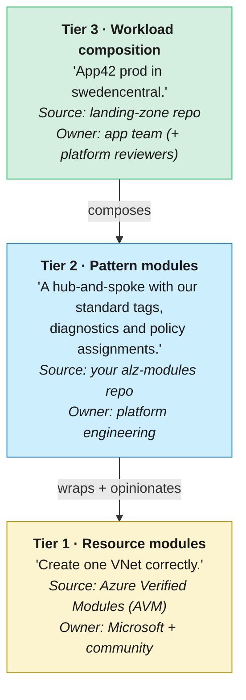

# 03 · Modules & registries — composition, versioning, distribution

**In this chapter:**

- [How we got here](#how-we-got-here)
- [Decision framework](#decision-framework)
- [The three‑tier module model](#the-threetier-module-model)
- [Azure Verified Modules (AVM)](#azure-verified-modules-avm)
- [Where do *your* (tier‑2) modules live?](#where-do-your-tier2-modules-live)
- [Versioning policy](#versioning-policy)
- [Module design checklist](#module-design-checklist)
- [Naming and namespacing](#naming-and-namespacing)
- [Anti-patterns](#anti-patterns)
- [References](#references)


> **Decision:** where do reusable modules live, how are they versioned, and
> how do consumers pin to a known‑good revision?

[← 02 IaC tooling](02-iac-tooling.md) · [Index](../README.md) · [04 Branching & environments →](04-branching-and-environments.md)

For most Azure Landing Zone (ALZ) Infrastructure as Code (IaC) estates, the safest
module model is to use Azure Verified Modules (AVM) resource modules as tier 1, publish
your own tier‑2 pattern modules with Semantic Versioning (SemVer), and require every
consumer to pin a known‑good version. That combination gives you one place to enforce
tags, diagnostics, security defaults, and naming while keeping landing‑zone code mostly
composition glue. Prefer a dedicated module repo and private registry once more than a
few teams consume the modules; Git tags are acceptable for simple Terraform‑only
estates, but floating branches are never acceptable. Treat AVM as the default, not a
mandate: raise upstream pull requests for gaps and keep mature custom tier‑1 modules
only when they are already tested and maintained. If you own platform modules, review
workload compositions, or need a versioning model that makes ALZ changes reproducible
across environments, the rest of the chapter shows how those choices fit together.

---

## How we got here

Module registries exist because copy/paste reuse and Git-source shortcuts failed at
enterprise scale, and AVM now provides the tier‑1 baseline this chapter builds on. The
first Terraform projects had no concept of modules at all, so engineers copy‑pasted
`.tf` files between repos and patched the differences by hand. When that became
unbearable, the community tried **Git submodules** (universally hated for confusing
checkouts), then `git::` sources pinned to commits (better, but no SemVer), then the
**public Terraform Registry** in 2017 for open‑source modules.

As reuse became more formal, private registries followed, either via Terraform Cloud or
self‑hosted Open Container Initiative (OCI) and HTTP backends. Bicep launched without
modules in 2020, added them in 2021, then added the **`br:` registry protocol** so you
could `bicep publish` to Azure Container Registry (ACR). The breakthrough came in 2023
with AVM: a single, Microsoft‑curated catalogue of Bicep *and* Terraform modules with
consistent inputs, baked‑in Well-Architected Framework (WAF) defaults, and a real
maintenance commitment. Before AVM, every consultancy shipped its own subtly broken
"vnet module"; after AVM, that duplication is a smell, which is why the decision
framework starts by asking how much module structure you actually need.

---

## Decision framework

With that history in mind, answer these questions in order before you add another tier
or registry. If a choice would make ownership, versioning, or release automation
ambiguous, simplify the module model first; the deeper sections below are there to
explain the defaults, not to justify unnecessary complexity.

1. **How many tiers of modules do you actually need?**
   Use AVM or equivalent resource modules as tier 1, add tier‑2 wrappers only
   where enterprise conventions need to be enforced, and keep tier 3 as
   workload composition glue.

2. **Where do your tier‑2 modules live?**
   Prefer a dedicated `alz-modules` repo for shared enterprise patterns; keep
   modules beside platform code only while one small platform team owns all
   consumers.

3. **How are modules distributed and versioned?**
   Git tags are fine for simple Terraform consumption; use ACR/OCI or a private
   Terraform registry once Bicep or multiple teams need the same registry UX as
   AVM.

4. **How do consumers pin module versions?**
   Pin foundation and platform repos to exact versions, let workload repos use
   minor ranges for patches, and never point any environment at `main`,
   `latest`, or a branch.

5. **When do you fork an AVM module instead of raising a PR upstream?**
   Do not fork by default; raise upstream PRs for gaps, and keep custom tier‑1
   modules only where they are already mature, tested, and actively maintained.

Quick reference:

| Question | Recommended default |
|----------|---------------------|
| Module tiers | Tier 1 = AVM/resource modules; tier 2 = enterprise patterns; tier 3 = workload composition. |
| Tier‑2 location | Dedicated `alz-modules` repo once modules are shared beyond one platform team. |
| Distribution | Git tags for simple Terraform estates; ACR/OCI or private registry for broader consumption. |
| Pinning | Exact for foundation/platform, minor range for workloads, never floating branches. |
| AVM gaps | Contribute upstream unless a mature custom tier‑1 module already exists. |

The full analysis follows the same order: first you separate the tiers, then you decide
how AVM, repositories, registries, versioning rules, and design standards make those
tiers safe to consume.

---

## The three‑tier module model

Keep resource modules, enterprise pattern modules, and workload composition separate,
because conflating them is the fastest way to lose governance consistency. A mature ALZ
implementation has **three tiers** of modules, and each tier exists to protect a
different ownership boundary.


```mermaid
flowchart TB
    T1["<b>Tier 1 · Resource modules</b><br/>'Create one VNet correctly.'<br/><i>Source: Azure Verified Modules (AVM)</i><br/><i>Owner: Microsoft + community</i>"]
    T2["<b>Tier 2 · Pattern modules</b><br/>'A hub-and-spoke with our standard tags,<br/>diagnostics and policy assignments.'<br/><i>Source: your alz-modules repo</i><br/><i>Owner: platform engineering</i>"]
    T3["<b>Tier 3 · Workload composition</b><br/>'App42 prod in swedencentral.'<br/><i>Source: landing-zone repo</i><br/><i>Owner: app team (+ platform reviewers)</i>"]

    T3 -->|composes| T2
    T2 -->|wraps + opinionates| T1

    classDef t1 fill:#fcf3cf,stroke:#b7950b,color:#1a1a1a
    classDef t2 fill:#cdeffd,stroke:#2980b9,color:#1a1a1a
    classDef t3 fill:#d4efdf,stroke:#27ae60,color:#1a1a1a
    class T1 t1
    class T2 t2
    class T3 t3
```

* **Tier 1** is *consumed*, never modified. If AVM is missing something,
  contribute upstream.
* **Tier 2** is the *opinionation layer*. This is where your enterprise
  conventions (tags, log analytics workspace, diagnostic settings, and network
  security group (NSG) defaults) get baked in *once*.
* **Tier 3** is just glue — picking pattern modules and parameterising them.

If your landing‑zone code is calling AVM resource modules directly, you have no place to
enforce your enterprise conventions, and every team will reinvent them. That is why tier
2 exists: it gives you a controlled opinionation layer while still letting tier 1 remain
a maintained resource catalogue. The good news for that first tier is that much of the
resource-module work has already been done for you.

---

## Azure Verified Modules (AVM)

Treat AVM as the default tier‑1 source, but wrap it with your own tier‑2 patterns before
you expose it broadly to enterprise consumers. [AVM](https://aka.ms/avm) is Microsoft's
official, supported library of Bicep and Terraform modules, and as of 2026 it covers the
vast majority of common Azure resources. That coverage is what lets tier 2 focus on
enterprise opinionation instead of reimplementing every storage account, virtual
network, or key vault from scratch.

That default matters because AVM resource modules give you a maintained baseline instead
of another custom library to carry forever. The practical benefits are the same ones the
tier model needs from tier 1:

* Maintained by Microsoft + community; security & WAF aligned by default.
* Predictable inputs/outputs across resources.
* Diagnostic settings, customer‑managed keys, role-based access control
  (RBAC), and private endpoints — all parameterised consistently.
* Versioned in Microsoft Container Registry (MCR) for Bicep / Terraform Registry.

> 📘 **Key terms**
>
> **SemVer (Semantic Versioning)** — a versioning scheme (`MAJOR.MINOR.PATCH`) where each component signals the type of change: major = breaking, minor = new features, patch = bug fixes.
>
> **Conventional Commits** — a commit‑message convention (e.g. `feat:`, `fix:`, `chore:`) that enables tools like `release-please` to automate changelog generation and version bumping.
>
> **Microsoft Container Registry (MCR)** — Microsoft's public OCI registry (`mcr.microsoft.com`) used to distribute container images and Bicep modules.
>
> **OCI (Open Container Initiative)** — an industry standard for container image formats and distribution; registries that speak OCI can also host IaC modules.
>
> **DRY (Don't Repeat Yourself)** — a software principle: every piece of knowledge should have a single, authoritative representation in the codebase.
>
> **WAF (Well-Architected Framework)** — Microsoft's set of design principles for building reliable, secure, cost‑efficient and performant Azure workloads.

However, AVM *pattern* modules should not become your production enterprise standard
without a wrapper. They are reference implementations, useful as scaffolding and
comparison material, whereas your tier‑2 modules are where your naming, logging, policy,
and security defaults become enforceable.

> ⚖️ **The debate — must every estate adopt AVM?**
>
> AVM is positioned as the default tier‑1 source above, but not everyone
> agrees.
>
> **The case for custom tier‑1 modules:** Organisations with mature,
> battle‑tested module libraries (some pre‑dating AVM by years) argue
> that migrating to AVM for standardisation's sake is cost without
> benefit. AVM modules are deliberately generic — they expose every
> parameter to stay broadly useful, which means your team still writes
> opinionated wrappers on top. If you already *have* those opinionated
> modules, AVM adds a layer without removing one. Additionally, AVM
> coverage, while broad, is not complete: niche resources or preview
> features may lag, forcing you to maintain custom modules alongside AVM
> anyway.
>
> **The case for AVM:** Starting from AVM means you inherit ongoing
> security patches, WAF alignment updates, and community contributions
> without maintaining them yourself. For greenfield estates or teams
> without a mature module library, building custom tier‑1 modules from
> scratch is reinventing work Microsoft already maintains. AVM's
> predictable interface (`diagnostic_settings`, `private_endpoints`,
> `role_assignments`) also makes onboarding faster across teams.
>
> **Pragmatic middle ground:** Treat AVM as *default*, not *mandatory*.
> Use it where it covers your needs and wrap it where it doesn't. Don't
> force‑migrate stable custom modules that are actively maintained and
> well‑tested — that's disruption for compliance's sake, not
> engineering's.

The two examples below show what that default looks like in code: you consume the
published module and pin the exact version rather than tracking an implicit latest. The
syntax differs between Bicep and Terraform, but the contract is the same.

### Bicep AVM example

```bicep
module storage 'br/public:avm/res/storage/storage-account:0.14.3' = {
  name: 'sa-${uniqueString(resourceGroup().id)}'
  params: {
    name: 'stplatlogs${uniqueString(resourceGroup().id)}'
    location: location
    skuName: 'Standard_GRS'
    publicNetworkAccess: 'Disabled'
    tags: tags
  }
}
```

The important detail is `0.14.3`, because you should always pin the module version even
in examples. Terraform makes the same rule visible through the `version` argument.

### Terraform AVM example

```hcl
module "storage" {
  source  = "Azure/avm-res-storage-storageaccount/azurerm"
  version = "0.6.4"

  name                = "stplatlogs${random_string.s.result}"
  resource_group_name = var.rg_name
  location            = var.location
  account_replication_type = "GRS"
  public_network_access_enabled = false
  tags                = var.tags
}
```

Once tier 1 is pinned and predictable, the next decision is where your opinionated
tier‑2 modules live and how consumers find them.

---

## Where do *your* (tier‑2) modules live?

Publish enterprise pattern modules from a dedicated module repo and registry once more
than a few teams consume them. AVM handles tier 1, but the tier‑2 pattern modules that
bake in your enterprise conventions are yours to build, release, and support, so their
home should make ownership and consumption obvious. In practice, three patterns show up
repeatedly.

### A) Dedicated `alz-modules` repo + Git tag versioning

A dedicated `alz-modules` repo, such as `github.com/<org>/alz-modules`, is the simplest
place to start because the repository boundary matches the ownership boundary. You
version it with SemVer Git tags such as `v1.4.2`, and Terraform consumers can reference
a tagged module path such as `git::https://github.com/<org>/alz-modules.git//network/hub?ref=v1.4.2`.
The tradeoff is that Git-source modules require network access from runners and do not
give Bicep the same consumption model, because Bicep cannot use `module x 'git::https://...'`; if Bicep
consumers matter, you need a registry. That limitation is what usually pushes growing
estates toward the next pattern.

### B) Private OCI registry (Azure Container Registry)

A private OCI registry, usually Azure Container Registry, becomes the more durable
option once you have several teams or any serious Bicep adoption. You publish Bicep
modules with `bicep publish`, publish Terraform modules to a private registry such as
Terraform Cloud, Azure DevOps Artifacts, JFrog, or an OCI registry with the `tfe`
provider, and consumers reference a versioned artifact:

  ```bicep
  module hub 'br:contoso.azurecr.io/bicep/modules/network-hub:1.4.2' = { ... }
  ```

This pattern gives consumers the same `br:` experience they already see with AVM, plus
stronger access control and an audit trail per pull. It does add ACR and authentication
setup, along with a modest operational cost, but that cost is usually justified as soon
as modules become a shared platform product rather than a single-team convenience.

### C) Public registry fork

For Terraform, you can also publish to the public Terraform Registry if your modules are
open source, although that is rare for enterprise ALZ modules because the patterns
usually encode internal conventions. In contrast to a private registry, the public
option optimises for community reuse rather than internal control. Whichever
distribution mechanism you choose, it is only as trustworthy as the versioning
discipline behind it, which is why the next section treats versioning as part of the
module architecture rather than as release hygiene.

---

## Versioning policy

Use SemVer, automate releases, and require pinned consumer versions, because a
deployment should never consume a floating branch. Since IaC modules change live
infrastructure rather than just application binaries, you need to define explicitly what
each `MAJOR.MINOR.PATCH` bump means for a module. The table below gives reviewers and
release automation the same vocabulary:

| Bump | Triggered by |
|------|--------------|
| MAJOR | Breaking change: input renamed/removed, output renamed, resource type changed in a way that requires manual migration, default behaviour changes that would alter an existing deployment. |
| MINOR | Backwards-compatible feature: new optional input, new optional resource, new output. |
| PATCH | Bug fix, doc change, no behavioural change for existing callers. |

You enforce that contract with release automation and compatibility tests, rather than
with reviewer memory.

* **Conventional Commits** + `release-please` / `semantic-release` to automate
  tag creation.
* A "compat" test in continuous integration (CI) that re-applies the module
  against a saved fixture and fails on unexpected diffs.

### Pinning strategy for consumers

The same versioning contract has to be visible in consumer repositories, because a good
release process in the module repo cannot protect an environment that points at a moving
target.

* **Foundation/platform repos:** pin to **exact version** (`= 1.4.2`).
* **Workload repos:** pin to **minor** (`~> 1.4`) so they pick up patches
  automatically. Major bumps require an explicit pull request (PR).
* **Never** float to `main` / `latest` in any environment, including dev.
  Reproducibility is non-negotiable.

### Rollout choreography

Once consumers are pinned, a tier‑2 module bump becomes an intentional rollout instead
of an accidental drift event. Bumping a module that 40 landing zones consume needs a
process:

1. Cut module release `v1.5.0`.
2. Open automated pull requests (PRs) to all consumers via Renovate / Dependabot.
3. CI in each consumer runs `plan`/`what-if`. Reviewers see exactly what
   would change in their workload.
4. Merge happens at the consumer's pace, within a service-level agreement
   (SLA), such as 30 days for minor releases and 90 days for major releases.
5. Deprecation: the module repo's CHANGELOG flags removal in `v2.0.0`; an
   automated check in the platform pipeline reports stragglers.

That choreography only works reliably if the modules themselves are small enough,
documented enough, and tested enough for consumers to trust the release notes. The
design checklist turns that expectation into something you can review.

---

## Module design checklist

Make pattern modules small, opinionated, documented, tested, and release-ready before
other teams depend on them. The checklist below is intentionally practical: each item
reduces the amount of tribal knowledge a consumer needs before they can trust a module
release.

A pattern module should:

- [ ] Take **opinionated defaults** (tags, diagnostic settings, log analytics
      workspace ID, private endpoints) so callers can't forget them.
- [ ] Expose **a small input surface** (5–15 parameters, not 50). If you
      need 50, you have multiple modules masquerading as one.
- [ ] Output **everything a downstream module might need** (IDs, names,
      principal IDs of identities) — outputs are cheap, refactoring is not.
- [ ] Include a **`README.md`** auto-generated from the schema
      (`terraform-docs`, `bicep-docs`, or AVM templates).
- [ ] Include an **`examples/`** folder with at least a `minimal` and a
      `complete` example. CI deploys both per release.
- [ ] Include **tests** — `terraform test` or AVM Bicep test patterns.
- [ ] Include a **`CHANGELOG.md`** auto-generated from commits.

Once the contract is this explicit, names and namespaces become part of the same
consumer experience: they help people find the right module before they ever read its
README. Poor names turn even well-tested modules into hidden infrastructure, so the next
section treats naming as part of design.

---

## Naming and namespacing

Group modules by domain and name each module for the pattern it delivers, not for every
underlying resource it happens to contain. In an `alz-modules` repo, that usually means
a domain-oriented layout that mirrors how platform engineers and workload teams search
for reusable patterns:

```
alz-modules/
├── network/
│   ├── hub/
│   ├── spoke/
│   └── private-dns/
├── identity/
│   ├── managed-identity/
│   └── role-assignment/
├── observability/
│   ├── log-analytics-workspace/
│   └── diagnostic-settings/
├── security/
│   ├── key-vault/
│   └── policy-assignment/
└── compute/
    └── vm-baseline/
```

Module names should describe **the pattern**, not the resource list, because a name such
as `hub` stays readable even when the implementation includes virtual networks,
firewalls, bastion, route tables, and private DNS. The README should still be explicit
about what is inside, but the module path should remain stable enough that consumers can
remember it and automation can depend on it. Naming discipline is one safeguard against
entropy; the anti-patterns below are the failures that entropy most reliably produces.

---

## Anti-patterns

Most module failures come from postponing reuse, floating versions, or hiding too many
behaviours behind one module API. If you see any of these patterns during review, treat
them as design feedback rather than as cosmetic cleanup.

* ❌ **Inlined modules copy-pasted between landing zones.** The "you'll DRY
  it later" trap. Promote to a shared module on the second use.
* ❌ **Pinning to a branch name.** "It worked yesterday" is not a strategy.
* ❌ **A "kitchen sink" module** with 80 boolean toggles. Split it.
* ❌ **Modules that wrap a single AVM resource module with no added
  opinionation.** Just call AVM directly.
* ❌ **Releasing a major version without a migration guide.** Always include
  a `MIGRATION.md` for breaking changes.

---

A mature module ecosystem — tiered correctly, versioned strictly, and published from a
registry — is what makes the branching and promotion strategies in the next chapter
operationally safe. Without pinned modules, "it worked in non-prod" is a coincidence
rather than a guarantee; with them, the diff between environments is visible, auditable,
and reversible. Chapter 04 picks up the story at the branch level, addressing how code
flows from a developer laptop all the way to a production subscription.

## References

Use these sources for the module catalogues, registry mechanics, and release conventions
referenced above.

* AVM — Azure Verified Modules: <https://aka.ms/avm>
* AVM Bicep specs: <https://github.com/Azure/bicep-registry-modules>
* AVM Terraform specs: <https://github.com/Azure/terraform-azurerm-avm-template>
* `bicep publish` to ACR:
  <https://learn.microsoft.com/azure/azure-resource-manager/bicep/private-module-registry>
* Terraform module sources:
  <https://developer.hashicorp.com/terraform/language/modules/sources>
* Renovate: <https://docs.renovatebot.com/>
* Conventional Commits: <https://www.conventionalcommits.org/>
* SemVer: <https://semver.org/>

---

[← 02 IaC tooling](02-iac-tooling.md) · [Index](../README.md) · [04 Branching & environments →](04-branching-and-environments.md)
