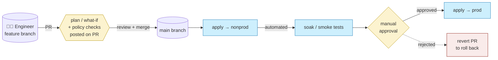

# 04 · Branching, environments & promotion

> **Decision:** how does a change flow from a developer laptop to production,
> and how does the Git branching model map to environments?

[← 03 Modules & registries](03-modules-and-registries.md) · [Index](../README.md) · [05 Authentication →](05-authentication.md)

Infrastructure changes are uniquely dangerous in one regard: unlike application code, a broken deploy can leave the network in a half-configured state that affects every workload sitting on top of it. A solid branching and promotion model is the operational safety net — it determines how much blast radius is possible from a single commit, how quickly a rollback can happen, and whether auditors can trace who approved what. This chapter recommends a specific model, acknowledges the alternative honestly, and explains how to make promotion mechanics reliable rather than ceremonial.

---

## How we got here

When IaC adoption took off around 2016, most ops teams reached for the
branching model their app‑dev colleagues were using: **GitFlow**.
`develop` → `release/*` → `main`, each mapped to an environment, each
deploy triggered by a merge. It worked — until the first hotfix had to be
cherry‑picked back to `develop`, and then to `release/1.4`, and someone
missed one. The next wave of teams tried **GitHub Flow** (one long branch,
short feature branches) but kept the "environment = branch" idea, which
ran into the same drift problems. The **GitOps movement** (Weaveworks
coined the term in 2017; Flux and ArgoCD popularised it) reframed the
question: environments are *folders containing manifests*, not branches
*containing code*. Combined with **trunk‑based development** practices
proven at high‑scale shops, "one branch, folder per environment" became
the dominant pattern by the early 2020s. The branch‑per‑environment model
still survives in regulated industries that map approval to branches —
usually because the auditors learned Git from a 2015 tutorial. Whichever
history your team carries, the two questions below cut through the legacy.

## The two questions you must answer

1. **Branching model:** trunk‑based vs. environment‑per‑branch (GitFlow‑ish)?
2. **Environment promotion:** how do you guarantee that what was tested in
   non‑prod is what hits prod?

The answers are coupled — choose them together. For the vast majority of ALZ deployments, they resolve to the same place.

---

## Recommended: trunk‑based + folder‑per‑environment

The mental model: **`main` is the source of truth for every environment**;
the difference between environments lives in parameter files, not in
divergent branches. A change moves through environments by being
*applied* to each in sequence, gated by approvals — not by being
*merged* between branches.



The repo layout that supports this:

```
alz-platform/
├── envs/
│   ├── nonprod/
│   │   ├── connectivity/   # uses modules @ pinned versions
│   │   ├── identity/
│   │   └── tfvars / params files
│   └── prod/
│       └── ... (same shape, different parameters)
└── modules/
```

* **One long‑lived branch:** `main`. All work happens on short‑lived feature
  branches that PR into `main`.
* **Environments are folders**, not branches.
* On PR: `plan` / `what‑if` runs for *all affected environments* and is
  posted as a PR comment.
* On merge to `main`: pipeline applies to **non‑prod automatically**, then
  **gates on a manual approval before prod**.

### Why this works

* **No merge hell.** Branch‑per‑environment models inevitably accumulate
  cherry‑pick debt and "what's actually in prod?" anxiety.
* **The diff between environments lives in code,** in the `envs/<name>/`
  parameter files — auditable, reviewable.
* **Linear history** simplifies rollback: revert the merge commit, apply.

### Why people resist it

> "But how do we hotfix prod without releasing the in‑flight feature?"

You don't ship in‑flight features to `main` until they're production‑ready.
Use **feature flags** (parameter toggles, conditional resources) and short
branches. If a feature really must land in code but not in prod yet, gate it
on an environment parameter:

```hcl
resource "azurerm_firewall_policy_rule_collection_group" "new_rules" {
  count = var.enable_new_rules ? 1 : 0
  ...
}
```

Set `enable_new_rules = false` in `envs/prod/terraform.tfvars` until ready.

---

## Alternative: branch‑per‑environment ("GitFlow for ops")

```
main      → prod
release/* → staging
develop   → nonprod
feature/* → ephemeral
```

* Pipeline triggers on push to each branch and deploys to the matching
  environment.
* Promotion = merging `develop` → `release/*` → `main`.

### When this works
* Long release cycles (quarterly).
* Strict change advisory boards that need a human to "release" each
  environment.
* Compliance regimes that map approval to *branch* rather than *deployment*.

### When it doesn't
* High‑frequency platform changes.
* Multiple environments per "stage" (e.g. multiple non‑prod tenants).
* Any team that has ever forgotten to cherry‑pick a hotfix back to `develop`.

**Recommendation:** use it only if your compliance team mandates it. Even
then, push back hard.

Whichever branching model you commit to, the next question is what your environment estate actually looks like — how many environments, what each one is for, and who controls access to it.

---

## Environment topology

Define your environments **explicitly** and document why each exists. A common
pattern:

| Environment | Purpose | Subscription model |
|-------------|---------|--------------------|
| `sandbox` | Engineer experimentation, throwaway | Single shared sub, auto‑cleanup |
| `dev` (optional) | Integration of in‑flight platform changes | Dedicated sub per platform |
| `nonprod` / `staging` | Pre‑prod validation, mirrors prod topology | Dedicated subs |
| `prod` | Production | Dedicated subs |
| `dr` (optional) | Disaster recovery | Mirrors prod, in second region |

Rules:

1. **Prod and non‑prod are in different subscriptions** (often different
   management groups). Anything else dilutes the value of the environment
   boundary.
2. **Engineers can `apply` in sandbox.** Pipelines `apply` everywhere else.
3. **Sandbox has aggressive lifecycle management.** Auto‑shutdown of VMs,
   nightly resource group cleanup, hard cost caps.

With the environment set defined, the question is how a change moves between them without the canonical trap: "it worked in staging".

---

## Promotion mechanics

The promotion contract: **what you tested is what you ship.**

### Promote the artifact, not the source

* Run `terraform plan` (or `bicep build`) once, store the artifact (plan file
  / compiled ARM JSON), and *apply that exact artifact* to each environment.
* This protects against:
  * Module version drift between environments (someone bumps a tag mid‑flow).
  * Time‑of‑check / time‑of‑apply differences in upstream data sources.

In practice:

```yaml
# pseudo-pipeline
- terraform plan -out=tfplan-nonprod -var-file=envs/nonprod.tfvars
- terraform apply tfplan-nonprod
- # Manual approval
- terraform plan -out=tfplan-prod -var-file=envs/prod.tfvars
- terraform apply tfplan-prod
```

Note: you **cannot** apply a non‑prod plan to prod (different state files,
different resources). The "promote the artifact" pattern in IaC means
*promote the same Git SHA + the same module versions + the same pipeline
template*, with environment‑specific parameter files.

### Lock module versions per environment

Pin module versions in `envs/<env>/versions.tf` (or a `module-versions.json`
read by Bicep) so you can promote `nonprod` first, observe, then update `prod`
to the same version explicitly.

```
envs/
├── nonprod/
│   └── versions.tf       # module "x" { version = "1.5.0" }
└── prod/
    └── versions.tf       # module "x" { version = "1.4.2" } ← lags
```

When non‑prod is happy after a soak period, a PR bumps prod to `1.5.0`. The
PR diff *is* the promotion.

Of course, that PR diff only means something if the review process attached to it has teeth.

---

## PR requirements

Recommended branch protection on `main`:

* ✅ Require pull request before merging.
* ✅ Require **at least 1** reviewer (2 for foundation/policy repos).
* ✅ Require status checks to pass: `lint`, `validate`, `plan`,
  `policy-test`, `security-scan`.
* ✅ Require **CODEOWNERS** review for paths under `envs/prod/` and
  `modules/`.
* ✅ Require branches up to date before merge.
* ✅ Require **signed commits** (see [06 security](06-security.md)).
* ✅ Dismiss stale reviews on new commits.
* ✅ Disallow force pushes and branch deletion.

---

## Drift between environments

Drift is inevitable. Make it visible:

* **Scheduled `plan` (or `what-if`) runs** in each environment, weekly. Any
  non‑empty plan posts to a Teams/Slack channel.
* Treat unexplained drift as an incident.

For Bicep with Deployment Stacks, set `denySettings: denyDelete` (or
`denyWriteAndDelete`) so out‑of‑band changes are blocked at the ARM layer.
For Terraform, drift detection runs are your only signal — invest in them.

See also [11 manageability](11-manageability.md).

There is, however, a complementary pattern that sidesteps long-lived environment drift entirely by making environments disposable.

---

## Ephemeral environments

For pattern modules and platform components, spin up a **PR‑scoped
environment** automatically:

* Workflow on PR creation: `terraform apply` to a uniquely named resource
  group (`pr-<number>-<sha>`).
* Run integration tests against it.
* Workflow on PR close: `terraform destroy`.

This is *not* a per‑PR copy of the entire ALZ — that's prohibitively
expensive. It's a per‑PR slice of the modules being changed.

---

## Anti‑patterns

* ❌ **`main` deploys straight to prod with no non‑prod stop.** The classic
  "we'll add staging later".
* ❌ **One state file shared across environments.** A failed `apply` in
  non‑prod can corrupt prod state.
* ❌ **Cherry‑picking commits between long‑lived branches.** You will lose
  one eventually; that's how outages start.
* ❌ **"It worked in non‑prod" without artefact promotion.** Non‑prod and
  prod ran against different module versions.
* ❌ **Merging your own PR.** Even for "trivial" changes. Especially in
  foundation repos.

---

With branching strategy, environment topology, and promotion mechanics in place, the structural decisions for your ALZ estate are largely complete. What remains are the operational details that determine whether the structure stays trustworthy over time: authentication (Chapter 05), security controls, state management, and drift response. Get the three foundational decisions right — topology, tooling, and promotion model — and the later chapters are refinement. Get any one of them wrong and no amount of clever pipeline YAML will compensate.

## References

* Trunk‑based development: <https://trunkbaseddevelopment.com/>
* GitHub branch protection:
  <https://docs.github.com/repositories/configuring-branches-and-merges-in-your-repository/managing-protected-branches>
* Azure DevOps branch policies:
  <https://learn.microsoft.com/azure/devops/repos/git/branch-policies>
* Hashicorp, *Recommended Terraform workflow*:
  <https://developer.hashicorp.com/terraform/cloud-docs/recommended-practices/part1>
* Microsoft, *CAF — environments*:
  <https://learn.microsoft.com/azure/cloud-adoption-framework/ready/considerations/environments>

---

[← 03 Modules & registries](03-modules-and-registries.md) · [Index](../README.md) · [05 Authentication →](05-authentication.md)
