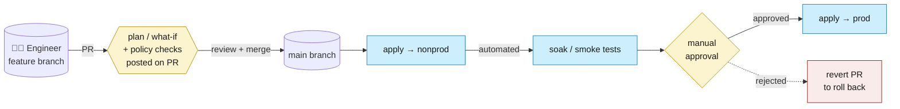

# 04 · Branching, environments & promotion

**In this chapter:**

- [How we got here](#how-we-got-here)
- [Decision framework](#decision-framework)
- [Recommended: trunk‑based + folder‑per‑environment](#recommended-trunkbased-folderperenvironment)
- [Alternative: branch‑per‑environment ("GitFlow for ops")](#alternative-branchperenvironment-gitflow-for-ops)
- [Environment topology](#environment-topology)
- [Promotion mechanics](#promotion-mechanics)
- [PR requirements](#pr-requirements)
- [Drift between environments](#drift-between-environments)
- [Ephemeral environments](#ephemeral-environments)
- [Keeping environment configurations DRY — Terragrunt and alternatives](#keeping-environment-configurations-dry-terragrunt-and-alternatives)
- [Anti‑patterns](#antipatterns)
- [References](#references)


> **Decision:** how does a change flow from a developer laptop to production,
> and how does the Git branching model map to environments?

[← 03 Modules & registries](03-modules-and-registries.md) · [Index](../README.md) · [05 Authentication →](05-authentication.md)

For most Azure Landing Zone (ALZ) platform repositories, you should use **trunk‑based development with folder‑per‑environment configuration**: `main` remains the source of truth, environment differences live in reviewed parameter files, and promotion is a gated deployment sequence from non‑prod to prod. Branch‑per‑environment is a fallback for teams whose compliance model explicitly requires branch‑level releases; everyone else should avoid the drift, cherry‑pick debt, and unclear rollback story it creates. This choice matters more for infrastructure than it does for ordinary application code, because a broken deployment can leave the network in a half‑configured state that affects every workload above it, so your branching model has to minimise blast radius, make rollback obvious, and leave an auditable trail of who approved what. The history of how teams arrived at these models explains why the safer default is still not always the first instinct.

---

## How we got here

When Infrastructure as Code (IaC) adoption took off around 2016, most ops teams reached for the
branching model their app‑dev colleagues were using: **GitFlow**.
`develop` → `release/*` → `main`, each mapped to an environment, each
deploy triggered by a merge. It worked — until the first hotfix had to be
cherry‑picked back to `develop`, and then to `release/1.4`, and someone
missed one. The next wave of teams tried **GitHub Flow** (one long branch,
short feature branches) but kept the "environment = branch" idea, which
ran into the same drift problems. The **GitOps movement** (Weaveworks
coined the term in 2017; Flux and ArgoCD popularised it) reframed the
question: environments are *folders containing manifests*, not branches
*containing code*. Combined with **trunk‑based development** practices
proven at high‑scale shops, "one branch, folder per environment" became
the dominant pattern by the early 2020s.

> 📘 **Key terms**
>
> **GitFlow** — a branching model with parallel long‑lived branches (`main`, `develop`, `release/*`, `hotfix/*`). Powerful for versioned software releases, but error‑prone for infrastructure where every branch must converge.
>
> **Trunk‑based development** — a model where all developers commit to a single long‑lived branch (`main`/`trunk`) via short‑lived feature branches, keeping integration continuous and merge conflicts small.
>
> **GitOps** — an operational pattern where the desired state of infrastructure is declared in Git and a reconciler (Flux, ArgoCD) or Continuous Integration/Continuous Delivery (CI/CD) pipeline continuously applies it, making Git the single source of truth.
>
> **Cherry‑picking** — a Git operation that copies a single commit from one branch to another. Useful for targeted hotfixes, but dangerous at scale because forgetting to cherry‑pick even once creates silent environment drift.
>
> **Drift** — the divergence between what your IaC code declares and what actually exists in the cloud. Drift can be caused by manual portal changes, failed applies, or cherry‑pick misses between branches.
>
> **Feature flags** — conditional toggles (often a boolean variable) that let code exist in `main` without being active in all environments, allowing incomplete features to be merged safely.
>
> **Ephemeral environments** — short‑lived, disposable environments (e.g. per‑PR) spun up for testing and torn down automatically when no longer needed.

That history explains why the branch‑per‑environment model still survives in regulated industries that map approval to branches, usually because the audit evidence was first designed around Git branch events rather than deployment approvals. Whichever history your team carries, use the framework below to separate a real compliance constraint from inherited habit before choosing mechanics.

---

## Decision framework

Choose the branching and promotion model by answering these questions in order. The answers are coupled — choose them together. For the vast majority of ALZ deployments, they converge on trunk‑based development with folder‑per‑environment configuration.

1. **Monorepo or repo‑per‑environment?** Keep environments in the same ALZ/platform repo by default so one PR can show the non‑prod and prod intent together; split repos only when environment ownership, permissions, or audit boundaries are genuinely different.
2. **Branch‑per‑environment or folder‑per‑environment?** Prefer folders such as `envs/nonprod/` and `envs/prod/` on `main`; use long‑lived environment branches only when compliance explicitly requires branch‑level releases.
3. **What environment topology do you need?** Define the minimum set of durable environments — usually sandbox, non‑prod/staging, prod, and optionally DR — and back prod and non‑prod with separate subscriptions or management groups.
4. **What exactly gets promoted?** Promote the same Git SHA, pinned module versions, and pipeline template through the sequence; environment‑specific plan artifacts may differ, but they must be generated from the same reviewed source.
5. **What PR requirements make `main` safe?** Require review, status checks, CODEOWNERS approval for `envs/prod/` and modules, current branches, signed commits where required, and no force pushes.
6. **How will drift and exceptions be handled?** Detect drift with scheduled plans, treat unexplained differences as incidents, and use feature flags or parameter gates instead of leaving unfinished work off to the side in long‑lived branches.

The sections below unpack those decisions, starting with the recommended model and then the branch‑per‑environment exception. From there, the chapter follows the change through environment design, promotion, review, drift response, and configuration reuse.

---

## Recommended: trunk‑based + folder‑per‑environment

The framework's default landing point is trunk‑based development with folder‑per‑environment configuration, because it gives you one source of truth while still making every environment difference explicit and reviewable. In that model, **`main` is the source of truth for every environment**; the differences between environments live in parameter files, not in divergent branches, and a change moves through environments by being *applied* to each in sequence behind approvals rather than being *merged* from one long‑lived branch to another.


```mermaid
flowchart LR
    Dev[("👩‍💻 Engineer<br/>feature branch")] -->|PR| Plan{{"plan / what-if<br/>+ policy checks<br/>posted on PR"}}
    Plan -->|review + merge| Main[("main branch")]
    Main --> NP["apply → nonprod"]
    NP -->|automated| Soak["soak / smoke tests"]
    Soak --> Gate{"manual<br/>approval"}
    Gate -->|approved| Prod["apply → prod"]
    Gate -.->|rejected| Revert["revert PR<br/>to roll back"]

    classDef env fill:#cdeffd,stroke:#2980b9,color:#1a1a1a
    classDef gate fill:#fcf3cf,stroke:#b7950b,color:#1a1a1a
    classDef bad fill:#f9ebea,stroke:#922b21,color:#1a1a1a
    class NP,Prod,Soak env
    class Plan,Gate gate
    class Revert bad
```

In repository terms, that promotion flow works best when the same shape exists under each environment folder. The shape matters because reviewers can compare intent across environments without mentally reconciling different directory structures:

```
alz-platform/
├── envs/
│   ├── nonprod/
│   │   ├── connectivity/   # uses modules @ pinned versions
│   │   ├── identity/
│   │   └── tfvars / params files
│   └── prod/
│       └── ... (same shape, different parameters)
└── modules/
```

That layout gives you a few operating rules that are easy to audit. `main` is the only long‑lived branch, all work happens on short‑lived feature branches that open pull requests into `main`, and environments are folders rather than branches. On each pull request, `plan` or `what‑if` runs for all affected environments and is posted as review evidence; after merge, the pipeline applies to **non‑prod automatically** and then **gates on a manual approval before prod**.

### Why this works

This model works because it attacks the failure modes that make infrastructure promotion hard. Branch‑per‑environment models inevitably accumulate cherry‑pick debt and "what's actually in prod?" anxiety, while folder‑per‑environment keeps the diff between environments in the `envs/<name>/` parameter files where it is auditable and reviewable. Because history stays linear, rollback is also easier to explain under pressure: revert the merge commit and apply the resulting source.

### Why people resist it

> "But how do we hotfix prod without releasing the in‑flight feature?"

You don't ship in‑flight features to `main` until they're production‑ready.
Use **feature flags** (parameter toggles, conditional resources) and short
branches. If a feature really must land in code but not in prod yet, gate it
on an environment parameter:

```hcl
resource "azurerm_firewall_policy_rule_collection_group" "new_rules" {
  count = var.enable_new_rules ? 1 : 0
  ...
}
```

You would keep `enable_new_rules = false` in `envs/prod/terraform.tfvars` until the change is ready, while still allowing the reviewed code to live on `main`. That distinction between hiding code in a branch and disabling behavior through an explicit parameter is what makes the branch‑per‑environment alternative a narrow exception rather than the default.

---

## Alternative: branch‑per‑environment ("GitFlow for ops")

Branch‑per‑environment is still defensible when an external compliance or release process genuinely requires branch‑level promotion, but you should treat it as an exception because it creates avoidable drift and cherry‑pick risk. In this model, each long‑lived branch maps to an environment, pipeline triggers fire on pushes to those branches, and promotion becomes a sequence of merges from `develop` to `release/*` to `main`.

```
main      → prod
release/* → staging
develop   → nonprod
feature/* → ephemeral
```

### When this works

This model works best when release cycles are long, usually quarterly, and when strict change advisory boards need a human to "release" each environment through a branch event. It also fits compliance regimes that map approval to *branch* rather than *deployment*, because the audit trail follows Git merges rather than deployment gates.

### When it doesn't

The same branch mapping becomes fragile as soon as platform changes are frequent, each stage contains multiple tenants, or the team has ever forgotten to cherry‑pick a hotfix back to `develop`. Use it only if your compliance team mandates it, and even then, push back hard enough to confirm that branch‑level evidence is really required rather than merely familiar.

> ⚖️ **The debate — trunk‑based vs branch‑per‑environment**
>
> This guide recommends trunk‑based development, but the question is far
> from settled — especially in regulated industries.
>
> **The case for branch‑per‑environment:** Some compliance regimes (financial
> services, government, healthcare) map approval gates to *branches*, not
> deployments. Their auditors aren't confused — they genuinely want a
> branch‑level audit trail where a prod release corresponds to a merge
> event, not a CI gate. Teams with strict change advisory boards,
> quarterly release windows, or multi‑tenant environments that must not
> drift between stages find branch‑per‑environment easier to govern.
>
> **The case for trunk‑based:** Fewer long‑lived branches means fewer
> merge conflicts, fewer forgotten cherry‑picks, and a single source of
> truth. Environment differences live in parameter files, not in code
> divergence. Most modern CI systems can provide the same audit trail via
> deployment approvals and environment protection rules.
>
> **Where the industry stands (2026):** Trunk‑based is the dominant
> recommendation in the DevOps literature (DORA research, Google's
> engineering practices), but enterprise adoption is uneven. Many teams
> that switched to trunk‑based report fewer incidents; others reverted
> after losing the "branch = frozen artifact" guarantee their auditors
> expected. There is no single right answer — the best model depends on
> your release cadence, audit requirements, and team discipline.

Once the branching model is explicit, define the environment estate it will protect — how many environments exist, what each one is for, and who controls access to it. That definition turns the Git model from an abstract workflow into a set of real blast‑radius boundaries.

---

## Environment topology

Because the branching model only has meaning when it protects clear deployment targets, keep the durable environment set small, named, and subscription‑separated so each boundary has a clear purpose and blast radius. Define your environments **explicitly** and document why each exists, resisting the temptation to create a new durable environment for every temporary validation need; a common pattern is:

| Environment | Purpose | Subscription model |
|-------------|---------|--------------------|
| `sandbox` | Engineer experimentation, throwaway | Single shared sub, auto‑cleanup |
| `dev` (optional) | Integration of in‑flight platform changes | Dedicated sub per platform |
| `nonprod` / `staging` | Pre‑prod validation, mirrors prod topology | Dedicated subs |
| `prod` | Production | Dedicated subs |
| `dr` (optional) | Disaster recovery | Mirrors prod, in second region |

Those names only become useful if you back them with hard boundaries and automation, so apply three rules consistently. Without these controls, environment names become labels on the same shared blast radius:

1. **Prod and non‑prod are in different subscriptions** (often different
   management groups). Anything else dilutes the value of the environment
   boundary.
2. **Engineers can `apply` in sandbox.** Pipelines `apply` everywhere else.
3. **Sandbox has aggressive lifecycle management.** Auto‑shutdown of VMs,
   nightly resource group cleanup, hard cost caps.

With the environment set defined, the question is how a change moves between those boundaries without falling into the canonical trap: "it worked in staging". Promotion mechanics are where that promise either becomes enforceable or collapses into hope.

---

## Promotion mechanics

To avoid the familiar "it worked in staging" trap, promotion must carry the same reviewed source, module versions, and pipeline logic forward so **what you tested is what you ship**. The details differ between Terraform and Bicep, but the governing idea is the same: you promote reviewed intent, not whatever happens to be current when the next environment deploys.

### Promote the artifact, not the source

The safest promotion pattern is to run `terraform plan` (or `bicep build`), store the resulting artifact, and apply the reviewed output through the sequence wherever the target environment allows it. That discipline protects you from module version drift between environments when someone bumps a tag mid‑flow, and from time‑of‑check / time‑of‑apply differences in upstream data sources.

In practice:

```yaml
# pseudo-pipeline
- terraform plan -out=tfplan-nonprod -var-file=envs/nonprod.tfvars
- terraform apply tfplan-nonprod
- # Manual approval
- terraform plan -out=tfplan-prod -var-file=envs/prod.tfvars
- terraform apply tfplan-prod
```

However, you **cannot** apply a non‑prod plan to prod because the state files and resources are different. In IaC, the "promote the artifact" pattern therefore means *promote the same Git SHA + the same module versions + the same pipeline template*, with environment‑specific parameter files.

### Lock module versions per environment

Pin module versions in `envs/<env>/versions.tf` (or a `module-versions.json`
read by Bicep) so you can promote `nonprod` first, observe, then update `prod`
to the same version explicitly. That makes version promotion a visible code review rather than an implicit side effect of rerunning a pipeline.

```
envs/
├── nonprod/
│   └── versions.tf       # module "x" { version = "1.5.0" }
└── prod/
    └── versions.tf       # module "x" { version = "1.4.2" } ← lags
```

When non‑prod is happy after a soak period, a PR bumps prod to `1.5.0`, and the PR diff *is* the promotion. Of course, that diff only means something if the review process attached to it has teeth, which is why branch protection and pull request rules are part of the promotion model rather than administrative decoration.

---

## PR requirements

Because `main` now controls every environment, you make it safe by requiring review, automated evidence, production ownership approval, and branch protection before any environment can change. The exact rule set varies by repository sensitivity, but a practical baseline for branch protection on `main` is:

* ✅ Require pull request before merging.
* ✅ Require **at least 1** reviewer (2 for foundation/policy repos).
* ✅ Require status checks to pass: `lint`, `validate`, `plan`,
  `policy-test`, `security-scan`.
* ✅ Require **CODEOWNERS** review for paths under `envs/prod/` and
  `modules/`.
* ✅ Require branches up to date before merge.
* ✅ Require **signed commits** (see [06 security](06-security.md)).
* ✅ Dismiss stale reviews on new commits.
* ✅ Disallow force pushes and branch deletion.

These controls reduce the chance that unreviewed change reaches an environment, but they do not prove the deployed environment still matches the source. Therefore, the operating model also needs an explicit drift loop that keeps Git and Azure from silently diverging after the merge.

---

## Drift between environments

Even with strong pull request controls, assume drift will happen and design the operating model to detect it quickly, explain it, and treat unexplained differences as incidents. The simplest visible signal is a scheduled `plan` or `what-if` run in each environment, usually weekly, with any non‑empty result posted to a Teams or Slack channel where it cannot be ignored.

For Bicep with Deployment Stacks, set `denySettings: denyDelete` or `denyWriteAndDelete` so out‑of‑band changes are blocked at the Azure Resource Manager (ARM) layer. For Terraform, drift detection runs are your only signal, so invest in them and treat unexplained drift as incident work rather than background noise, as discussed further in [11 manageability](11-manageability.md).

There is, however, a complementary pattern that sidesteps long‑lived environment drift entirely by making environments disposable. It does not replace the durable environment chain, but it gives risky module changes a cheaper place to fail.

---

## Ephemeral environments

That recurring drift loop protects durable environments, while ephemeral environments give you a different kind of confidence: pull request (PR)-scoped validation for modules and platform slices without pretending that every pull request needs a full disposable copy of the entire ALZ. For pattern modules and platform components, you can spin up a **PR‑scoped environment** automatically, run the tests that need real Azure resources, and then remove the slice before it becomes another environment to govern:

* Workflow on PR creation: `terraform apply` to a uniquely named resource
  group (`pr-<number>-<sha>`).
* Run integration tests against it.
* Workflow on PR close: `terraform destroy`.

This is a per‑PR slice of the modules being changed, not a copy of the whole landing zone, because the latter is usually too expensive and too slow to be useful. Once those short‑lived slices exist beside durable environments, the remaining maintenance problem is how to keep the repeated environment configuration readable without adding unnecessary orchestration tooling.

---

## Keeping environment configurations DRY — Terragrunt and alternatives

Start with native `envs/` folders, parameter files, and Continuous Integration (CI) matrices, and add Terragrunt, Atmos, or Terramate only when repeated environment boilerplate becomes measurable pain. Modules solve the don't repeat yourself (DRY) problem for *resource definitions*, but a separate DRY problem lurks in *environment configurations*: the backend blocks, provider blocks, and `.tfvars` that differ per environment. When you have five environments × eight workloads, even a well‑structured `envs/` folder accumulates significant boilerplate.

> 📘 **Key terms**
>
> **Terragrunt** — a thin wrapper around Terraform (by Gruntwork) that generates backend configs, provider blocks, and input variables from a shared template, reducing per‑environment boilerplate. It also manages cross‑stack dependencies (e.g. "the spoke needs the hub's VNet ID").
>
> **Atmos** — a framework by Cloud Posse that provides environment composition, stack configuration inheritance, and component orchestration for Terraform projects.
>
> **Terramate** — an orchestration tool that adds code generation, change detection, and execution ordering to Terraform/OpenTofu projects without wrapping the CLI.

### What Terragrunt solves

Terragrunt earns its keep when the repetition is not just cosmetic but operational: backends, providers, inputs, dependencies, and execution order all have to stay aligned across many stacks. The table below shows the specific places where it replaces hand‑maintained repetition with generated or inherited configuration.

| Problem | Terragrunt approach |
|---------|---------------------|
| Duplicated backend blocks | `generate "backend"` in a root `terragrunt.hcl` |
| Duplicated provider blocks | `generate "provider"` with inherited variables |
| Per‑env variable files | `inputs = { ... }` inheritance from parent directories |
| Cross‑stack dependencies | `dependency` blocks that read outputs from other stacks |
| Execution order | `run-all plan` applies stacks in dependency order |

Terragrunt remains **widely used** and solves these problems well. It was the
de facto standard for multi‑environment Terraform orchestration from roughly
2019 to 2023, and many mature estates run it successfully today.

### Why we don't recommend it as the default for ALZ

For a *typical ALZ estate* — three to five environments, a handful of
workloads, one cloud — the extra layer often costs more than it saves. The most common costs show up in day‑to‑day debugging and pipeline maintenance:

* **Additional domain-specific language (DSL) to learn.** Terragrunt's HCL‑dialect (`dependency`,
  `generate`, `include`) is conceptually simple but adds a debugging layer
  between the engineer and Terraform. Error messages refer to generated files,
  not the source.
* **Versioning surface.** You now pin Terraform *and* Terragrunt versions,
  and their compatibility matrix is not always smooth.
* **CI complexity.** Most pipeline examples assume `terraform plan`; Terragrunt
  `run-all` requires different caching, parallelism, and artifact strategies.
* **Native alternatives have closed part of the gap:**

| Terragrunt capability | Native equivalent (2026) |
|------------------------|--------------------------|
| DRY backend config | Partial backend config (`-backend-config=`) + CI variables |
| DRY provider config | `envs/<env>/provider.tf` shared via symlink or CI template |
| Per‑env variables | `envs/<env>/*.tfvars` + matrix pipeline |
| Cross‑stack data | `terraform_remote_state` data source or explicit outputs piped via CI |
| Execution order | Pipeline DAG stages / explicit `needs:` / `dependsOn:` |
| For Bicep | Parameter files + Deployment Stacks handle all of the above natively |

Where native tooling still falls short is orchestration across dozens of Terraform stacks with complex inter‑dependencies, especially when you want a single `run-all plan` command. In that specific shape of estate, Terragrunt or Terramate genuinely saves time, but that threshold is higher than many ALZ teams reach at the start.

### Recommendation

For most ALZ teams, a well‑structured `envs/` folder, `.tfvars` per environment, and a CI matrix build achieve the same DRY outcome with **less tooling surface**. Adopt Terragrunt, Atmos, or Terramate when the environment × workload matrix grows large enough that the native approach produces measurable duplication pain, not as a default starting point.

> ⚖️ **The debate — Terragrunt and DRY orchestrators**
>
> The recommendation above ("start native, adopt Terragrunt when the pain
> is real") is itself debated.
>
> **The counter‑argument:** Experienced practitioners — including
> Gruntwork, Cloud Posse, and many platform engineers managing 50+
> landing zones — argue that Terragrunt's overhead is modest compared to
> the duplication and orchestration bugs you accumulate without it. They
> point out that "native equivalents" (symlinks, `-backend-config=`, CI
> variable injection) are fragile workarounds that break in non‑obvious
> ways, whereas Terragrunt's `dependency` blocks and `run-all` give you a
> tested, deterministic execution graph. From their perspective, the
> advice to "wait until it hurts" means you only adopt good tooling
> *after* accruing tech debt — the equivalent of saying "don't write
> tests until you have bugs."
>
> **This guide's position:** For a small‑to‑mid ALZ (fewer than ~15 stacks), the
> native approach is simpler and has a lower bus‑factor risk. Beyond
> that threshold the tradeoff tilts, and a DRY orchestrator becomes the
> pragmatic choice. Reasonable engineers disagree on where the tipping
> point is.

With the promotion model, environment boundaries, and configuration tooling now tied together, the remaining risk is less subtle: shortcuts that bypass non‑prod validation, shared state isolation, artifact promotion, or independent review. These are the choices that usually feel convenient in the moment and expensive during an incident.

---

## Anti‑patterns

Avoid these shortcuts because each one breaks a safety mechanism established earlier in the chapter. If you find yourself making one of them, treat it as a signal that the normal path is too slow or too unclear and fix that path instead.

* ❌ **`main` deploys straight to prod with no non‑prod stop.** The classic
  "we'll add staging later".
* ❌ **One state file shared across environments.** A failed `apply` in
  non‑prod can corrupt prod state.
* ❌ **Cherry‑picking commits between long‑lived branches.** You will lose
  one eventually; that's how outages start.
* ❌ **"It worked in non‑prod" without artefact promotion.** Non‑prod and
  prod ran against different module versions.
* ❌ **Merging your own PR.** Even for "trivial" changes. Especially in
  foundation repos.

---

With branching strategy, environment topology, and promotion mechanics in place, the structural decisions for your ALZ estate are largely complete. What remains are the operational details that determine whether the structure stays trustworthy over time: authentication (Chapter 05), security controls, state management, and drift response. Get the three foundational decisions right — topology, tooling, and promotion model — and the later chapters are refinement. Get any one of them wrong and no amount of clever pipeline YAML will compensate.

## References

* Trunk‑based development: <https://trunkbaseddevelopment.com/>
* GitHub branch protection:
  <https://docs.github.com/repositories/configuring-branches-and-merges-in-your-repository/managing-protected-branches>
* Azure DevOps branch policies:
  <https://learn.microsoft.com/azure/devops/repos/git/branch-policies>
* Hashicorp, *Recommended Terraform workflow*:
  <https://developer.hashicorp.com/terraform/cloud-docs/recommended-practices/part1>
* Microsoft, *CAF — environments*:
  <https://learn.microsoft.com/azure/cloud-adoption-framework/ready/considerations/environments>

---

[← 03 Modules & registries](03-modules-and-registries.md) · [Index](../README.md) · [05 Authentication →](05-authentication.md)
