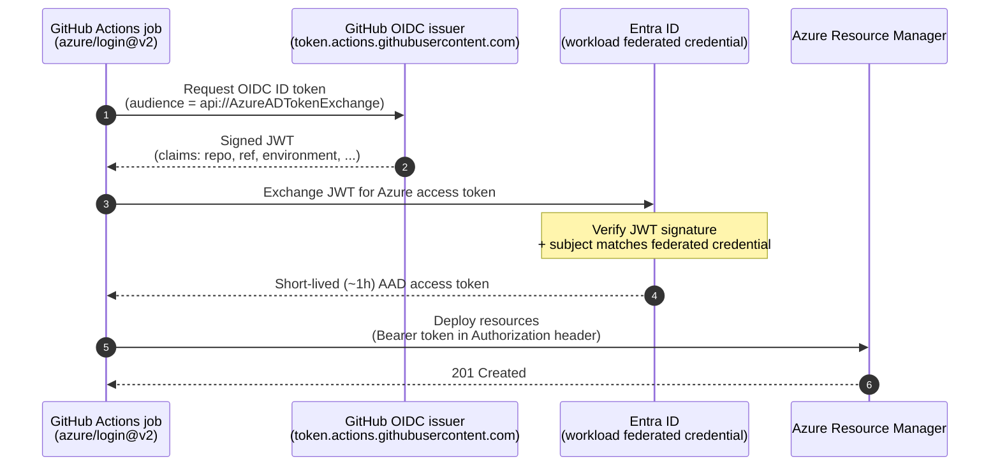

# 05 · Authentication & identity for pipelines

> **Decision:** how do CI/CD runners and engineers authenticate to Azure
> without ever holding a long‑lived secret?

[← 04 Branching & environments](04-branching-and-environments.md) · [Index](../README.md) · [06 Security →](06-security.md)

---

Every pipeline that deploys to Azure needs to prove its identity. For years that proof came in the form of a secret — a certificate or client secret tucked into an environment variable, one careless `git push` away from a breach report. This chapter shows how to eliminate that secret entirely using workload identity federation, how to scope the resulting access to the minimum blast radius, and how to make your audit trail actually useful.

## How we got here

The history of pipeline auth to Azure is a sequence of *reactions to
breaches*. In the early days you minted a **service principal with an
X.509 certificate**, mounted it onto your build agent, and prayed nobody
copied the PFX. When that proved operationally painful, the community
moved to **client secrets** — easier to handle, easier to leak, and leak
they did, repeatedly, in committed YAML files and CI logs. Microsoft
shipped **Managed Identities** in 2017, which solved the problem
elegantly *for workloads running in Azure*, but CI/CD runners (GitHub‑
hosted, Jenkins on‑prem, GitLab SaaS) still needed long‑lived secrets.
GitHub announced **OIDC for Actions** in 2021, Entra added support for
**workload federated credentials** the same year, and the entire problem
class evaporated almost overnight: the runner asks GitHub for a
short‑lived signed JWT, exchanges it with Entra, and gets a 1‑hour
access token. No secret ever exists. By 2024 federated credentials had
spread to **user‑assigned managed identities** as well, and Azure DevOps
shipped its own equivalent. There is now no defensible reason to store an
Azure secret in a CI system — and yet, the surveys keep showing that most
do. This chapter exists to make sure you don't.

## The hard rule

**No long‑lived Azure credentials in any CI/CD system. Period.**

In 2026 there is no good reason to store a service principal client secret
or certificate in a GitHub Actions secret, an Azure DevOps service connection
of type "manual", or a Jenkins credential. OIDC federation is broadly
supported and removes the entire class of "leaked secret" incidents.

---

## What to use, by runner

The mechanism varies by CI platform, but the principle is uniform: federate whenever possible, use managed identity for Azure‑hosted runners, and reserve interactive `az login` for humans.

| Runner | Recommended | How |
|--------|-------------|-----|
| GitHub Actions | **OIDC → Entra workload federated credential → SPN** | `azure/login@v2` with `client-id`, `tenant-id`, `subscription-id`, no secret |
| Azure DevOps Pipelines | **Workload identity federation service connection** | "Workload identity federation" connection type |
| GitLab CI | **OIDC ID tokens → federated credential → SPN** | `id_tokens:` block + `azure/login` |
| Self‑hosted runner on Azure VM/AKS | **Managed Identity** | System‑ or user‑assigned MI on the runner host |
| Local developer workstation | **`az login` (interactive) + Conditional Access** | Never share an SPN secret with developers |

---

## OIDC federation — how it actually works

The whole exchange happens inside a single workflow run. No secret is
created, transmitted, or stored — only short‑lived signed tokens cross
the wire.



The trust is established once on the **Entra app registration** (or
user‑assigned managed identity) by adding a *federated credential* that
restricts which workflow, environment, branch, or repo can request a token.

### Setup (Bicep example)

```bicep
resource app 'Microsoft.Graph/applications@v1.0' = {
  displayName: 'sp-alz-platform-prod'
}

resource fic 'Microsoft.Graph/applications/federatedIdentityCredentials@v1.0' = {
  parent: app
  name: 'github-prod'
  audiences: [ 'api://AzureADTokenExchange' ]
  issuer: 'https://token.actions.githubusercontent.com'
  // Restrict to the prod environment in this specific repo:
  subject: 'repo:contoso/alz-platform:environment:prod'
}
```

### Setup (CLI)

```bash
APP_ID=$(az ad app create --display-name sp-alz-platform-prod --query appId -o tsv)
az ad sp create --id $APP_ID

az ad app federated-credential create --id $APP_ID --parameters '{
  "name": "github-prod",
  "issuer": "https://token.actions.githubusercontent.com",
  "subject": "repo:contoso/alz-platform:environment:prod",
  "audiences": ["api://AzureADTokenExchange"]
}'
```

### Choosing a `subject` template

The subject is the most security‑critical field. Be **as restrictive as
possible**:

| Pattern | When to use |
|---------|-------------|
| `repo:org/repo:environment:prod` | **Recommended.** Ties to a GitHub Environment with reviewers. |
| `repo:org/repo:ref:refs/heads/main` | Only main branch can deploy. |
| `repo:org/repo:pull_request` | Read‑only plan jobs from PRs (forks excluded). |
| `repo:org/repo:*` | ❌ Too permissive. Anyone with write to *any* branch can assume the SPN. |

You can attach **multiple** federated credentials to the same SPN (e.g. one
for `prod` environment, one for the `main` branch deploy job).

### GitHub Actions consumer

```yaml
permissions:
  id-token: write   # ← required for OIDC
  contents: read

jobs:
  deploy:
    environment: prod   # ← matches the subject filter
    runs-on: ubuntu-latest
    steps:
      - uses: actions/checkout@v4
      - uses: azure/login@v2
        with:
          client-id: ${{ vars.AZURE_CLIENT_ID }}
          tenant-id: ${{ vars.AZURE_TENANT_ID }}
          subscription-id: ${{ vars.AZURE_SUBSCRIPTION_ID }}
      - run: az account show
```

Note: those values can be in `vars` (not `secrets`) — they aren't sensitive.

---

## SPN vs Managed Identity vs User‑Assigned MI with federation

OIDC works with more than one identity type, and the choice carries security implications beyond mere convenience.

| Identity type | Used for | Notes |
|---------------|----------|-------|
| Service Principal (app registration) | GitHub / ADO / GitLab pipelines | Add a federated credential — no secret. |
| User‑assigned Managed Identity | Self‑hosted runners on Azure | MIs now also support federated credentials → can be used from non‑Azure runners too. |
| System‑assigned Managed Identity | A runner VM/AKS workload that won't be replaced | Tied to the lifecycle of the host. |

Microsoft now recommends **user‑assigned MI with federation** even for
GitHub Actions, because MIs can't have client secrets created against them at
all — defence in depth. SPNs remain valid; both are acceptable.

---

## RBAC scope — least privilege per environment

Create one identity per **(environment × layer)**:

```
sp-alz-foundation-prod      → Owner @ tenant root MG (rare use)
sp-alz-platform-nonprod     → Contributor @ platform-nonprod MG
sp-alz-platform-prod        → Contributor @ platform-prod MG
sp-alz-landingzone-corp-app01-prod → Contributor @ corp-app01-prod sub
```

* **Do not reuse identities across environments.** A leaked non‑prod token
  must not give access to prod.
* Prefer **Contributor + a few explicit role assignments** (User Access
  Administrator, Network Contributor) over a blanket Owner.
* Foundation identities need **Owner** at tenant scope to manage RBAC and
  policy — restrict their use with strict federated credential subjects and
  GitHub Environment approval gates.
* Use **Privileged Identity Management (PIM)** for any standing high‑privilege
  human access; pipeline identities should not need PIM elevation since their
  blast radius is limited by the federated credential subject.

### Use Azure Resource Manager scopes thoughtfully

Granting at the management group scope cascades to all subscriptions inside.
For landing‑zone identities, prefer subscription‑scope grants — they're more
auditable.

That covers the Azure plane. Landing zone pipelines, however, rarely speak to ARM alone — they also interact with GitHub APIs, container registries, secret stores, and third‑party tooling.

---

## Authenticating to other systems

Pipelines often need more than just Azure:

| Target | Recommendation |
|--------|----------------|
| GitHub (gh CLI, REST) | `${{ secrets.GITHUB_TOKEN }}` (built‑in) or a GitHub App with fine‑grained perms |
| Azure DevOps | Workload identity federation (the same SPN) + ADO PAT only as last resort |
| Azure Container Registry | `az acr login` after `azure/login` (uses AAD) — never docker login with credentials |
| Terraform Cloud / Enterprise | Dynamic provider credentials (TFC's own OIDC to Azure) |
| Vault | OIDC auth method + AppRole as fallback |

The principle is the same: **federate or use an issued token, never store a
long‑lived secret.**

Pipelines are only one half of the authentication picture. The engineers who trigger, debug, and approve them need their own distinct identity path — one that never crosses with the deploy SPN.

---

## Developer access

Engineers should **never** hold the same identity as a pipeline. Patterns:

* Engineers `az login` interactively. Conditional Access enforces MFA + device
  compliance.
* For "deploy from my laptop" cases (sandbox only), they get a *role
  assignment on the sandbox subscription* via PIM.
* Production access for break‑glass: a dedicated emergency account, MFA,
  PIM‑elevated, with full audit alerting. Not the deploy SPN.

Keeping humans and pipelines on separate identities is a prerequisite for meaningful audit. Here is what that audit should actually monitor.

---

## Audit & rotation

OIDC removes secret rotation from your operational burden, but not auditing:

* Stream Entra **sign‑in logs** to your SIEM. Filter on the deploy SPN
  app IDs.
* Alert on:
  * Sign‑ins with subject claims that don't match your federation rules
    (the federated credential should reject these — alert if they appear).
  * Unexpected source IPs (GitHub‑hosted runners come from known ranges).
  * SPN being granted any new role assignment outside the change window.
* Review federated credentials quarterly. Remove anything that no longer maps
  to an active workflow.
* If you still must use SPN client secrets, rotate them ≤ 90 days, ideally
  via Key Vault rotation policies — but really, just move to OIDC.

---

## Multi‑tenant scenarios

If your platform spans multiple Entra tenants (acquisitions, sovereign
clouds), do **not** create one SPN that has Guest access across tenants.
Create one identity *per tenant*, federated separately. The cross‑tenant
glue lives in the pipeline (it picks the right credential for the target
subscription), not in Entra.

---

## Anti‑patterns

* ❌ **Service principal client secret stored in GitHub `secrets`** —
  whoever can edit the workflow file can exfiltrate it via `echo`.
* ❌ **One SPN with Owner @ root for "convenience"** — the full‑estate
  blast radius is unacceptable.
* ❌ **Federated credential subject `repo:org/repo:*`** — defeats the
  purpose of federation.
* ❌ **Engineers sharing an `azureuser@contoso.onmicrosoft.com`** account
  for "lab access". Always individual identities.
* ❌ **No alerting on the deploy SPN.** You'd never know if it was abused.
* ❌ **Same SPN used by humans and pipelines.** Audit becomes impossible.

Authentication is the gate that governs everything else in this book. Get it wrong and every other control becomes optional — a determined attacker holding a long‑lived Owner secret can undo your policy assignments, drain your state storage, and cover their tracks before morning. Get it right with OIDC federation, scoped identities, and PIM‑gated human access, and the controls in the next chapter become substantially cheaper to enforce. Chapter 06 builds on this foundation to address secrets that genuinely do need to be stored, the integrity of the artefacts your pipeline produces, and the supply‑chain risks that no authentication scheme alone can neutralise.

---

## References

* GitHub, *Configuring OIDC in cloud providers — Azure*:
  <https://docs.github.com/actions/deployment/security-hardening-your-deployments/configuring-openid-connect-in-azure>
* Microsoft, *Workload identity federation*:
  <https://learn.microsoft.com/entra/workload-id/workload-identity-federation>
* Microsoft, *Federated identity credentials on managed identities*:
  <https://learn.microsoft.com/entra/identity/managed-identities-azure-resources/how-manage-federated-identity-credentials>
* Azure DevOps, *Workload identity federation for service connections*:
  <https://learn.microsoft.com/azure/devops/pipelines/library/connect-to-azure>
* Microsoft, *Securing Azure pipelines (defender for DevOps)*:
  <https://learn.microsoft.com/azure/defender-for-cloud/defender-for-devops-introduction>

---

[← 04 Branching & environments](04-branching-and-environments.md) · [Index](../README.md) · [06 Security →](06-security.md)
