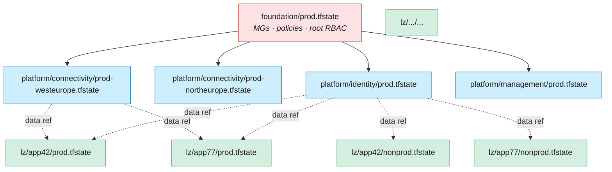

# 07 · State management

**In this chapter:**

- [How we got here](#how-we-got-here)
- [Why this is not a footnote](#why-this-is-not-a-footnote)
- [Terraform backend choice](#terraform-backend-choice)
- [Locking](#locking)
- [Blast radius — how to size state files](#blast-radius-how-to-size-state-files)
- [Cross‑state references](#crossstate-references)
- [State surgery — when you must](#state-surgery-when-you-must)
- [Bicep — Deployment Stacks](#bicep-deployment-stacks)
- [Drift detection](#drift-detection)
- [Anti‑patterns](#antipatterns)
- [References](#references)


> **Decision:** for Terraform, where does state live, how is it locked, and
> what is the blast radius of a single `apply`? For Bicep, the equivalent
> question is how you carve up Deployment Stacks.

[← 06 Security](06-security.md) · [Index](../README.md) · [08 CI/CD pipeline patterns →](08-cicd-pipelines.md)

---

State is where Terraform keeps its map of the world. It is also, historically, where teams have kept their worst secrets, their most spectacular outages, and their longest Friday evenings. This chapter shows how to design a state topology that contains blast radius, harden the backend that stores it, and — for those on Bicep — how Deployment Stacks offer an escape from the problem entirely.

## How we got here

The earliest Terraform shops kept `terraform.tfstate` on the engineer's
laptop, occasionally emailing it around or — worse — committing it to
Git. Concurrent applies were "managed" by Slack message
(*"@everyone don't apply, I'm applying"*), and the inevitable
state‑file conflicts were resolved by hand‑merging JSON. Hashicorp
shipped **remote backends with locking** (S3 + DynamoDB; later
`azurerm` with blob leases) around 2017, which solved the concurrency
problem but introduced a new one: many teams pointed *every* environment
at the same backend and the same state file, producing a single
explosive `apply` whose blast radius was the whole estate. The
2018–2022 period was a slow lesson in **state granularity** — one state
per (workload × environment) — and in **state‑as‑a‑secret‑store**
hardening. Bicep deliberately avoided the question for years (ARM was
the source of truth), but customers kept asking for the *features* state
provided: managed‑resource tracking, drift protection, "what would
removing this line do?" Microsoft's answer was **Deployment Stacks**
(GA 2024), which give you Terraform‑style guarantees with no state file
to operate. The chapter covers both worlds.

> 📘 **Key terms**
>
> **Remote backend** — a shared, network‑accessible location (e.g. Azure Blob Storage) where Terraform stores state, enabling locking and team collaboration.
>
> **Blob lease** — an Azure Storage locking mechanism that Terraform's `azurerm` backend uses to prevent two concurrent `apply` operations against the same state file.
>
> **State surgery** — manually editing Terraform state (via `terraform state mv`, `rm`, or `import`) to fix drift between state and reality without recreating resources.
>
> **`force-unlock`** — a Terraform command that manually releases a stuck state lock, typically needed after a runner crash during `apply`.
>
> **`denySettings`** — a Deployment Stacks property that prevents out‑of‑band changes to managed resources (e.g. `denyDelete` blocks manual deletions).
>
> **`actionOnUnmanage`** — a Deployment Stacks property that controls what happens to resources removed from the template: `deleteAll`, `detachAll`, or per‑type settings.
>
> **Azure Blueprints** — a now‑deprecated Azure governance service (sunset July 2026) that bundled ARM templates, policy assignments, role assignments, and resource groups into a versioned, assignable package. Superseded by Deployment Stacks.

Understanding why state management matters operationally is best approached by considering how badly it can go wrong.

## Why this is not a footnote

State is the **most operationally dangerous** part of Terraform. A corrupt
state file at 2 a.m. on a Friday is a career‑defining moment. Get the
shape right up front:

* **One state file per (environment × workload).** Not per repo, not per
  team — per *unit of deployment*.
* **Backend that supports locking.** No exceptions.
* **Treat state like a secret store.** Encrypted at rest with CMK, network
  isolated, access audited.

For Bicep, **Deployment Stacks** play the same role: scope = blast radius.

With the principles established, the next question is which backend configuration satisfies them.

---

## Terraform backend choice

Not all backends are created equal for enterprise use. The choice affects locking behaviour, authentication options, network isolation, and whether your OIDC story carries through end to end.

| Backend | Recommendation |
|---------|----------------|
| `azurerm` (Azure Storage) | **Default for Azure‑native shops.** Supports OIDC, blob lease locking, CMK, private endpoint. |
| Terraform Cloud / Enterprise (HCP) | Strong if you also want run UI, Sentinel policy, and dynamic provider credentials. Costs money. |
| `s3` + DynamoDB | Only if you genuinely have AWS in the picture. |
| Local state | **Never.** Not even for dev. ¹ |

¹ *This is a strong stance — see the debate box below.*

> ⚖️ **The debate — local state in sandbox environments**
>
> "Never local state, not even for dev" is the safest blanket rule, but
> practitioners with personal sandbox subscriptions and aggressive
> auto‑cleanup policies (e.g. Azure subscription lifecycle management,
> nightly resource‑group purge) argue that remote state adds unnecessary
> ceremony for truly disposable, exploratory work. A more nuanced
> position: **remote state for anything that persists or is shared; local
> state is acceptable for isolated sandboxes with automatic teardown** —
> provided the team understands this is a *conscious* exception, not the
> default.

### Recommended `azurerm` backend setup

One **dedicated subscription** (`sub-tfstate-prod`) hosts state for
everything. Inside, **one storage account per environment**, **one container
per workload**, and **one blob (state file) per environment‑workload**.

```
sub-tfstate-prod/
├── rg-tfstate-prod
│   └── sttfstateprod001
│       ├── platform-connectivity-prod
│       │   └── terraform.tfstate
│       ├── platform-identity-prod
│       │   └── terraform.tfstate
│       ├── lz-corp-app01-prod
│       │   └── terraform.tfstate
│       └── ...
```

```hcl
terraform {
  backend "azurerm" {
    resource_group_name  = "rg-tfstate-prod"
    storage_account_name = "sttfstateprod001"
    container_name       = "platform-connectivity-prod"
    key                  = "terraform.tfstate"
    use_oidc             = true
    use_azuread_auth     = true
  }
}
```

Hardening checklist for the storage account:

- [ ] Public network access **disabled**, private endpoint only.
- [ ] **AAD auth** for blob (`use_azuread_auth = true`); shared‑key access
      disabled at the storage account level.
- [ ] **Customer‑managed key** (CMK) in a Key Vault you control.
- [ ] **Soft delete** for blobs and containers (≥ 30 days).
- [ ] **Versioning** enabled — `terraform.tfstate` versions are your
      "undo" button.
- [ ] **Diagnostic logs** to a Log Analytics workspace; alert on any
      access from outside the runner subnets.
- [ ] **RBAC**: only the deploy SPN has `Storage Blob Data Contributor`;
      humans only via PIM with elevation alerts.

---

## Locking

Terraform's `azurerm` backend uses **blob leases** for locking. This is
sufficient and battle‑tested. Behaviour:

* Each `plan` / `apply` acquires a lease on the state blob.
* If a lease is held, other operations fail fast with the lock ID.
* If a runner crashes mid‑apply, the lease eventually expires (default 60s
  acquire retry) — but a manual `terraform force-unlock <ID>` is sometimes
  needed.

### Pipeline contract

* **Concurrency control** at the pipeline level (`concurrency: deploy-<env>`
  in GitHub Actions) so you never enqueue two `apply`s for the same state.
* If a job fails mid‑apply, the next job blocks on lock, alerts the team,
  and someone investigates *before* force‑unlocking.

Locking prevents the concurrent‑apply catastrophe. The complementary concern is the sheer amount of infrastructure a single apply can reach — which is entirely a function of how you carve your state files.

---

## Blast radius — how to size state files

The smaller the state, the smaller the blast radius of a corruption or a
bad apply, but the more cross‑state references you need. The sweet spot:

| Layer | Recommended state granularity |
|-------|------------------------------|
| Foundation | One state per *environment* (prod, nonprod). |
| Platform — connectivity | One state per *environment × region* (one for `prod-westeurope`, one for `prod-northeurope`). |
| Platform — identity / mgmt | One state per *environment*. |
| Landing zone | One state per *(workload × environment)*. Never share. |

Visualised as a tree, a healthy state layout is wide and shallow — many
small files at the leaves, a handful at the root:



Rule of thumb: **a single `apply` should touch resources owned by one team
and deployable in under 15 minutes.** If `plan` takes 20 minutes, your state
is too big.

### Subscription vending — the three‑layer state model

When your estate vends (provisions) application landing zone subscriptions
at scale, a **three‑layer state architecture** prevents the common trap of
one giant state file managing hundreds of subscriptions:

| Layer | Scope | Storage | Owned by |
|-------|-------|---------|----------|
| **Platform** | Management groups, policies, hub networking | Dedicated storage account in the management subscription | Platform team |
| **Vending** | One state file per vended subscription — resource groups, baseline RBAC, VNet peering, tags | Separate storage account (or container per subscription) | Platform team (automated) |
| **Workload** | Application resources inside the vended subscription | App team's own storage account | Application team |

This separation means:

* A **bad vending apply** only corrupts one subscription's scaffold, not
  the entire estate.
* **Parallel deployments** — each subscription's state file is independent,
  so your CI pipeline can deploy 50 subscriptions concurrently.
* **Clear ownership** — the platform team owns layers 1–2; the app team owns
  layer 3. State permissions follow the same boundary.

For Bicep estates, the same principle applies via Deployment Stacks: one
stack per vended subscription, scoped at subscription level.

> 🎥 **From the ALZ Weekly Questions** — [Subscription Vending: Repo Structure, Security & Multi-Tenant](https://www.youtube.com/watch?v=11PmT0t6TUI)
> The three‑layer model also lets you use `git diff` in CI to build a matrix of changed subscriptions — only deploying what changed, not re‑planning the entire estate.

---

## Cross‑state references

Workload state needs the hub VNet ID. Two patterns:

### A) `terraform_remote_state` data source

```hcl
data "terraform_remote_state" "connectivity" {
  backend = "azurerm"
  config = {
    resource_group_name  = "rg-tfstate-prod"
    storage_account_name = "sttfstateprod001"
    container_name       = "platform-connectivity-prod"
    key                  = "terraform.tfstate"
    use_oidc             = true
  }
}

resource "azurerm_virtual_network_peering" "to_hub" {
  remote_virtual_network_id = data.terraform_remote_state.connectivity.outputs.hub_vnet_id
  ...
}
```

**Pros:** simple, no extra infrastructure, real‑time.
**Cons:** the consumer needs **read access to the producer's state file** —
which contains all of the producer's secrets in cleartext.

### B) Outputs in Azure (recommended)

The producer writes its outputs to **Azure App Configuration** or **tagged
on a known resource group**:

```hcl
resource "azurerm_app_configuration_key" "hub_vnet_id" {
  configuration_store_id = data.azurerm_app_configuration.platform.id
  key                    = "platform/connectivity/hub-vnet-id/${var.env}"
  value                  = azurerm_virtual_network.hub.id
  label                  = var.env
}
```

The consumer reads via the same App Configuration:

```hcl
data "azurerm_app_configuration_key" "hub_vnet_id" {
  configuration_store_id = data.azurerm_app_configuration.platform.id
  key                    = "platform/connectivity/hub-vnet-id/${var.env}"
  label                  = var.env
}
```

**Pros:** consumers never see producer state. Outputs are first‑class,
versioned in App Configuration, with point‑in‑time history.
**Cons:** an extra component; subtle race if consumer reads before producer
publishes.

For Bicep, the equivalent is `existing` lookups or App Configuration / RG
tags — Bicep has no remote‑state concept by design.

Even the best‑designed topology will eventually require manual intervention — a resource renamed mid‑flight, an import needed for something created out‑of‑band, a module refactor that moved resources between states. That is what state surgery is for, and it deserves a ceremony proportionate to the risk.

---

## State surgery — when you must

Avoid it. When unavoidable:

1. **Always back up** the current state first:
   `terraform state pull > backup-$(date +%s).tfstate`
2. Use `terraform state mv` / `rm` / `import` rather than hand‑editing JSON.
3. Do it from a controlled runner, not your laptop, so the action is logged.
4. Open a PR with a `STATE-SURGERY.md` describing the why and the commands.
5. Run `plan` afterwards — it must show **no changes**, otherwise stop.

For the `import` workflow, prefer **HCL `import` blocks** (Terraform 1.5+)
over the legacy CLI command — they are reviewable in PR.

```hcl
import {
  to = azurerm_resource_group.legacy
  id = "/subscriptions/.../resourceGroups/rg-legacy"
}
```

All of the above applies to Terraform. If you are working in Bicep, you have a different but equally powerful option — one that sidesteps the state problem altogether.

### Migrating state from CAF‑Enterprise‑Scale to AVM

If your estate was built on the classic `Azure/terraform-azurerm-caf-enterprise-scale`
module, you'll need a state migration to move to the AVM‑based modules. The ALZ team
provides a **Golang state migration tool** that automates much of this:

1. **Phase 1 — Connectivity and management resources.** The tool reads your existing
   state, maps resource addresses from CAF‑ES module paths to AVM module paths, and
   generates Terraform `import` blocks. Resources like VNets, firewalls, Log Analytics
   workspaces, and ExpressRoute circuits move cleanly.
2. **Phase 2 — Management groups and policies.** The policy structure differs
   significantly between CAF‑ES and AVM. The tool produces an **issues CSV** listing
   resources that require manual review or re‑creation.

**Practical guidance:**

* The tool works from **any CAF‑ES version** — you don't have to be on the latest
  before migrating (though older versions produce more issues).
* **Only import resources you cannot easily delete and recreate** — ExpressRoute
  circuits, firewalls with live BGP sessions, DNS zones with active records. For
  management groups and policies, a clean re‑deploy with Deployment Stacks handling
  the cutover is often simpler.
* The accelerator generates a starting Terraform configuration with migration
  comments showing where to add `import` blocks.
* The migration tool is **reusable** beyond ALZ — it can restructure any Terraform
  state file by mapping old module addresses to new ones.

> 🎥 **From the ALZ Weekly Questions** — [Migrating from CAF-Enterprise-Scale to AVM](https://www.youtube.com/watch?v=DSBWjQlVpSs)
> Think of migration as resource mapping → attribute mapping → `terraform apply` with import blocks. The tool handles the first two steps; you review and apply.

---

## Bicep — Deployment Stacks

Bicep doesn't have state, but **Deployment Stacks** give you the same
benefits:

* A stack tracks the resources it deployed.
* `denySettings` blocks out‑of‑band modifications (`denyDelete` or
  `denyWriteAndDelete`).
* `actionOnUnmanage` controls what happens to resources removed from the
  template (`detach`, `delete`, or `deleteAll`).

Carve stacks the same way you'd carve Terraform state — one stack per
(workload × environment), scoped at subscription or resource group.

```bash
az stack sub create \
  --name lz-corp-app01-prod \
  --location swedencentral \
  --template-file main.bicep \
  --parameters @prod.bicepparam \
  --deny-settings-mode denyWriteAndDelete \
  --deny-settings-excluded-actions "Microsoft.Compute/virtualMachines/start/action" \
  --action-on-unmanage deleteAll
```

Tradeoff vs raw `az deployment`: stacks are slower to create but vastly
safer for production. For ephemeral PR environments, raw deployments are
fine; for prod, stacks.

A key Day‑2 benefit: when the ALZ library removes a deprecated policy
assignment, the Deployment Stack's `actionOnUnmanage: deleteAll` setting
**automatically cleans up the orphaned assignment** — no manual intervention
required. This closes a gap that previously made Bicep ALZ harder to
maintain than Terraform ALZ for policy lifecycle management.

> 🎥 **From the ALZ Weekly Questions** — [How to Stay Current with ALZ Azure Policies](https://www.youtube.com/watch?v=ddcVKS_MKkk)
> Deployment Stacks gave Bicep ALZ automatic cleanup of deprecated policies — matching what Terraform achieves through state tracking.

> ⚖️ **The debate — are Deployment Stacks production‑ready at scale?**
>
> Deployment Stacks GA'd in late 2024 and are maturing rapidly, but the
> community has less collective operational experience with them than
> with Terraform state, which has a decade of battle scars.
>
> **Concerns from practitioners:** `what-if` for stacks is still in
> preview (as of early 2026) and less reliable than `terraform plan`.
> Tooling around stacks — refactoring, automated drift detection, import
> of existing resources — is thinner than Terraform's mature ecosystem
> (Spacelift, Env0, state‑mv, etc.). Teams running early production
> stacks have reported edge cases with complex resource dependencies and
> `denySettings` interactions that are not yet well‑documented. Migration
> from Blueprints is documented but not extensively battle‑tested by the
> community.
>
> **The optimistic view:** Stacks remove an *entire category* of
> operational pain (state corruption, lock contention, backend
> availability). Microsoft is investing heavily, and the feature set is
> advancing quickly. For new Bicep estates, stacks are the obvious
> default; the rough edges are real but narrowing.
>
> **Bottom line:** If you're starting greenfield with Bicep, Deployment
> Stacks are the right bet. If you're evaluating a migration *from*
> Terraform specifically to avoid state, make sure you're gaining more
> than you're giving up in ecosystem maturity. Test thoroughly in
> non‑prod before trusting `denySettings` with your production estate.

### Deployment Stacks vs Azure Blueprints (deprecated)

Teams migrating from **Azure Blueprints** (deprecated July 2026) will
recognise the ambition: both aim to deploy a *set* of resources as a
governed unit with lifecycle tracking and policy enforcement. The
execution is very different.

| Capability | Azure Blueprints | Deployment Stacks |
|------------|-----------------|-------------------|
| **Status** | Deprecated (July 2026) | GA (2024) |
| **Scope** | Management group or subscription | Management group, subscription, or resource group |
| **Template language** | ARM JSON only | Bicep or ARM JSON |
| **Versioning** | Built‑in (draft → published → assigned) | External — you version the template in Git; the stack always applies the latest |
| **Drift protection** | Resource locks applied per‑artefact | `denySettings` at the ARM layer — more granular, supports excluded principals and actions |
| **Unmanage behaviour** | Resources orphaned on blueprint deletion | Configurable via `actionOnUnmanage`: delete, detach, or per‑type |
| **Policy / role bundling** | Blueprints could assign policies and roles as artefacts | Stacks deploy whatever the template contains — policies and roles are just resources |
| **Sequencing** | Built‑in artefact sequencing | Template‑level `dependsOn` (standard ARM/Bicep) |
| **What-if / plan** | No | `az stack … --what-if` (preview) |
| **State storage** | Azure‑managed (opaque) | Azure‑managed (opaque) — same model, better transparency |

**What Blueprints got right:** the idea that a landing zone is a *governed
package* — not just resources but also policies, roles, and locks deployed
as a single unit with lifecycle tracking. That concept survives in Stacks.

**What Blueprints got wrong:** coupling to ARM JSON, an opaque versioning
system disconnected from Git, no real plan/what‑if, and insufficient
adoption to justify continued investment.

**Migration path:** replace each Blueprint assignment with a Deployment
Stack whose Bicep template reproduces the same resources, policy
assignments, and role assignments. The `denySettings` property replaces
Blueprint locks, and Git versioning replaces the built‑in draft/published
workflow. Microsoft provides a
[migration guide](https://learn.microsoft.com/azure/governance/blueprints/concepts/deployment-stacks-migration).

---

## Drift detection

Run a scheduled `plan` (or `what‑if` for Bicep) per state/stack, weekly:

* Empty diff → all green.
* Non‑empty diff → post to a "platform drift" Teams channel; create an
  issue; require triage within an SLA.

For Bicep stacks with `denySettings`, drift should be impossible by
construction — but human break‑glass paths exist, so verify.

See [11 manageability](11-manageability.md) for full drift handling.

The anti‑patterns below are the architectural choices most likely to turn a controlled `apply` into an all‑hands incident.

---

## Anti‑patterns

* ❌ **One state file for the whole estate.** "Apply" becomes a ritual,
  changes pile up, and one mistake breaks everything.
* ❌ **Local state on engineer laptops.** Even in dev. Especially in dev.
* ❌ **State backend in the same subscription as the resources it
  manages.** A bad `apply` could nuke the storage account holding the
  state. Put state in its own subscription.
* ❌ **Sharing state files across teams via `terraform_remote_state`
  without realising it leaks all producer secrets.** Use App Configuration
  outputs instead.
* ❌ **Editing state files by hand.** Even with `jq`. There is no
  validation; one typo and the state is unrecoverable.
* ❌ **Bicep deployments without stacks for prod.** You lose drift
  protection.

State — or its Bicep equivalent — is the operational ledger for your entire Azure estate. The decisions in this chapter determine whether that ledger is a reliable audit trail or a liability waiting to ruin someone's weekend. A granular, hardened, properly‑referenced state topology is also the prerequisite for the CI/CD pipeline patterns in the next chapter: once you know exactly what each apply touches and why it is safe to run concurrently, designing the pipeline around it becomes considerably more straightforward.

---

## References

* Hashicorp, *Backend configuration*:
  <https://developer.hashicorp.com/terraform/language/settings/backends/azurerm>
* Hashicorp, *State*:
  <https://developer.hashicorp.com/terraform/language/state>
* Microsoft, *Deployment stacks*:
  <https://learn.microsoft.com/azure/azure-resource-manager/bicep/deployment-stacks>
* Microsoft, *Migrate from Blueprints to Deployment Stacks*:
  <https://learn.microsoft.com/azure/governance/blueprints/concepts/deployment-stacks-migration>
* Microsoft, *Azure Blueprints deprecation*:
  <https://learn.microsoft.com/azure/governance/blueprints/overview>
* Microsoft, *Storage account security baseline*:
  <https://learn.microsoft.com/security/benchmark/azure/baselines/storage-security-baseline>
* Hashicorp, *`import` blocks*:
  <https://developer.hashicorp.com/terraform/language/import>

---

[← 06 Security](06-security.md) · [Index](../README.md) · [08 CI/CD pipeline patterns →](08-cicd-pipelines.md)
