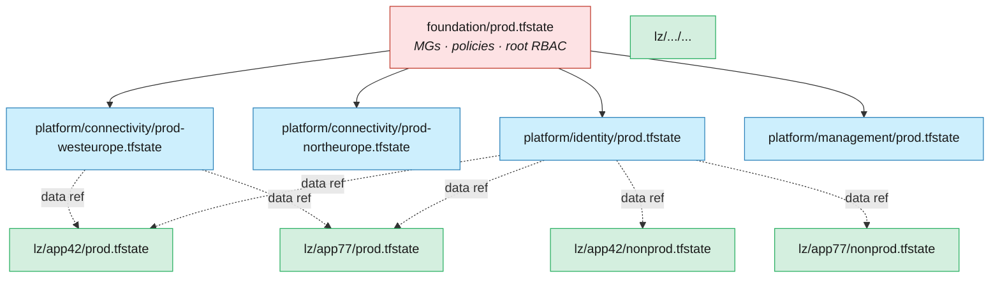

# 07 · State management

**In this chapter:**

- [How we got here](#how-we-got-here)
- [Decision framework](#decision-framework)
- [Terraform backend choice](#terraform-backend-choice)
- [Locking](#locking)
- [Blast radius — how to size state files](#blast-radius-how-to-size-state-files)
- [Cross‑state references](#crossstate-references)
- [State surgery — when you must](#state-surgery-when-you-must)
- [Bicep — Deployment Stacks](#bicep-deployment-stacks)
- [Drift detection](#drift-detection)
- [Anti‑patterns](#antipatterns)
- [References](#references)


> **Decision:** for Terraform, where does state live, how is it locked, and
> what is the blast radius of a single `apply`? For Bicep, the equivalent
> question is how you carve up Deployment Stacks.

[← 06 Security](06-security.md) · [Index](../README.md) · [08 CI/CD pipeline patterns →](08-cicd-pipelines.md)

Treat state topology as an operational safety control, not as a footnote. For Terraform, size state files to limit blast radius: use one Terraform state file per environment per workload, default to a remote backend with locking, and never share state between environments, never treat local state as harmless, and never let consumers read a producer's state just to get an output. For Azure‑native Terraform, your default backend should be Azure Storage with blob lease locking, private endpoints, customer‑managed keys (CMKs), role‑based access control (RBAC), and a dedicated state subscription; for production Bicep, the equivalent lifecycle boundary is a Deployment Stack with explicit scope, `denySettings`, and reviewed `actionOnUnmanage`. State is where Terraform keeps its map of the world — and historically where teams have kept their worst secrets, their most spectacular outages, and their longest Friday evenings — so the choices in this chapter are about operational safety as much as tool configuration.

---

## How we got here

To see why that operational framing matters, start with the earliest Terraform shops, which kept `terraform.tfstate` on the engineer's
laptop, occasionally emailing it around or — worse — committing it to
Git. Concurrent applies were "managed" by Slack message
(*"@everyone don't apply, I'm applying"*), and the inevitable
state‑file conflicts were resolved by hand‑merging JSON. Hashicorp
shipped **remote backends with locking** (S3 + DynamoDB; later
`azurerm` with blob leases) around 2017, which solved the concurrency
problem but introduced a new one: many teams pointed *every* environment
at the same backend and the same state file, producing a single
explosive `apply` whose blast radius was the whole estate. The
2018–2022 period was a slow lesson in **state granularity** — one state
per (workload × environment) — and in **state‑as‑a‑secret‑store**
hardening. Bicep deliberately avoided the question for years because Azure Resource Manager (ARM) was the source of truth, but customers kept asking for the *features* state provided: managed‑resource tracking, drift protection, and "what would removing this line do?" Microsoft's answer was **Deployment Stacks**, which reached general availability (GA) in 2024 and give you Terraform‑style guarantees with no state file to operate. Those histories now leave you with two related decisions: where Terraform state should live, and how Bicep stacks should draw their lifecycle boundary.

> 📘 **Key terms**
>
> **Remote backend** — a shared, network‑accessible location (e.g. Azure Blob Storage) where Terraform stores state, enabling locking and team collaboration.
>
> **Blob lease** — an Azure Storage locking mechanism that Terraform's `azurerm` backend uses to prevent two concurrent `apply` operations against the same state file.
>
> **State surgery** — manually editing Terraform state (via `terraform state mv`, `rm`, or `import`) to fix drift between state and reality without recreating resources.
>
> **`force-unlock`** — a Terraform command that manually releases a stuck state lock, typically needed after a runner crash during `apply`.
>
> **`denySettings`** — a Deployment Stacks property that prevents out‑of‑band changes to managed resources (e.g. `denyDelete` blocks manual deletions).
>
> **`actionOnUnmanage`** — a Deployment Stacks property that controls what happens to resources removed from the template: `deleteAll`, `detachAll`, or per‑type settings.
>
> **Azure Blueprints** — a now‑deprecated Azure governance service (sunset July 2026) that bundled ARM templates, policy assignments, role assignments, and resource groups into a versioned, assignable package. Superseded by Deployment Stacks.

---

## Decision framework

With that history and vocabulary in place, pick the state model by answering these questions in order. The first two
answers set the tool and storage model; the later answers reduce blast radius,
secret exposure, and lifecycle risk before any pipeline runs `apply`.

1. **Terraform or Bicep — which dictates the state model?**
   * Terraform → choose and harden a remote backend; state is an operator‑owned
     artifact.
   * Bicep → use Deployment Stacks for production lifecycle management; Azure
     owns the stack metadata.

2. **Which Terraform backend fits the operating model?**
   * Choose a backend that supports locking — no exceptions.
   * Azure‑native ALZ → `azurerm` backend in Azure Storage with blob lease
     locking is the recommended default.
   * Terraform Cloud / Enterprise → viable when you also want run UI, Sentinel,
     and dynamic provider credentials.
   * `s3` + DynamoDB → only when AWS is already part of the platform.
   * Local state → never for anything persistent or shared.

3. **How small should one state file be?**
   * Use one state per *(environment × workload)* as the default blast‑radius
     boundary; never one mega‑state for the estate.
   * Size by unit of deployment, not by repo or team.
   * A single `apply` should touch resources owned by one team and deployable in
     under 15 minutes.

4. **How do downstream stacks reference upstream state?**
   * Prefer explicit outputs published to App Configuration, tagged resource
     groups, or another controlled configuration store.
   * Use `terraform_remote_state` only when the consumer is trusted to read the
     producer's full state contents.
   * For Bicep, use `existing` lookups or the same explicit output store.

5. **For Bicep, are Deployment Stacks managing production lifecycle?**
   * Use stacks for lifecycle tracking, `denySettings`, `actionOnUnmanage`, and
     managed identity rotation.
   * Raw `az deployment` is acceptable for ephemeral PR environments, not for
     production landing zones.

6. **How is state secured?**
   * Treat state like a secret store: encrypted at rest with CMK, network
     isolated, access audited, humans elevated through PIM, and soft delete and
     versioning enabled.
   * Put Terraform state in a separate subscription, behind a private endpoint,
     encrypted with customer‑managed keys, and accessed through RBAC rather than
     shared keys.

Quick reference of the core choices:

| Decision | Recommended default | Why |
|----------|---------------------|-----|
| Terraform backend | Azure Storage `azurerm` backend | OIDC, blob lease locking, private endpoint, CMK, Azure RBAC. |
| Terraform granularity | One state per *(environment × workload)* | Limits corruption and bad‑apply blast radius. |
| Cross‑state references | Explicit outputs in App Configuration or tags | Avoids leaking producer state secrets to consumers. |
| Bicep lifecycle | Deployment Stacks for prod | Gives managed resource tracking, deny settings, and unmanage behaviour. |
| State security | Dedicated subscription + private endpoint + CMK + RBAC | Keeps the ledger outside the blast radius of the resources it manages. |

State is the **most operationally dangerous** part of Terraform. A corrupt state file at 2 a.m. on a Friday is a career‑defining moment, and the same principle applies to Bicep stacks: scope is blast radius. The full analysis starts with the Terraform backend because that is the first place you either contain or amplify every later risk.

---

## Terraform backend choice

Because the framework's first Terraform question is storage, start with the backend that gives you Azure‑native controls by default: for Azure Landing Zone (ALZ) implementations, use the Terraform `azurerm` backend in Azure Storage, and choose another backend only when its operating model is already part of your platform. The choice is not cosmetic; it determines locking behaviour, authentication options such as OpenID Connect (OIDC), network isolation, and whether your identity model carries through end to end.

| Backend | Recommendation |
|---------|----------------|
| `azurerm` (Azure Storage) | **Default for Azure‑native shops.** Supports OIDC, blob lease locking, CMK, private endpoint. |
| Terraform Cloud / Enterprise (HCP) | Strong if you also want run UI, Sentinel policy, and dynamic provider credentials. Costs money. |
| `s3` + DynamoDB | Only if you genuinely have AWS in the picture. |
| Local state | **Never.** Not even for dev. ¹ |

¹ *This is a strong stance — see the debate box below.*

> ⚖️ **The debate — local state in sandbox environments**
>
> "Never local state, not even for dev" is the safest blanket rule, but
> practitioners with personal sandbox subscriptions and aggressive
> auto‑cleanup policies (e.g. Azure subscription lifecycle management,
> nightly resource‑group purge) argue that remote state adds unnecessary
> ceremony for truly disposable, exploratory work. A more nuanced
> position: **remote state for anything that persists or is shared; local
> state is acceptable for isolated sandboxes with automatic teardown** —
> provided the team understands this is a *conscious* exception, not the
> default.

### Recommended `azurerm` backend setup

With that caveat out in the open, the Azure Storage pattern is deliberately boring: one **dedicated subscription** (`sub-tfstate-prod`) hosts state for everything. Inside it, use **one storage account per environment**, **one container per workload**, and **one blob (state file) per environment‑workload**.

```
sub-tfstate-prod/
├── rg-tfstate-prod
│   └── sttfstateprod001
│       ├── platform-connectivity-prod
│       │   └── terraform.tfstate
│       ├── platform-identity-prod
│       │   └── terraform.tfstate
│       ├── lz-corp-app01-prod
│       │   └── terraform.tfstate
│       └── ...
```

```hcl
terraform {
  backend "azurerm" {
    resource_group_name  = "rg-tfstate-prod"
    storage_account_name = "sttfstateprod001"
    container_name       = "platform-connectivity-prod"
    key                  = "terraform.tfstate"
    use_oidc             = true
    use_azuread_auth     = true
  }
}
```

Once the layout exists, harden the storage account as though it were a secret store, because in practice that is what Terraform state becomes:

- [ ] Public network access **disabled**, private endpoint only.
- [ ] **Microsoft Entra ID authentication** for blob (`use_azuread_auth = true`);
      shared‑key access disabled at the storage account level.
- [ ] **Customer‑managed key** (CMK) in a Key Vault you control.
- [ ] **Soft delete** for blobs and containers (≥ 30 days).
- [ ] **Versioning** enabled — `terraform.tfstate` versions are your
      "undo" button.
- [ ] **Diagnostic logs** to a Log Analytics workspace; alert on any
      access from outside the runner subnets.
- [ ] **RBAC**: only the deploy service principal (SPN) has
      `Storage Blob Data Contributor`; humans only via PIM with elevation alerts.

After the backend is isolated and recoverable, the next failure mode is concurrency: two runners trying to mutate the same ledger at once.

---

## Locking

Backend hardening protects the ledger from exposure and deletion, but locking protects it from concurrent writers. Blob lease locking is mandatory for Terraform, and you still need pipeline-level concurrency so two jobs never contend for the same state in the first place. The Terraform `azurerm` backend uses Azure Storage **blob leases** for this purpose, and the behaviour is simple enough that your pipeline contract can be explicit:

* Each `plan` / `apply` acquires a lease on the state blob.
* If a lease is held, other operations fail fast with the lock ID.
* If a runner crashes mid‑apply, the lease eventually expires (default 60s
  acquire retry) — but a manual `terraform force-unlock <ID>` is sometimes
  needed.

### Pipeline contract

* **Concurrency control** at the pipeline level (`concurrency: deploy-<env>`
  in GitHub Actions) so you never enqueue two `apply`s for the same state.
* If a job fails mid‑apply, the next job blocks on lock, alerts the team,
  and someone investigates *before* force‑unlocking.

Locking prevents the concurrent‑apply catastrophe. The complementary concern is the sheer amount of infrastructure a single apply can reach — which is entirely a function of how you carve your state files.

---

## Blast radius — how to size state files

Once locking ensures that only one writer touches the file, the next question is how much infrastructure that writer can affect. Keep state wide and shallow: a single `apply` should affect one team's resources, in one environment, and finish in under 15 minutes. Smaller state files reduce the blast radius of corruption or a bad apply, although they also increase the number of cross-state references you need to manage; the practical sweet spot is this:

| Layer | Recommended state granularity |
|-------|------------------------------|
| Foundation | One state per *environment* (prod, nonprod). |
| Platform — connectivity | One state per *environment × region* (one for `prod-westeurope`, one for `prod-northeurope`). |
| Platform — identity / mgmt | One state per *environment*. |
| Landing zone | One state per *(workload × environment)*. Never share. |

Visualised as a tree, a healthy state layout is wide and shallow — many
small files at the leaves, a handful at the root:


```mermaid
flowchart TB
    F["foundation/prod.tfstate<br/><i>MGs · policies · root RBAC</i>"]
    P1["platform/connectivity/prod-westeurope.tfstate"]
    P2["platform/connectivity/prod-northeurope.tfstate"]
    P3["platform/identity/prod.tfstate"]
    P4["platform/management/prod.tfstate"]
    L1["lz/app42/prod.tfstate"]
    L2["lz/app42/nonprod.tfstate"]
    L3["lz/app77/prod.tfstate"]
    L4["lz/app77/nonprod.tfstate"]
    L5["lz/.../..."]

    F --> P1 & P2 & P3 & P4
    P1 -. data ref .-> L1 & L3
    P3 -. data ref .-> L1 & L2 & L3 & L4

    classDef found fill:#fde2e4,stroke:#c0392b,color:#1a1a1a
    classDef plat  fill:#cdeffd,stroke:#2980b9,color:#1a1a1a
    classDef lz    fill:#d4efdf,stroke:#27ae60,color:#1a1a1a
    class F found
    class P1,P2,P3,P4 plat
    class L1,L2,L3,L4,L5 lz
```

The practical test is the same regardless of the tree shape: if a single `apply` no longer touches resources owned by one team, or if `plan` takes 20 minutes, your state is too big. At that point, split the file before the pipeline normalizes long plans and broad approvals as business as usual.

### Subscription vending — the three‑layer state model

When your estate vends (provisions) application landing zone subscriptions
at scale, a **three‑layer state architecture** prevents the common trap of
one giant state file managing hundreds of subscriptions:

| Layer | Scope | Storage | Owned by |
|-------|-------|---------|----------|
| **Platform** | Management groups, policies, hub networking | Dedicated storage account in the management subscription | Platform team |
| **Vending** | One state file per vended subscription — resource groups, baseline RBAC, VNet peering, tags | Separate storage account (or container per subscription) | Platform team (automated) |
| **Workload** | Application resources inside the vended subscription | App team's own storage account | Application team |

This separation means:

* A **bad vending apply** only corrupts one subscription's scaffold, not
  the entire estate.
* **Parallel deployments** — each subscription's state file is independent,
  so your CI pipeline can deploy 50 subscriptions concurrently.
* **Clear ownership** — the platform team owns layers 1–2; the app team owns
  layer 3. State permissions follow the same boundary.

For Bicep estates, the same principle applies via Deployment Stacks: one
stack per vended subscription, scoped at subscription level.

> 🎥 **From the ALZ Weekly Questions** — [Subscription Vending: Repo Structure, Security & Multi-Tenant](https://www.youtube.com/watch?v=11PmT0t6TUI)
> The three‑layer model also lets you use `git diff` in CI to build a matrix of changed subscriptions — only deploying what changed, not re‑planning the entire estate.

---

## Cross‑state references

The wide-and-shallow model only works if you resist the temptation to stitch the leaves back together through unrestricted state reads. Prefer explicit published outputs over direct state reads: `terraform_remote_state` is convenient, but it grants access to everything in the producer's state file. A common example is a workload stack that needs the hub virtual network ID, and you usually have two ways to provide it.

### A) `terraform_remote_state` data source

```hcl
data "terraform_remote_state" "connectivity" {
  backend = "azurerm"
  config = {
    resource_group_name  = "rg-tfstate-prod"
    storage_account_name = "sttfstateprod001"
    container_name       = "platform-connectivity-prod"
    key                  = "terraform.tfstate"
    use_oidc             = true
  }
}

resource "azurerm_virtual_network_peering" "to_hub" {
  remote_virtual_network_id = data.terraform_remote_state.connectivity.outputs.hub_vnet_id
  ...
}
```

**Pros:** simple, no extra infrastructure, real‑time.
**Cons:** the consumer needs **read access to the producer's state file** —
which contains all of the producer's secrets in cleartext.

### B) Outputs in Azure (recommended)

The producer writes its outputs to **Azure App Configuration** or **tagged
on a known resource group**:

```hcl
resource "azurerm_app_configuration_key" "hub_vnet_id" {
  configuration_store_id = data.azurerm_app_configuration.platform.id
  key                    = "platform/connectivity/hub-vnet-id/${var.env}"
  value                  = azurerm_virtual_network.hub.id
  label                  = var.env
}
```

The consumer reads via the same App Configuration:

```hcl
data "azurerm_app_configuration_key" "hub_vnet_id" {
  configuration_store_id = data.azurerm_app_configuration.platform.id
  key                    = "platform/connectivity/hub-vnet-id/${var.env}"
  label                  = var.env
}
```

**Pros:** consumers never see producer state. Outputs are first‑class,
versioned in App Configuration, with point‑in‑time history.
**Cons:** an extra component; subtle race if consumer reads before producer
publishes.

For Bicep, the equivalent is `existing` lookups or App Configuration / resource group (RG) tags — Bicep has no remote‑state concept by design.

Even the best‑designed topology will eventually require manual intervention — a resource renamed mid‑flight, an import needed for something created out‑of‑band, a module refactor that moved resources between states. That is what state surgery is for, and it deserves a ceremony proportionate to the risk.

---

## State surgery — when you must

Even with clean output contracts, you will eventually meet a resource that no longer lines up with the state file that owns it. Avoid state surgery unless there is no safer path; when you must perform it, use reviewed Terraform commands from a logged runner, back up the state first, and prove the post-surgery plan is clean. The operating rule is deliberately conservative:

1. **Always back up** the current state first:
   `terraform state pull > backup-$(date +%s).tfstate`
2. Use `terraform state mv` / `rm` / `import` rather than hand‑editing JSON.
3. Do it from a controlled runner, not your laptop, so the action is logged.
4. Open a PR with a `STATE-SURGERY.md` describing the why and the commands.
5. Run `plan` afterwards — it must show **no changes**, otherwise stop.

For the `import` workflow, prefer **HashiCorp Configuration Language (HCL) `import` blocks** (Terraform 1.5+) over the legacy CLI command because they are reviewable in a pull request.

```hcl
import {
  to = azurerm_resource_group.legacy
  id = "/subscriptions/.../resourceGroups/rg-legacy"
}
```

All of the above applies to Terraform. If you are working in Bicep, you have a different but equally powerful option — one that sidesteps the state problem altogether.

### Migrating state from CAF‑Enterprise‑Scale to AVM

That same controlled approach matters most if your estate was built on the classic Cloud Adoption Framework Enterprise-Scale (CAF-ES) module (`Azure/terraform-azurerm-caf-enterprise-scale`), because moving to Azure Verified Modules (AVM) changes state addresses as well as code. The ALZ team provides a **Golang state migration tool** that automates much of this:

1. **Phase 1 — Connectivity and management resources.** The tool reads your existing
   state, maps resource addresses from CAF‑ES module paths to AVM module paths, and
   generates Terraform `import` blocks. Resources like VNets, firewalls, Log Analytics
   workspaces, and ExpressRoute circuits move cleanly.
2. **Phase 2 — Management groups and policies.** The policy structure differs
   significantly between CAF‑ES and AVM. The tool produces an **issues CSV** listing
   resources that require manual review or re‑creation.

For that migration, the practical guidance is narrower than the tool's capabilities:

* The tool works from **any CAF‑ES version** — you don't have to be on the latest
  before migrating (though older versions produce more issues).
* **Only import resources you cannot easily delete and recreate** — ExpressRoute
  circuits, firewalls with live BGP sessions, DNS zones with active records. For
  management groups and policies, a clean re‑deploy with Deployment Stacks handling
  the cutover is often simpler.
* The accelerator generates a starting Terraform configuration with migration
  comments showing where to add `import` blocks.
* The migration tool is **reusable** beyond ALZ — it can restructure any Terraform
  state file by mapping old module addresses to new ones.

> 🎥 **From the ALZ Weekly Questions** — [Migrating from CAF-Enterprise-Scale to AVM](https://www.youtube.com/watch?v=DSBWjQlVpSs)
> Think of migration as resource mapping → attribute mapping → `terraform apply` with import blocks. The tool handles the first two steps; you review and apply.

---

## Bicep — Deployment Stacks

Terraform needs a hardened state backend because the state file is yours to operate; Bicep takes the opposite route by letting Azure keep the lifecycle metadata. For production Bicep ALZ deployments, use Deployment Stacks, and reserve raw deployments for disposable environments where lifecycle protection is not required. Deployment Stacks give you the state-like benefits that raw `az deployment` lacks:

* A stack tracks the resources it deployed.
* `denySettings` blocks out‑of‑band modifications (`denyDelete` or
  `denyWriteAndDelete`).
* `actionOnUnmanage` controls what happens to resources removed from the
  template (`detach`, `delete`, or `deleteAll`).

Because stacks are the lifecycle boundary, carve them the same way you'd carve Terraform state — one stack per (workload × environment), scoped at subscription or resource group.

```bash
az stack sub create \
  --name lz-corp-app01-prod \
  --location swedencentral \
  --template-file main.bicep \
  --parameters @prod.bicepparam \
  --deny-settings-mode denyWriteAndDelete \
  --deny-settings-excluded-actions "Microsoft.Compute/virtualMachines/start/action" \
  --action-on-unmanage deleteAll
```

The tradeoff against raw `az deployment` is straightforward: stacks are slower to create, but they are vastly safer for production, while raw deployments remain fine for ephemeral pull request (PR) environments. That distinction matters most after deployment, where lifecycle tracking starts paying you back.

A key Day‑2 benefit: when the ALZ library removes a deprecated policy
assignment, the Deployment Stack's `actionOnUnmanage: deleteAll` setting
**automatically cleans up the orphaned assignment** — no manual intervention
required. This closes a gap that previously made Bicep ALZ harder to
maintain than Terraform ALZ for policy lifecycle management.

> 🎥 **From the ALZ Weekly Questions** — [How to Stay Current with ALZ Azure Policies](https://www.youtube.com/watch?v=ddcVKS_MKkk)
> Deployment Stacks gave Bicep ALZ automatic cleanup of deprecated policies — matching what Terraform achieves through state tracking.

> ⚖️ **The debate — are Deployment Stacks production‑ready at scale?**
>
> Deployment Stacks GA'd in late 2024 and are maturing rapidly, but the
> community has less collective operational experience with them than
> with Terraform state, which has a decade of battle scars.
>
> **Concerns from practitioners:** `what-if` for stacks is still in
> preview (as of early 2026) and less reliable than `terraform plan`.
> Tooling around stacks — refactoring, automated drift detection, import
> of existing resources — is thinner than Terraform's mature ecosystem
> (Spacelift, Env0, state‑mv, etc.). Teams running early production
> stacks have reported edge cases with complex resource dependencies and
> `denySettings` interactions that are not yet well‑documented. Migration
> from Blueprints is documented but not extensively battle‑tested by the
> community.
>
> **The optimistic view:** Stacks remove an *entire category* of
> operational pain (state corruption, lock contention, backend
> availability). Microsoft is investing heavily, and the feature set is
> advancing quickly. For new Bicep estates, stacks are the obvious
> default; the rough edges are real but narrowing.
>
> For greenfield Bicep estates, Deployment Stacks are the right bet. If you're evaluating a migration *from* Terraform specifically to avoid state, make sure you're gaining more than you're giving up in ecosystem maturity, and test thoroughly in non‑prod before trusting `denySettings` with your production estate.

### Deployment Stacks vs Azure Blueprints (deprecated)

Teams migrating from **Azure Blueprints** (deprecated July 2026) will
recognise the ambition: both aim to deploy a *set* of resources as a
governed unit with lifecycle tracking and policy enforcement. The
execution is very different.

| Capability | Azure Blueprints | Deployment Stacks |
|------------|-----------------|-------------------|
| **Status** | Deprecated (July 2026) | GA (2024) |
| **Scope** | Management group or subscription | Management group, subscription, or resource group |
| **Template language** | ARM JSON only | Bicep or ARM JSON |
| **Versioning** | Built‑in (draft → published → assigned) | External — you version the template in Git; the stack always applies the latest |
| **Drift protection** | Resource locks applied per‑artefact | `denySettings` at the ARM layer — more granular, supports excluded principals and actions |
| **Unmanage behaviour** | Resources orphaned on blueprint deletion | Configurable via `actionOnUnmanage`: delete, detach, or per‑type |
| **Policy / role bundling** | Blueprints could assign policies and roles as artefacts | Stacks deploy whatever the template contains — policies and roles are just resources |
| **Sequencing** | Built‑in artefact sequencing | Template‑level `dependsOn` (standard ARM/Bicep) |
| **What-if / plan** | No | `az stack … --what-if` (preview) |
| **State storage** | Azure‑managed (opaque) | Azure‑managed (opaque) — same model, better transparency |

Blueprints were right about one important idea: a landing zone is a *governed package*, not just resources but also policies, roles, and locks deployed as a single unit with lifecycle tracking. That concept survives in Stacks.

Where Blueprints failed was execution: they were coupled to ARM JSON, used an opaque versioning system disconnected from Git, offered no real plan/what‑if experience, and never reached enough adoption to justify continued investment.

The migration path is therefore conceptual rather than mechanical: replace each Blueprint assignment with a Deployment Stack whose Bicep template reproduces the same resources, policy assignments, and role assignments. The `denySettings` property replaces Blueprint locks, Git versioning replaces the built‑in draft/published workflow, and Microsoft's [migration guide](https://learn.microsoft.com/azure/governance/blueprints/concepts/deployment-stacks-migration) gives you the detailed steps.

Once stacks replace Blueprints or raw deployments, the remaining operational question is the same one Terraform asks every week: has reality drifted from the declared model?

---

## Drift detection

After you have defined state files or stacks, you need scheduled proof that reality still matches them; absence of drift must be verified, not assumed. Run a weekly scheduled `plan` for every Terraform state file, or `what‑if` for every Bicep stack:

* Empty diff → all green.
* Non‑empty diff → post to a "platform drift" Teams channel; create an
  issue; require triage within an SLA.

For Bicep stacks with `denySettings`, drift should be impossible by construction, but human break‑glass paths and excluded actions exist, so you still verify and route the full operational process through [11 manageability](11-manageability.md).

The anti‑patterns below are the architectural choices most likely to turn a controlled `apply` into an all‑hands incident.

---

## Anti‑patterns

The anti-patterns are familiar now because each one reverses a safety property the chapter has been building toward: they expand blast radius, weaken locking, or expose secrets before the first production apply.

* ❌ **One state file for the whole estate.** "Apply" becomes a ritual,
  changes pile up, and one mistake breaks everything.
* ❌ **Local state on engineer laptops.** Even in dev. Especially in dev.
* ❌ **State backend in the same subscription as the resources it
  manages.** A bad `apply` could nuke the storage account holding the
  state. Put state in its own subscription.
* ❌ **Sharing state files across teams via `terraform_remote_state`
  without realising it leaks all producer secrets.** Use App Configuration
  outputs instead.
* ❌ **Editing state files by hand.** Even with `jq`. There is no
  validation; one typo and the state is unrecoverable.
* ❌ **Bicep deployments without stacks for prod.** You lose drift
  protection.

State — or its Bicep equivalent — is the operational ledger for your entire Azure estate. The decisions in this chapter determine whether that ledger is a reliable audit trail or a liability waiting to ruin someone's weekend. A granular, hardened, properly‑referenced state topology is also the prerequisite for the CI/CD pipeline patterns in the next chapter: once you know exactly what each apply touches and why it is safe to run concurrently, designing the pipeline around it becomes considerably more straightforward.

---

## References

* Hashicorp, *Backend configuration*:
  <https://developer.hashicorp.com/terraform/language/settings/backends/azurerm>
* Hashicorp, *State*:
  <https://developer.hashicorp.com/terraform/language/state>
* Microsoft, *Deployment stacks*:
  <https://learn.microsoft.com/azure/azure-resource-manager/bicep/deployment-stacks>
* Microsoft, *Migrate from Blueprints to Deployment Stacks*:
  <https://learn.microsoft.com/azure/governance/blueprints/concepts/deployment-stacks-migration>
* Microsoft, *Azure Blueprints deprecation*:
  <https://learn.microsoft.com/azure/governance/blueprints/overview>
* Microsoft, *Storage account security baseline*:
  <https://learn.microsoft.com/security/benchmark/azure/baselines/storage-security-baseline>
* Hashicorp, *`import` blocks*:
  <https://developer.hashicorp.com/terraform/language/import>
* 🎥 ALZ Weekly — *Subscription Vending: Repo Structure, Security & Multi-Tenant*:
  <https://www.youtube.com/watch?v=11PmT0t6TUI>
* 🎥 ALZ Weekly — *Migrating from CAF-Enterprise-Scale to AVM*:
  <https://www.youtube.com/watch?v=DSBWjQlVpSs>
* 🎥 ALZ Weekly — *How to Stay Current with ALZ Azure Policies*:
  <https://www.youtube.com/watch?v=ddcVKS_MKkk>

---

[← 06 Security](06-security.md) · [Index](../README.md) · [08 CI/CD pipeline patterns →](08-cicd-pipelines.md)
