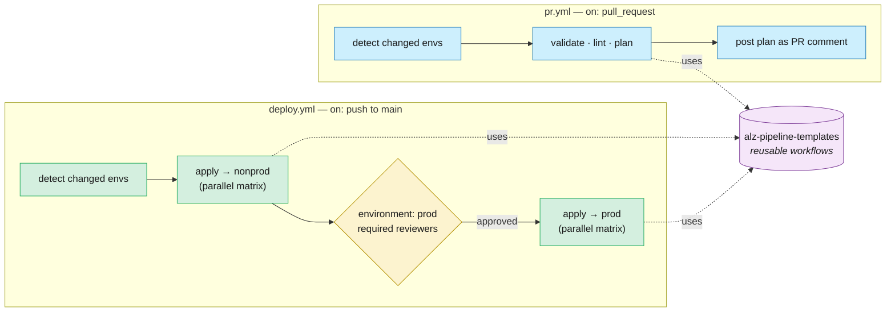

# 08 · CI/CD pipeline patterns

**In this chapter:**

- [How we got here](#how-we-got-here)
- [Decision framework](#decision-framework)
- [GitHub Actions vs Azure DevOps Pipelines](#github-actions-vs-azure-devops-pipelines)
- [The standard two‑workflow shape](#the-standard-twoworkflow-shape)
- [Reusable workflow (the actual work)](#reusable-workflow-the-actual-work)
- [PR comments that are actually useful](#pr-comments-that-are-actually-useful)
- [Detecting changed environments](#detecting-changed-environments)
- [Pipeline‑as‑code, but DRY](#pipelineascode-but-dry)
- [Long‑running operations & retry](#longrunning-operations-retry)
- [Manual operations & the "break glass" pipeline](#manual-operations-the-break-glass-pipeline)
- [Caching and runtime](#caching-and-runtime)
- [Anti‑patterns](#antipatterns)
- [References](#references)


> **Decision:** what does the workflow that turns a commit into a deployed
> Azure resource look like — and how do you keep it consistent across many
> repos?

[← 07 State management](07-state-management.md) · [Index](../README.md) · [09 Testing & policy →](09-testing-and-policy.md)

**Recommendation in one paragraph.** Standardise on a two‑workflow CI/CD
shape for ALZ IaC: every pull request runs validation and plan, every merge
to `main` deploys through environment gates, and both workflows delegate the
real work to reusable pipeline templates. Pick GitHub Actions or Azure DevOps
Pipelines based on where your code, identity federation, network egress, and
audit controls already work — both are first‑class Azure deployment platforms
in 2026. Add path‑based change detection, readable PR plan comments,
idempotent retry, audited break‑glass workflows, and targeted caching so the
pipeline catches bad infrastructure changes before they reach production
instead of becoming a fragile script held together with `sleep 30`.

---

## How we got here

The ALZ pipeline consensus landed on reusable workflows, ephemeral runners,
and OIDC because every earlier generation of hand‑built deploy jobs drifted,
leaked state, or hid change history.

Early infrastructure pipelines were **Jenkins freestyle jobs** with the
Terraform commands pasted into a textbox; the pipeline definition lived
in the Jenkins UI, not in Git, so reviewing a deploy meant taking a
screenshot. The "pipeline‑as‑code" movement (Jenkinsfile in 2016, then
Travis/CircleCI YAML, then Azure Pipelines YAML in 2019, then GitHub
Actions in late 2019) finally put deploy logic into version control —
but every repo copy‑pasted the same workflow, and within a year the
copies had drifted. **Reusable workflows** (GitHub Actions, 2021) and
**YAML templates with `extends:`** (Azure DevOps) gave central platform
teams a way to own the pipeline once and have every consumer stay in
sync. Around the same time, the GitOps community pushed the idea of
**ephemeral, short‑lived runners** — and after a string of self‑hosted
runner compromises in 2022–2024, that became the security baseline. The
patterns in this chapter assume reusable workflows, ephemeral runners,
and OIDC auth — the consensus shape of an IaC pipeline in 2026. Before
getting into those patterns, one question needs settling: which platform?

> 📘 **Key terms**
>
> **Pipeline‑as‑code** — defining your CI/CD pipeline in a version‑controlled file (e.g. `.github/workflows/*.yml`, `azure-pipelines.yml`) rather than a GUI, so it is reviewable, auditable, and versionable alongside the code it deploys.
>
> **Reusable workflows** — GitHub Actions feature (`workflow_call`) that lets you define a workflow once in a central repository and call it from many consumer repos, keeping pipeline logic DRY.
>
> **Matrix builds** — a CI/CD pattern that spawns parallel jobs for each entry in a list (e.g. one job per environment or workload), so changes to many targets are validated concurrently.
>
> **Ephemeral runners** — CI/CD build agents that are created for a single job and destroyed afterward, eliminating the risk of credential leakage or cross‑job contamination.
>
> **`workflow_dispatch`** — a GitHub Actions trigger that allows manually starting a workflow from the UI or API, typically used for break‑glass operations.
>
> **Idempotent** — a property meaning that running the same operation multiple times produces the same result as running it once. Critical for `apply` retries: re‑applying the same plan should not create duplicate resources.
>
> **DX (Developer Experience)** — the overall quality of the tooling, documentation, and workflows from a developer's perspective.

---

## Decision framework

Use this sequence to turn pipeline design into explicit choices instead of
inherited YAML. The recommended default is GitHub Actions or Azure DevOps
Pipelines where your estate already operates, a PR‑plan plus main‑merge deploy
shape, reusable definitions, path‑filtered matrices, readable PR plan comments,
and a gated break‑glass workflow.

1. **GitHub Actions or Azure DevOps Pipelines?**
   * Pick the platform your IdP federation, private network egress, runner
     model, and audit story already support.
   * If the code already lives on github.com, default to GitHub Actions; if it
     lives on dev.azure.com, default to Azure DevOps Pipelines.
   * Do not run both unless a hard compliance, hosting, or migration constraint
     justifies the extra syntax and operations burden.

2. **What is your standard workflow shape?**
   * Recommended: one PR‑triggered workflow that validates and plans, plus one
     `main`‑merge workflow that deploys through environment gates.
   * Treat production approval as an environment control, not an ad‑hoc prompt
     inside a shell script.

3. **How do you keep CI definitions DRY?**
   * Use reusable workflows, Azure Pipelines templates, and composite actions so
     the platform team fixes the pipeline once.
   * Version shared pipeline contracts and roll updates through Renovate or
     Dependabot instead of editing dozens of repos manually.

4. **How do you detect which environments to plan or apply on each change?**
   * Use path filters plus a generated matrix so each changed environment,
     workload, or subscription is planned independently.
   * Maintain a module‑to‑consumer map so shared module changes trigger every
     affected environment.

5. **How do you surface plan output?**
   * Post a PR comment with a summary table, highlighted destructive changes,
     and a collapsed full diff.
   * Make the reviewer answer "what will change?" without downloading artifacts
     or reading raw terminal logs.

6. **Do you need a break‑glass or manual pipeline for incidents?**
   * Yes — build it deliberately with `workflow_dispatch`, constrained inputs,
     protected environments, required reviewers, and audit notifications.
   * A gated manual workflow is safer than engineers running Terraform locally
     against production state.

The deep sections below show the implementation details behind each answer.

---

## GitHub Actions vs Azure DevOps Pipelines

**Verdict:** both GitHub Actions and Azure DevOps Pipelines can deploy Azure
Landing Zones well, so choose the platform your source control, identity
federation, network egress, and audit controls already make reliable.

Compare the platforms on these criteria:

| Factor | GitHub Actions | Azure DevOps Pipelines |
|--------|----------------|------------------------|
| Already there | Yes if code is on github.com | Yes if code is on dev.azure.com |
| OIDC to Azure | Mature, simple | Mature ("Workload identity federation") |
| Reusable workflow / template DX | `workflow_call`, composite actions | YAML templates, extends |
| Marketplace ecosystem | Larger (Actions Marketplace) | Smaller |
| Approval gates / environments | GitHub Environments | Environments + approvals |
| Cost | Generous free + per‑minute | Per‑user + per‑pipeline minute |
| Secret store integration | OIDC + Key Vault works well | Variable groups + Key Vault native |

**Recommendation:** wherever the *code* lives. Don't mix unless you have a
strong reason — the cognitive overhead of two pipeline syntaxes outweighs
any feature delta.

The patterns below are illustrated with **GitHub Actions**; the same shape
works in ADO. Whichever you choose, the anatomy is the same — and it fits
in two files.

---

## The standard two‑workflow shape

**Verdict:** every IaC repo should expose a PR validation workflow and a
main‑branch deploy workflow, with environment gates separating non‑prod from
prod.

Each repo should have exactly two workflows: one that runs on every
PR to *prove* the change is safe, and one that runs after merge to
*apply* it. Both delegate the actual work to a shared reusable workflow,
so the per‑repo files stay short and consistent.



Plus shared **reusable workflows** in a central repo (e.g. `alz-pipeline-templates`).

### `pr.yml` (validation)

```yaml
name: PR validation

on:
  pull_request:
    branches: [main]

permissions:
  contents: read
  id-token: write
  pull-requests: write   # to post the plan as a PR comment

concurrency:
  group: pr-${{ github.event.number }}
  cancel-in-progress: true

jobs:
  detect:
    # Detect which envs/workloads changed → matrix output
    runs-on: ubuntu-latest
    outputs:
      changed: ${{ steps.detect.outputs.changed }}
    steps:
      - uses: actions/checkout@<sha>
        with: { fetch-depth: 0 }
      - id: detect
        run: ./scripts/detect-changed-envs.sh >> $GITHUB_OUTPUT

  validate:
    needs: detect
    if: needs.detect.outputs.changed != '[]'
    strategy:
      fail-fast: false
      matrix:
        target: ${{ fromJson(needs.detect.outputs.changed) }}
    uses: contoso/alz-pipeline-templates/.github/workflows/tf-validate.yml@v2
    with:
      working-directory: envs/${{ matrix.target }}
    secrets: inherit
```

### `deploy.yml` (apply)

```yaml
name: Deploy

on:
  push:
    branches: [main]
  workflow_dispatch:

permissions:
  contents: read
  id-token: write

concurrency:
  group: deploy-${{ github.ref }}
  cancel-in-progress: false   # never cancel an in-flight apply

jobs:
  detect:
    runs-on: ubuntu-latest
    outputs:
      changed: ${{ steps.detect.outputs.changed }}
    steps:
      - uses: actions/checkout@<sha>
        with: { fetch-depth: 0 }
      - id: detect
        run: ./scripts/detect-changed-envs.sh >> $GITHUB_OUTPUT

  nonprod:
    needs: detect
    strategy:
      max-parallel: 4
      matrix:
        target: ${{ fromJson(needs.detect.outputs.changed) }}
    uses: contoso/alz-pipeline-templates/.github/workflows/tf-apply.yml@v2
    with:
      working-directory: envs/nonprod/${{ matrix.target }}
      environment: nonprod
    secrets: inherit

  prod:
    needs: nonprod
    strategy:
      max-parallel: 4
      matrix:
        target: ${{ fromJson(needs.detect.outputs.changed) }}
    uses: contoso/alz-pipeline-templates/.github/workflows/tf-apply.yml@v2
    with:
      working-directory: envs/prod/${{ matrix.target }}
      environment: prod    # ← reviewers configured here
    secrets: inherit
```

The **GitHub Environment `prod`** has:

* Required reviewers (e.g. 2 from the platform team).
* A **wait timer** (e.g. 10 minutes) so a "ship it" can be aborted.
* **Deployment branches** restricted to `main`.
* The **OIDC client‑id `vars`** for the prod SPN.

---

## Reusable workflow (the actual work)

**Verdict:** put the Terraform or Bicep mechanics in a reusable workflow so
every repo calls the same tested deploy contract.

The reusable workflow is the single source of truth — every repo calls these.

`alz-pipeline-templates/.github/workflows/tf-apply.yml`:

```yaml
on:
  workflow_call:
    inputs:
      working-directory: { required: true, type: string }
      environment:       { required: true, type: string }

jobs:
  apply:
    runs-on: ubuntu-latest
    environment: ${{ inputs.environment }}
    defaults: { run: { working-directory: ${{ inputs.working-directory }} } }
    steps:
      - uses: actions/checkout@<sha>
        with: { persist-credentials: false }

      - uses: hashicorp/setup-terraform@<sha>
        with: { terraform_version: 1.9.5 }

      - uses: azure/login@<sha>
        with:
          client-id:       ${{ vars.AZURE_CLIENT_ID }}
          tenant-id:       ${{ vars.AZURE_TENANT_ID }}
          subscription-id: ${{ vars.AZURE_SUBSCRIPTION_ID }}

      - run: terraform init -input=false
      - run: terraform plan -input=false -out=tfplan -var-file=terraform.tfvars
      - run: terraform apply -input=false -auto-approve tfplan
      - if: failure()
        run: |
          gh issue create --title "Apply failed: ${{ inputs.working-directory }}" \
                          --body "${{ github.server_url }}/${{ github.repository }}/actions/runs/${{ github.run_id }}"
        env:
          GH_TOKEN: ${{ secrets.GITHUB_TOKEN }}
```

A matching `tf-validate.yml` does `init`, `validate`, `plan`, `tflint`,
`tfsec`/`checkov`, and posts the plan to the PR.

---

## PR comments that are actually useful

**Verdict:** the plan comment should summarize risk first and hide raw detail
behind an expandable section.

Plan output dumped raw into a comment is unreadable. Format it:

* **Collapsed `<details>` block** with the full plan inside.
* A **summary table** at the top: `+ N to add · ~ M to change · - K to
  destroy`.
* **Highlight destructive changes** in bold.
* For Bicep, post the `what-if` output similarly — use `--result-format` to
  get JSON, then render to markdown.

Use the `hashicorp/setup-terraform` Action's built-in PR comment mechanism,
or roll your own with `actions/github-script`.

A readable plan comment is half the story. The other half is making sure the pipeline only plans the things that actually changed — which is where the detect script earns its keep.

---

## Detecting changed environments

**Verdict:** use git diff, path filters, and a matrix so the pipeline plans or
applies only the environments affected by a change.

The detect script is the bit that makes a layered repo scale:

```bash
#!/usr/bin/env bash
# scripts/detect-changed-envs.sh
set -euo pipefail
base="${GITHUB_BASE_REF:-main}"
git fetch origin "$base" --depth=1
changed_dirs=$(git diff --name-only "origin/$base"...HEAD \
  | grep '^envs/' \
  | awk -F/ '{print $2"/"$3}' \
  | sort -u)
json=$(printf '%s\n' "$changed_dirs" | jq -R . | jq -s -c .)
echo "changed=${json:-[]}"
```

This produces `["nonprod/connectivity","prod/identity"]` and the matrix
explodes it into parallel jobs. Touched modules trigger plan runs in
**every** consumer environment of that module — implement that with a
module‑to‑consumer map maintained in the repo.

### Scaling to subscription vending — the git‑diff matrix pattern

When your repo vends application landing zone subscriptions (see
[01 Repository topology — subscription vending](01-repository-topology.md#subscription-vending-repo-structure-at-scale)),
the same detect‑and‑matrix pattern scales to hundreds of subscriptions:

1. Each vended subscription has a config file (`.tfvars` or `.bicepparam`)
   in a flat or shallow directory structure (e.g. `subscriptions/app01-prod/`).
2. The `detect-changed-envs.sh` script (or equivalent) uses `git diff` to
   identify which subscription directories changed.
3. The pipeline builds a **matrix** from the changed set and deploys each
   subscription independently and in parallel — not a sequential mega‑apply.

```yaml
# GitHub Actions example — subscription vending matrix
jobs:
  detect:
    runs-on: ubuntu-latest
    outputs:
      subscriptions: ${{ steps.detect.outputs.changed }}
    steps:
      - uses: actions/checkout@v4
        with: { fetch-depth: 0 }
      - id: detect
        run: |
          changed=$(git diff --name-only origin/main...HEAD \
            | grep '^subscriptions/' \
            | awk -F/ '{print $2}' | sort -u \
            | jq -R . | jq -s -c .)
          echo "changed=${changed}" >> "$GITHUB_OUTPUT"

  deploy:
    needs: detect
    if: needs.detect.outputs.subscriptions != '[]'
    strategy:
      matrix:
        subscription: ${{ fromJson(needs.detect.outputs.subscriptions) }}
      max-parallel: 10
    runs-on: ubuntu-latest
    steps:
      - run: echo "Deploying ${{ matrix.subscription }}"
      # ... terraform plan/apply scoped to this subscription
```

This ensures that adding a new subscription is a **single config file** —
the pipeline discovers it automatically.

> 🎥 **From the ALZ Weekly Questions** — [Subscription Vending: Repo Structure, Security & Multi-Tenant](https://www.youtube.com/watch?v=11PmT0t6TUI)
> The git‑diff matrix pattern is the recommended CI/CD approach for subscription vending. It avoids pipeline timeouts and allows 10+ parallel deployments.

Detection gives you scale; the next challenge is keeping a growing fleet of repos from drifting apart.

---

## Pipeline‑as‑code, but DRY

**Verdict:** centralize pipeline logic and version it, because per‑repo YAML
copies diverge faster than platform teams can review them.

Patterns to keep many repos consistent:

* **Reusable workflows** (`workflow_call`) — call the same job from many
  repos, versioned by tag (`@v2`).
* **Composite actions** for short, repo‑agnostic snippets (e.g. "post plan
  to PR").
* **Org‑wide required workflows** — GitHub lets you enforce that a workflow
  *must* run on every PR in selected repos. Use this for policy/security
  checks you can't allow to be removed.
* **Renovate** / Dependabot to bump the pinned `@vX.Y.Z` references in
  every consumer when you ship a new template version.

Keeping workflows DRY solves the consistency problem. The next challenge is reliability: Azure is eventually consistent, and some operations simply fail on first attempt.

---

## Long‑running operations & retry

**Verdict:** retry only idempotent, known‑flaky operations and encode
service‑specific waits where the service knowledge belongs.

Some Azure operations are flaky (Key Vault soft‑delete naming, AAD
propagation, role assignment lag). Don't paper over with `sleep 30`:

* In Terraform, use `time_sleep` only as a last resort; prefer
  `null_resource` with `local-exec` that polls the desired state.
* Implement **idempotent retry** at the pipeline step level —
  `nick-fields/retry` action with `max_attempts: 3` for known‑flaky steps.
* Bake bug‑specific waits into modules (with comments linking to the
  upstream issue) rather than at the pipeline level — the module is where
  the knowledge belongs.

---

## Manual operations & the "break glass" pipeline

**Verdict:** provide a manual break‑glass path, but make it more constrained,
observable, and auditable than the normal deploy path.

You will need it. Build one consciously:

* `workflow_dispatch` workflow with **inputs**: target environment, target
  workload, action (`plan` / `apply` / `import` / `destroy`).
* Restricted to a small group via the `environment: break-glass` (with two
  reviewers).
* Logs everything; posts a notification to a security channel automatically.

This is far better than engineers running Terraform locally against
production state.

With the operational edge cases handled, there are some cheap wins on raw speed that cost almost nothing to add.

---

## Caching and runtime

**Verdict:** cache only deterministic tool artifacts and spend on larger runners
when `init` and `plan` time dominates review feedback.

A few cheap wins:

* Cache `~/.terraform.d/plugin-cache` and the `.terraform` provider
  directory across runs.
* Use `setup-terraform` with `terraform_wrapper: false` if you parse the
  plan output yourself — the wrapper truncates large outputs.
* For Bicep, cache the compiled JSON between `pr` and `deploy` workflows
  via `actions/cache` keyed on the file SHA.
* Larger runners pay for themselves on `init` heavy plans (more network
  bandwidth, more CPU for `plan`).

---

## Anti‑patterns

**Verdict:** avoid any shortcut that hides deploy risk, forks the shared
pipeline contract, or turns automation back into a manual handoff.

* ❌ **Per‑repo, hand‑rolled workflows.** They diverge within a quarter.
  Use reusable workflows.
* ❌ **`apply` without an explicit `plan` artifact** — what got applied is
  not necessarily what was reviewed.
* ❌ **`continue-on-error: true`** to "make the build green" while
  investigating. Fix or skip; never silently swallow.
* ❌ **Pipelines that need a human to copy a value between steps.** That's
  not automation, that's a Slack thread.
* ❌ **Using `cancel-in-progress: true` on the deploy concurrency group.**
  An in‑flight `apply` should always finish; cancellation can corrupt state.
* ❌ **One pipeline that deploys all environments serially in one run.**
  Use environment gates between non‑prod and prod, not a long script.

The patterns in this chapter give the pipeline its shape. What that pipeline *validates* — the static checks, policy assertions, and integration tests — is the subject of the next chapter. A fast, well-structured pipeline running weak checks still lets bad changes through; what you run inside the workflow matters as much as how the workflow is arranged.

---

## References

These references support the reusable workflow, environment gate, template, and
Terraform automation patterns recommended above.

* GitHub, *Reusable workflows*:
  <https://docs.github.com/actions/using-workflows/reusing-workflows>
* GitHub, *Required workflows*:
  <https://docs.github.com/actions/using-workflows/required-workflows>
* GitHub, *Environments*:
  <https://docs.github.com/actions/deployment/targeting-different-environments/using-environments-for-deployment>
* Azure DevOps, *YAML templates*:
  <https://learn.microsoft.com/azure/devops/pipelines/process/templates>
* Hashicorp, *Run Terraform in CI*:
  <https://developer.hashicorp.com/terraform/tutorials/automation/automate-terraform>
* 🎥 ALZ Weekly — *Subscription Vending: Repo Structure, Security & Multi-Tenant*:
  <https://www.youtube.com/watch?v=11PmT0t6TUI>

---

[← 07 State management](07-state-management.md) · [Index](../README.md) · [09 Testing & policy →](09-testing-and-policy.md)
