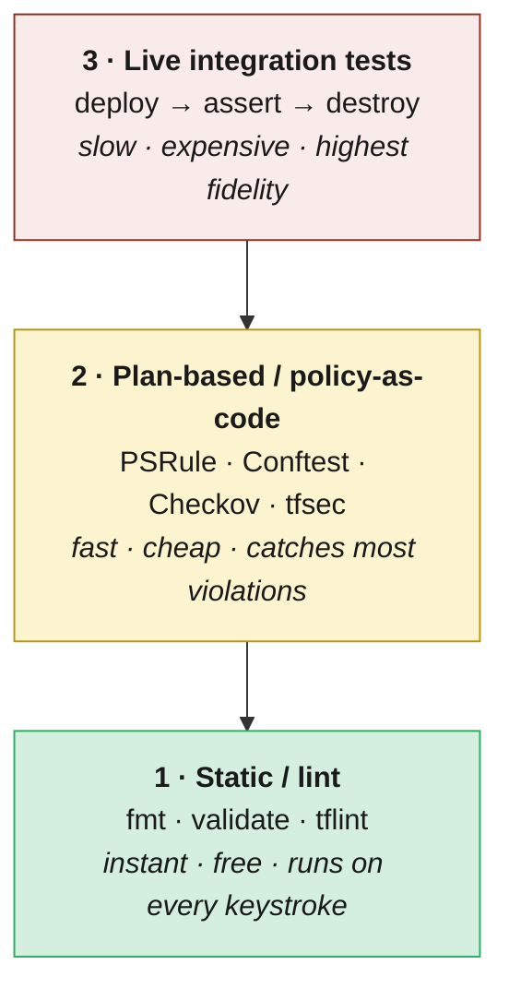

# 09 · Testing, validation & policy‑as‑code

**In this chapter:**

- [How we got here](#how-we-got-here)
- [The testing pyramid for IaC](#the-testing-pyramid-for-iac)
- [Layer 1 — Static checks (every commit)](#layer-1-static-checks-every-commit)
- [Layer 2 — Policy‑as‑code on the plan](#layer-2-policyascode-on-the-plan)
- [Layer 3 — Live integration tests](#layer-3-live-integration-tests)
- [Policy‑as‑code vs Azure Policy](#policyascode-vs-azure-policy)
- [Test coverage targets](#test-coverage-targets)
- [Anti‑patterns](#antipatterns)
- [References](#references)


> **Decision:** what automated checks block a PR, and what's the contract
> between platform and application teams expressed as policy?

[← 08 CI/CD pipeline patterns](08-cicd-pipelines.md) · [Index](../README.md) · [10 Code quality →](10-code-quality.md)

A pipeline that merely runs `terraform apply` is a deployment button, not a quality gate. What separates a mature IaC workflow from a fragile one is everything that happens *before* the apply: the linting that catches silly mistakes, the policy check that enforces enterprise rules, and the integration test that proves the module actually works. This chapter maps out that defence-in-depth pyramid and explains where each layer pays its way.

---

## How we got here

For most of Terraform's first decade, "testing" meant *running `terraform
plan` and squinting at the diff*. The brave wrote shell scripts that
ran `apply`, hit a few endpoints with `curl`, then `destroy`d everything
— a category formalised in 2018 as **Terratest** (Gruntwork's Go
library). It worked, but writing infrastructure tests in Go was a steep
ask for ops teams, and Kitchen‑Terraform never quite caught on. The
**policy‑as‑code** movement, born from HashiCorp's Sentinel and
generalised by **Open Policy Agent** (CNCF, 2018), shifted the centre of
gravity: instead of *running* the deploy and checking the result, *parse
the plan and reject bad ones* before they touched Azure. Microsoft's
**PSRule for Azure** (2020) brought hundreds of WAF‑aligned rules out of
the box, while Bridgecrew's **Checkov** (2019) and Aqua's **tfsec**
(2019) made multi‑cloud scanning trivial. Native **`terraform test`**
finally landed in Terraform 1.6 (October 2023), making real integration
testing accessible to anyone who could write HCL. The result: the modern
IaC pipeline is a **defence‑in‑depth pyramid** — static linting, plan‑
time policy, integration tests on modules, and runtime Azure Policy as
the safety net. Here is what that pyramid looks like in practice, and
where each layer belongs.

> 📘 **Key terms**
>
> **Policy‑as‑code** — expressing governance rules (naming, allowed SKUs, required tags) in version‑controlled code so they are testable, reviewable, and enforceable automatically.
>
> **OPA (Open Policy Agent)** — a CNCF‑graduated general‑purpose policy engine. Policies are written in the **Rego** language and evaluated against structured data (e.g. a Terraform plan JSON).
>
> **SARIF (Static Analysis Results Interchange Format)** — a JSON‑based standard for reporting findings from static‑analysis tools. GitHub's code scanning UI can ingest SARIF files directly.
>
> **Terratest** — a Go library by Gruntwork for writing automated integration tests that deploy real infrastructure, validate it, and tear it down.
>
> **CIS (Center for Internet Security)** — an organisation that publishes security benchmarks (e.g. CIS Azure Foundations Benchmark) used by tools like Checkov and PSRule.
>
> **Dynamic blocks** — a Terraform construct (`dynamic "block_name" { ... }`) that generates repeated nested blocks from a collection, used to keep module code DRY.
>
> **Fixture resources** — pre‑created, known‑good resources (or resource definitions) used as stable inputs for integration tests, avoiding hard‑coded names that cause collisions.
>
> **Smoke test** — a lightweight, fast test that checks whether the most critical path works at all (e.g. "did the deployment succeed and is the resource reachable?"), without exhaustive validation.

## The testing pyramid for IaC



Bottom is cheap and fast; top is expensive and slow. Push as many checks
as possible to the bottom.

---

## Layer 1 — Static checks (every commit)

Run on every developer machine via pre‑commit and again in CI.

### Terraform

| Tool | What it does |
|------|--------------|
| `terraform fmt -check -recursive` | Formatting. Fail PR on diff. |
| `terraform validate` | Catches typos, missing variables, type errors. |
| [`tflint`](https://github.com/terraform-linters/tflint) | Provider‑aware lints (deprecated args, AzureRM-specific issues). Use the `terraform-linters/tflint-ruleset-azurerm` plugin. |
| [`terraform-docs`](https://terraform-docs.io/) | Generates module READMEs. CI verifies docs are up to date. |

### Bicep

| Tool | What it does |
|------|--------------|
| `bicep build` | Catches syntax + type errors at compile time. |
| `bicep format --check` | Formatting. |
| `bicep lint` (built‑in) | Common authoring issues; configured via `bicepconfig.json`. |
| [`PSRule for Azure`](https://azure.github.io/PSRule.Rules.Azure/) | Static analysis for ARM/Bicep against Azure WAF + CIS rules. |

### Cross‑cutting

* **EditorConfig** + Prettier for YAML / Markdown / JSON.
* `actionlint` for GitHub Actions; `zizmor` for Actions security audit.
* `markdownlint` for docs.
* Run them all from a single `pre-commit` config — one file, one mental model.

Static checks catch what the *author* got wrong. The next layer enforces what the *organisation* requires — and that is an entirely different problem.

---

## Layer 2 — Policy‑as‑code on the plan

This is where you enforce *enterprise rules* at PR time, before any
Azure resource is created.

### What to enforce

* **Naming convention** (resource names match a regex).
* **Required tags** (`CostCenter`, `Owner`, `DataClassification`).
* **Region restrictions** (no resources in `westeurope` if the workload is
  data‑resident in `swedencentral`).
* **Forbidden SKUs** (no Basic SKU public IPs in production; no
  Standard_LRS storage for prod databases).
* **Network controls** (no public endpoints on storage / SQL; private
  endpoints required).
* **Encryption** (CMK on key vaults, soft‑delete + purge protection
  enabled).
* **RBAC** (no `Owner` assignments outside the platform team's identity).

### Tools

| Tool | Best for |
|------|----------|
| [**PSRule for Azure**](https://azure.github.io/PSRule.Rules.Azure/) | Bicep + Terraform; ships hundreds of WAF rules out of the box. **Recommended default.** |
| [**Checkov**](https://www.checkov.io/) | Multi‑IaC (Terraform, Bicep, ARM, K8s); fast onboarding. |
| [**tfsec**](https://aquasecurity.github.io/tfsec/) | Terraform‑only; merged into Trivy now. |
| [**Conftest** (OPA/Rego)](https://www.conftest.dev/) | When you need to write *organisation‑specific* rules and you're comfortable in Rego. |
| [**Sentinel** (HCP)](https://developer.hashicorp.com/sentinel) | Only if you're on Terraform Cloud/Enterprise. |

### Pattern: PSRule on Bicep in CI

```yaml
- name: Build Bicep to ARM
  run: bicep build envs/prod/connectivity/main.bicep --outdir build/

- name: Run PSRule
  uses: microsoft/ps-rule@<sha>
  with:
    modules: PSRule.Rules.Azure
    inputPath: build/
    baseline: Azure.Pillar.Security
    outputFormat: Sarif
    outputPath: psrule.sarif

- uses: github/codeql-action/upload-sarif@<sha>
  with:
    sarif_file: psrule.sarif
```

PSRule findings show up in the GitHub **Security** tab and on the PR.

### Pattern: Checkov on Terraform plan

```yaml
- run: terraform plan -out tfplan && terraform show -json tfplan > tfplan.json
- uses: bridgecrewio/checkov-action@<sha>
  with:
    file: tfplan.json
    output_format: sarif
    soft_fail: false
```

Checking against the **plan JSON** is more accurate than against `.tf` files
because it captures resolved variables, modules, and dynamic blocks.

### Custom Rego example (Conftest)

Forbid public storage accounts in any non‑sandbox env:

```rego
package main

deny[msg] {
  resource := input.resource_changes[_]
  resource.type == "azurerm_storage_account"
  resource.change.after.public_network_access_enabled == true
  not is_sandbox(input)
  msg := sprintf("storage account %q must not allow public network access", [resource.address])
}

is_sandbox(plan) {
  plan.variables.environment.value == "sandbox"
}
```

```bash
conftest test --policy ./policies tfplan.json
```

Plan-time policy stops non-compliant configuration from ever touching Azure. For well-isolated modules, though, you want to go one step further and prove the thing actually deploys and behaves correctly under real conditions.

---

## Layer 3 — Live integration tests

Deploy a real instance, assert behaviour, destroy. Reserved for **modules**,
not workloads.

### Terraform

* **`terraform test`** (built‑in since 1.6) — assertion blocks, can run
  ephemeral applies. Default choice in 2026.
* **Terratest** (Go) — older, more flexible, but heavier maintenance.

```hcl
# tests/main.tftest.hcl
run "creates_hub_vnet" {
  variables {
    address_space = "10.0.0.0/16"
    location      = "swedencentral"
  }

  assert {
    condition     = output.vnet_id != ""
    error_message = "Hub VNet was not created"
  }
}
```

### Bicep

* **PSRule unit tests** for static rules.
* `az deployment what-if` against a sacrificial resource group as a smoke
  test.
* For full integration: deploy via Deployment Stack to a per‑PR resource
  group, run `az` queries to assert state, then `az stack sub delete
  --action-on-unmanage deleteAll`.

### Where they run

* **Module repos:** every PR runs the full integration test suite in a
  dedicated test subscription.
* **Workload repos:** integration tests are usually unnecessary if your
  modules are well‑tested. Plan/policy checks suffice.

> ⚖️ **The debate — can you skip integration tests for workloads?**
>
> The advice above ("plan/policy checks suffice for workloads") saves
> time and CI cost, but it's a **risk acceptance decision**, not a
> universal best practice.
>
> **The counter‑argument:** Modules are unit‑tested in isolation; they
> validate that *the module* works, not that *your specific composition*
> of modules works. Unique parameter combinations, conditional feature
> flags, cross‑module data flows, and custom policies can all produce
> failures that only integration tests catch. Teams that have deployed
> workload changes relying solely on plan‑time checks have hit issues —
> resource dependency ordering, eventual‑consistency race conditions,
> private‑endpoint DNS propagation — that only manifest at apply time.
>
> **When skipping is reasonable:** If your tier‑2 modules are heavily
> tested, your workload compositions are simple (thin wrappers calling
> modules with `.tfvars`), and you have strong runtime policy as a safety
> net, the residual risk may be low enough to accept.
>
> **When it isn't:** If workloads compose modules with complex
> conditionals, `for_each` over dynamic data, or cross‑stack references,
> integration tests on the *composition* are the only way to catch
> interaction bugs before production.

At this point you have checks at every stage of development. There is still a gap: what prevents someone creating a non-compliant resource directly through the portal? That is where Azure Policy comes in — and it needs to stay in sync with everything above.

---

## Policy‑as‑code vs Azure Policy

There are **two** layers of policy:

1. **Repo‑side (PR‑time) policy** — Checkov/PSRule/Conftest. Catches
   issues *before* deployment. Fast feedback, free, scoped to what you can
   see in code.
2. **Platform‑side (runtime) Azure Policy** — applied at the management
   group / subscription, enforces continuously, including for resources
   created outside IaC.

You need **both**:

* PR‑time policy gives instant developer feedback and prevents the bad PR
  from merging.
* Azure Policy is the *insurance* — it catches anything the PR check
  missed, and resources created via portal/CLI/script.

The two should be **expressed from the same intent**. A common pattern:

* Source of truth: a YAML file describing each control.
* Generator script produces:
  * A PSRule / Checkov rule for PR time.
  * An Azure Policy `policyDefinition` and assignment for runtime.

That way, drift between "what we lint" and "what we enforce" is impossible
by construction.

> ⚖️ **The debate — does PR‑time policy violate "Azure as the single control plane"?**
>
> One of the CAF design principles for Azure Landing Zones is to use
> **Azure as the single platform for operations management and policy**.
> Adding PSRule, Checkov, or Conftest as a second enforcement layer at
> PR time creates a tension with that principle: you now have policy
> logic in *two* places — Azure Policy in the cloud and linting rules
> in your CI pipeline — with no guarantee they stay in sync.
>
> **The case for Azure Policy only:**
> * One control plane means one place to audit, one place to update,
>   and one compliance dashboard. No rule drift, no "it passed CI but
>   Azure Policy denied it" confusion.
> * Azure Policy's `what-if` and `DoNotEnforce` assignment modes can
>   surface violations *before* deployment, partially closing the
>   feedback gap.
> * Fewer tools to maintain, licence, and train on.
>
> **The case for dual‑layer:**
> * Azure Policy acts *after* deployment (or at deployment time at the
>   earliest). PR‑time checks catch issues *minutes* into a developer's
>   workflow, not after a 15‑minute `terraform plan` + `apply` cycle.
> * Not all controls map cleanly to Azure Policy. Code‑level concerns —
>   "this module is missing a `description`", "this variable has no
>   validation block" — are invisible to Azure Policy because they don't
>   exist as deployed resources.
> * Azure Policy cannot block a PR from merging. If your governance model
>   requires that non‑compliant code *never reaches* the main branch,
>   you need a CI‑side gate.
>
> **Where most teams land:** the dual‑layer approach wins in practice,
> but the "single source of truth" pattern described above is
> non‑negotiable — without it, rule drift between the two layers
> erodes trust in both. Teams that skip the generation step and
> hand‑maintain parallel rule sets in Azure Policy *and* PSRule/Checkov
> inevitably diverge, and the resulting "it passed CI but was denied
> at deploy" incidents undermine the entire governance model.

### Azure Policy lifecycle in this repo

* Policy *definitions* in code (Bicep/Terraform).
* Policy *assignments* in the foundation/policy repo.
* Initiative/Set definitions for grouped controls.
* On PR: `az policy assignment create --enforcement-mode DoNotEnforce`
  against a test management group, then run a compliance scan, then
  destroy.
* On merge: deploy with `Default` enforcement.

For deny vs audit:

* **Audit**: rolling out a new control. Run for ≥ 2 weeks, generate the
  exemption list from existing non‑compliant resources, then flip to deny.
* **Deny**: steady state for any control where remediation is cheap and
  the violation has a real impact.

### Built‑in policy versioning

Azure built‑in policies now carry a **`version` field** in their
metadata (SemVer: `MAJOR.MINOR.PATCH`). Microsoft updates built‑in
definitions in place — your existing assignments automatically pick up
the latest version unless you pin to a specific one.

> 🎥 **From the ALZ Weekly Questions** — [How to Stay Current with ALZ Azure Policies](https://www.youtube.com/watch?v=ddcVKS_MKkk)
> **Patch versions auto‑apply** — you cannot pin to a patch. Minor and major version updates require you to update the reference in your library metadata. This means your compliance posture can shift at the patch level without a PR in your repo.

This creates a **silent drift risk**: a built‑in policy you assigned two
years ago may have changed its logic, added parameters, or expanded its
scope. Your compliance posture shifts without a PR, a review, or a test
in *your* pipeline.

Mitigations:

* **Snapshot built‑in definitions in your repo.** Export the JSON of
  every built‑in you assign (via `az policy definition show` or the
  [Azure/azure-policy](https://github.com/Azure/azure-policy) repo) and
  store it alongside your assignments. A scheduled CI job diffs the
  live definition against your snapshot and opens a PR when the version
  changes — giving your team a chance to review before accepting.
* **Subscribe to the Azure Policy changelog.** Microsoft publishes
  [built‑in policy change logs](https://learn.microsoft.com/azure/governance/policy/concepts/built-in-policy-changes);
  feed them into your governance channel.
* **Test assignments, not just definitions.** When a built‑in updates,
  re‑run your compliance scan against your fixture resources to verify
  the new version doesn't flag resources that were previously compliant
  (false positives) or miss resources that should be flagged (false
  negatives).

### Updating ALZ policies — the practical workflow

Whether you use Bicep or Terraform, the ALZ library is the **source of truth** for which policies are assigned and at what version. Updating policies is a routine Day‑2 operation with a well‑defined workflow:

**Terraform workflow:**

1. Update `metadata.json` in your repo to reference a newer ALZ library version.
2. Run `terraform plan` — the ALZ provider dynamically pulls the library and shows what policy definitions, assignments, or role definitions changed.
3. Review the plan output carefully — don't blindly approve.
4. Merge the PR → pipeline runs `terraform apply`.

**Bicep workflow:**

1. Delete the local `lib/` directory that contains the generated ALZ library files.
2. Run the `alzlib` tool to regenerate from the latest library version: `alzlib generate`.
3. Run the `Update-ALZReferences.ps1` script to align your parameter files.
4. Open a PR — the pipeline runs `what-if` to show changes.
5. Merge → pipeline deploys via Deployment Stacks (which automatically clean up deprecated policy assignments).

> 🎥 **From the ALZ Weekly Questions** — [How to Stay Current with ALZ Azure Policies](https://www.youtube.com/watch?v=ddcVKS_MKkk)
> Deployment Stacks give Bicep a major advantage here: when a policy is removed from the ALZ library, the stack automatically deletes the orphaned assignment. Terraform achieves the same via state tracking, but Bicep teams historically had to clean up manually.

### EPAC as an alternative policy management tool

**EPAC (Enterprise Policy as Code)** is a community‑driven tool that provides a structured way to manage Azure Policy assignments at scale, especially across **multi‑tenant** environments. It uses a declarative JSON/CSV format and supports complex policy ecosystems with hundreds of assignments.

**When EPAC makes sense:**

* Large multi‑tenant estates where the ALZ‑native policy management feels limiting.
* Organisations that want a single policy repository covering multiple ALZ instances.
* Teams that need advanced features like policy exemption management, effect overrides, and compliance reporting.

**The risks:**

* EPAC is **community‑driven** — it has no Microsoft product lifecycle, no SLA, and no guaranteed long‑term support.
* If the maintainers step away, you own the codebase. Only adopt EPAC if your team has the skills and willingness to **fork and maintain** it independently.
* EPAC has its own sequencing requirements that can conflict with how ALZ deploys policies. Integration requires careful planning.

**If you don't use EPAC**, you can disable ALZ‑native policy assignments and manage policies entirely through your own definitions:

* **Bicep:** set the policy module references to `null` or `no` in the configuration.
* **Terraform:** use an **empty archetype** that deploys management groups without any policy assignments.

> 🎥 **From the ALZ Weekly Questions** — [Using EPAC for Azure Policy in ALZ](https://www.youtube.com/watch?v=x1I_XhC6GtA)
> EPAC is a power tool — powerful in expert hands, dangerous if adopted without deep understanding. The ALZ team's position: if you don't understand EPAC well enough to fork it, you probably shouldn't depend on it.

### The custom → built‑in lifecycle

A common pattern in maturing ALZ estates:

1. **You write a custom policy** because no built‑in exists for a
   specific control (e.g. "deny storage accounts without infrastructure
   encryption").
2. **Months later, Microsoft ships a built‑in** that covers the same
   control — often with better alias coverage, edge‑case handling, and
   ongoing maintenance.
3. **You now maintain a custom policy that duplicates a built‑in** —
   accruing maintenance cost and risking divergence.

The responsible lifecycle:

* **Inventory custom policies quarterly.** For each, check whether a
  built‑in equivalent now exists. The
  [Azure/azure-policy](https://github.com/Azure/azure-policy) repo and
  `az policy definition list --filter "policyType eq 'BuiltIn'"` are
  your search tools.
* **Don't auto‑swap.** A built‑in may have different parameter names,
  a broader or narrower scope, or different default values. Test the
  built‑in against your estate in audit mode before replacing.
* **Migration steps:**
  1. Assign the built‑in in **audit mode** alongside the custom policy.
  2. Compare compliance results — they should match. Investigate
     discrepancies.
  3. Once confident, remove the custom assignment and flip the built‑in
     to **deny** (or whichever effect applies).
  4. Retire (but keep archived) the custom definition.
* **Tag custom policies with `lifecycle: custom-pending-review`** so
  your quarterly inventory script can flag them automatically.

> ⚖️ **The debate — should you always prefer built‑ins?**
>
> Built‑ins are maintained by Microsoft and get free updates, but they
> are also **opaque**: you can't modify their logic, and a version bump
> can change behaviour without your consent. Custom policies give you
> full control at the cost of full maintenance. Some teams prefer to
> *wrap* built‑ins in initiatives with explicit version pins and treat
> the built‑in as an upstream dependency (similar to how you'd pin a
> module version). Others mandate custom‑only for critical controls so
> that *every* change flows through their PR process. Neither approach is
> universally superior — the right balance depends on how much governance
> automation your team can sustain.

---

## Test coverage targets

Pragmatic, not dogmatic:

| Artifact | Minimum coverage |
|----------|------------------|
| Tier‑2 pattern modules | Static + plan‑policy + ≥ 1 integration test per major code path |
| Tier‑3 workload composition | Static + plan‑policy. No need for integration tests if modules are tested. |
| Custom Azure Policy | Compliance test against a fixture resource that should pass + a fixture that should fail |
| Pipeline templates | Unit test the templates with `act` or by running them against a sample repo |

These targets are intentionally conservative. A 45-minute test suite that engineers skip is worse than no tests at all — so cut scope ruthlessly, parallelise what remains, and treat build time as a metric worth watching.

---

## Anti‑patterns

* ❌ **All policy lives in Azure Policy.** Developers find out at deploy
  time, after they've waited for a 15‑min `terraform plan` to come back.
  Move what you can to PR time.
* ❌ **All policy lives at PR time.** Anyone clicking in the portal
  bypasses your controls.
* ❌ **`soft_fail: true` on Checkov to "fix later".** Later never comes.
* ❌ **Integration tests against a shared test subscription with hard‑coded
  names.** Two PRs run simultaneously → name collision → both fail.
* ❌ **Tests that take 45 minutes.** Engineers will avoid them. Parallelise
  or trim coverage.

The discipline of layered validation ultimately comes down to shortening the feedback loop: moving pain from the 4 AM incident to the 30-second pre-commit hook. Once that loop is tight, the question shifts to the *experience* of working inside the repo day-to-day — which is the subject of the next chapter.

---

## References

* PSRule for Azure: <https://azure.github.io/PSRule.Rules.Azure/>
* Checkov: <https://www.checkov.io/>
* Conftest: <https://www.conftest.dev/>
* Hashicorp, *`terraform test`*:
  <https://developer.hashicorp.com/terraform/language/tests>
* Terratest: <https://terratest.gruntwork.io/>
* Microsoft, *Azure Policy as code*:
  <https://learn.microsoft.com/azure/governance/policy/concepts/policy-as-code>
* OPA / Rego: <https://www.openpolicyagent.org/docs/latest/policy-language/>
* 🎥 ALZ Weekly — *How to Stay Current with ALZ Azure Policies*:
  <https://www.youtube.com/watch?v=ddcVKS_MKkk>
* 🎥 ALZ Weekly — *Using EPAC for Azure Policy in ALZ*:
  <https://www.youtube.com/watch?v=x1I_XhC6GtA>

---

[← 08 CI/CD pipeline patterns](08-cicd-pipelines.md) · [Index](../README.md) · [10 Code quality →](10-code-quality.md)
