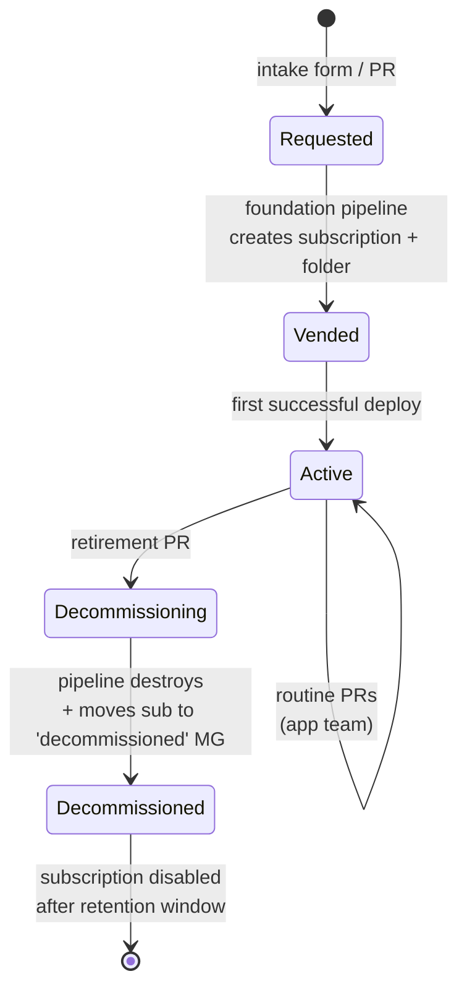

# 11 · Manageability & day‑2 operations

> **Decision:** how do you keep an ALZ healthy after the first deploy —
> ownership, drift, blast radius, lifecycle, and runbooks?

[← 10 Code quality](10-code-quality.md) · [Index](../README.md) · [12 Naming & tagging →](12-naming-and-tagging.md)

The real test of any ALZ implementation is not whether the first `apply` succeeds — it's whether the system stays coherent under the steady pressure of operational reality: teams bypassing the pipeline "just this once", subscriptions that were meant to be temporary becoming permanent, and identities that quietly accumulate permissions like barnacles. This chapter tackles the day-2 problem head-on, covering ownership governance, drift detection, blast-radius control, lifecycle management, and the humble runbook that saves you at 2 a.m.

---

## How we got here

The first generation of "infrastructure as code" was really
*infrastructure as code, plus quite a lot of clicking when nobody was
looking*. Drift wasn't a concept; it was a fact of life that a `vnet`
created by Terraform on Monday would have an extra subnet by Friday
because someone needed to *just quickly fix something*. Tools like
**driftctl** (2021) and **Terraformer** brought visibility, and
scheduled `terraform plan -detailed-exitcode` runs became a standard
Day‑2 practice. Microsoft's **Deployment Stacks** with `denySettings`
(GA 2024) finally made out‑of‑band changes *blockable at the ARM
layer*, not just detectable after the fact. **CODEOWNERS** (GitHub
2017) gave path‑based governance that scales beyond "the platform team
reviews everything", and **Privileged Identity Management** (Entra)
made standing high‑privilege access the exception rather than the rule.
Day‑2 ops in 2026 is no longer a heroic firefighting practice — done
right, it's mostly Renovate PRs, drift dashboards, and the occasional
runbook. This chapter shows the building blocks.

## CODEOWNERS — your first line of governance

`CODEOWNERS` enforces *who must approve* a PR for any given path. In a
layered repo it's the difference between governance and chaos.

```
# .github/CODEOWNERS
# Everything by default
*                                      @org/platform-engineering

# Foundation needs a second pair of eyes from cloud governance
/envs/prod/foundation/                 @org/platform-engineering @org/cloud-governance
/policies/                             @org/cloud-governance @org/security

# Per-landing-zone owners
/envs/prod/lz-corp-app01/              @org/team-app01 @org/platform-reviewers
/envs/prod/lz-corp-app02/              @org/team-app02 @org/platform-reviewers

# Pipeline templates: only platform team
/.github/workflows/                    @org/platform-engineering
```

Combine with **branch protection** that *requires* CODEOWNERS review.
Without that requirement, CODEOWNERS is informational only.

Review the file quarterly — leavers, reorgs, retired apps.

Ownership governance tells you *who* must approve a deliberate change — but it says nothing about changes that never went through the PR process at all. Detecting those requires something more active.

---

## Drift detection

Drift is changes made to Azure resources outside your IaC. It happens — a
firefighter clicks in the portal, an automation script bypasses the
pipeline. Make it visible.

### Pattern: scheduled `plan` / `what-if`

```yaml
# .github/workflows/drift.yml
on:
  schedule:
    - cron: '0 6 * * 1'  # Mondays 06:00 UTC
  workflow_dispatch:

jobs:
  drift:
    strategy:
      matrix:
        env: [nonprod, prod]
        workload: [connectivity, identity, management]
    uses: contoso/alz-pipeline-templates/.github/workflows/tf-drift.yml@v2
    with:
      working-directory: envs/${{ matrix.env }}/${{ matrix.workload }}
```

`tf-drift.yml` runs `terraform plan -detailed-exitcode`:

* Exit 0 → no changes ✅
* Exit 2 → drift detected → **post to a Teams/Slack channel + open an
  issue** with the diff.
* Exit 1 → error → page the on‑call.

For Bicep with Deployment Stacks, use `az stack sub show` to compare the
declared state with the actual `Microsoft.Resources/deployments`. The
`denySettings: denyWriteAndDelete` mode prevents most drift at the source.

### When drift is found

Triage:

1. **Reproduce** by running `plan` interactively.
2. Was the change legitimate?
   * **Yes** → codify it: open a PR that adopts the change and merge.
   * **No** → revert by running `apply` to restore desired state.
3. **Always investigate why** — drift indicates a process gap. Maybe a
   policy is missing, maybe an engineer doesn't know the rules.

Detecting drift is valuable; limiting how much damage a single bad change can cause is equally important. The structural approaches to keeping your blast radius small are the subject of the next section.

---

## Blast radius management

The size of "what one bad apply can break." Strategies:

### 1. State‑file granularity

Already covered in [07 state management](07-state-management.md). One state
per (environment × workload).

### 2. Bicep Deployment Stacks `denySettings`

```bash
az stack sub create \
  --deny-settings-mode denyWriteAndDelete \
  --deny-settings-excluded-actions "Microsoft.KeyVault/vaults/secrets/write" \
  --deny-settings-excluded-principals "<sp-app-runtime-id>"
```

A subsequent rogue `apply` (or click in the portal) is blocked at the ARM
layer. Excluded principals are the rare identities allowed to mutate inside
the stack.

### 3. Resource locks

Azure Resource Locks (`CanNotDelete` / `ReadOnly`) are a complementary
last line of defence. Apply them via IaC (so they're code‑managed) on
critical resources: hub VNet, ExpressRoute circuits, central Key Vaults,
log analytics workspaces.

```hcl
resource "azurerm_management_lock" "hub_vnet" {
  name       = "lock-cannotdelete"
  scope      = azurerm_virtual_network.hub.id
  lock_level = "CanNotDelete"
  notes      = "Critical hub network — break-glass via PIM"
}
```

Tradeoff: locks make legitimate IaC operations harder too — `terraform
apply` that needs to *replace* a locked resource fails. Reserve locks for
genuinely critical, slow‑moving resources.

### 4. Soft delete + purge protection

For Key Vault, Storage, and similar — enable soft delete and purge
protection unconditionally in your modules. Recovery beats prevention when
the worst happens.

Architectural controls limit the structural blast radius. But those controls are only as strong as the identities that hold the keys to the pipeline — which makes RBAC for the IaC system itself equally worth examining.

---

## RBAC for the IaC system itself

Day‑2 RBAC concerns are different from day‑1:

| Identity | Permissions |
|----------|-------------|
| Pipeline SPN (per env) | Contributor at the env scope; explicit User Access Admin if it manages role assignments |
| Engineers (read, all envs) | Reader on all subscriptions — debugging needs visibility |
| Engineers (write, sandbox only) | Contributor on personal sandbox subs |
| Engineers (write, prod break‑glass) | PIM‑elevated, alerting on every elevation |
| Platform team leads | Owner via PIM only, hours‑bounded |

Use **Azure Resource Graph** queries on a schedule to audit:

```kusto
AuthorizationResources
| where type =~ "microsoft.authorization/roleassignments"
| where properties.roleDefinitionId endswith "/8e3af657-a8ff-443c-a75c-2fe8c4bcb635"  // Owner
| project subscription = subscriptionId, principalId = properties.principalId, scope = properties.scope
```

Send the diff vs last week to the security team.

Role assignments are a snapshot of *who can do what right now*. The complementary concern is the lifecycle of the resources those identities manage — landing zones are created, evolve, and should be retired cleanly when they are no longer needed.

---

## Lifecycle of a landing zone

Define an explicit lifecycle. The repo should support each transition:



| Phase | Repo action |
|-------|-------------|
| Vended | A PR creates a folder under `envs/<env>/lz-<name>/` from a template |
| Active | Routine PRs from app team; pipeline deploys |
| Decommissioned | A PR removes the folder; pipeline destroys; the subscription is moved to a `decommissioned` MG and disabled |

Decommission must be **first‑class**. Without it, your estate accumulates
zombie subscriptions forever.

### Subscription vending

Two viable patterns:

* **Manual via repo:** A new landing zone PR includes a `subscription.yml`
  that the foundation pipeline consumes to call the EA / MCA API and create
  the subscription.
* **Automated via Azure subscription vending API + Service Catalog
  template:** the LZ accelerator / ALZ vending module handles it.

Either way, **the subscription belongs to the foundation/platform repo**,
not the workload repo. The workload repo only consumes the subscription ID.

A well-defined lifecycle tells you *what* needs to happen at each stage. A runbook tells you *exactly how* — step by step, copy-pasteable — so that an operation works the first time it is needed, under pressure, by someone who may not have done it before.

---

## Runbooks (in‑repo)

Every IaC repo benefits from a `docs/runbooks/` folder with one‑pagers
for the operations your team actually does:

* `credential-leak.md`
* `state-corruption-recovery.md`
* `force-unlock-state.md`
* `import-existing-resource.md`
* `decommission-landing-zone.md`
* `roll-back-failed-deploy.md`
* `rotate-encryption-key.md`

Each runbook has:

1. **When to use this** (1 sentence)
2. **Prerequisites** (access, tools)
3. **Steps**, copy‑pasteable
4. **Verification** of success
5. **Communication** template (who to notify, where)

These get used at 2 a.m. Make them findable, terse, and tested.

Runbooks address the sudden, high-pressure operational events. Cost management addresses the opposite: the slow, silent accumulation of spend that nobody notices until the monthly finance review lands in someone's inbox.

---

## Cost & usage management

Cost is a manageability concern; surface it in the repo:

* Tag every resource with `CostCenter` and `Owner` — enforced via the
  policy layer.
* Run [Azure Cost Management exports](https://learn.microsoft.com/azure/cost-management-billing/costs/tutorial-export-acm-data)
  to a storage account, ingest into Log Analytics, and surface per‑landing‑
  zone cost in a dashboard.
* For module changes that significantly affect cost (e.g. SKU bump), the PR
  template includes a "cost impact" field; reviewer asks for an estimate
  using the [Azure Pricing Calculator](https://azure.microsoft.com/pricing/calculator/).
* Set **subscription budgets** in IaC; alert at 50/75/90 % to the LZ owner.

Knowing what your infrastructure costs is one signal. Knowing how the system that *deploys* that infrastructure is behaving is another — and the pipeline deserves the same observability treatment as any other production service.

---

## Observability of the IaC pipeline itself

The pipeline is a service; treat it as one:

* Send pipeline metrics to Application Insights or LAW: run duration per
  env, success/failure rate, time‑to‑production for a typical PR.
* Track lead time and change failure rate (DORA metrics) per repo.
* Alert on:
  * Apply failures in prod (page on‑call).
  * Drift detection alerts (queue for triage).
  * Unusual SPN sign‑ins (security).
  * Pipelines that haven't run in > N days (dead workloads?).

---

## Anti‑patterns

* ❌ **No drift detection.** You are flying blind. A misconfiguration can
  exist for months before someone trips over it.
* ❌ **CODEOWNERS that lists `@org/everyone`.** Reviews become rubber
  stamps.
* ❌ **Resource locks that the pipeline SPN bypasses without anyone
  noticing.** A lock that doesn't lock the deploy identity is theatre.
* ❌ **No decommission process.** Subscriptions accumulate forever and
  you'll find a "test‑sub‑2019" still costing $4 k/month.
* ❌ **Runbooks in a wiki nobody can find at 2 a.m.** Keep them with the
  code.
* ❌ **Engineers fixing prod by editing in the portal "just this once".**
  Either it goes through code, or your code is no longer authoritative.

---

Manageability is where the gap between "it worked on day one" and "it still works reliably at year three" lives. The practices in this chapter — ownership via CODEOWNERS, scheduled drift detection, Deployment Stacks to block drift at the ARM layer, PIM-bounded access, structured landing-zone lifecycles, in-repo runbooks, and pipeline observability — do not all need to be in place before you ship. Start with drift detection and CODEOWNERS; the rest grows naturally as the estate matures. Chapter 12 turns to the seemingly mundane but genuinely load-bearing question of what you call things — and what metadata travels with them.

## References

* GitHub, *About code owners*:
  <https://docs.github.com/repositories/managing-your-repositorys-settings-and-features/customizing-your-repository/about-code-owners>
* Microsoft, *Manage drift in deployment stacks*:
  <https://learn.microsoft.com/azure/azure-resource-manager/bicep/deployment-stacks#protect-managed-resources-against-deletion>
* Microsoft, *Azure resource locks*:
  <https://learn.microsoft.com/azure/azure-resource-manager/management/lock-resources>
* Microsoft, *Subscription vending*:
  <https://learn.microsoft.com/azure/architecture/landing-zones/subscription-vending>
* Microsoft, *PIM*:
  <https://learn.microsoft.com/entra/id-governance/privileged-identity-management/pim-configure>
* DORA metrics: <https://dora.dev/>

---

[← 10 Code quality](10-code-quality.md) · [Index](../README.md) · [12 Naming & tagging →](12-naming-and-tagging.md)
