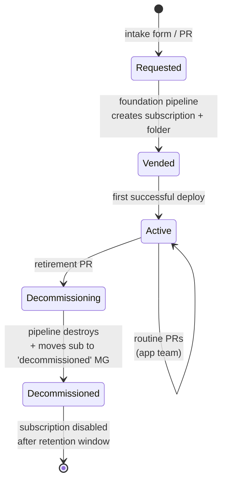

# 11 · Manageability & day‑2 operations

**In this chapter:**

- [How we got here](#how-we-got-here)
- [Decision framework](#decision-framework)
- [CODEOWNERS — your first line of governance](#codeowners-your-first-line-of-governance)
- [Drift detection](#drift-detection)
- [Blast radius management](#blast-radius-management)
- [RBAC for the IaC system itself](#rbac-for-the-iac-system-itself)
- [Lifecycle of a landing zone](#lifecycle-of-a-landing-zone)
- [Runbooks (in‑repo)](#runbooks-inrepo)
- [Cost & usage management](#cost-usage-management)
- [Observability of the IaC pipeline itself](#observability-of-the-iac-pipeline-itself)
- [Anti‑patterns](#antipatterns)
- [References](#references)


> **Decision:** how do you keep an ALZ healthy after the first deploy —
> ownership, drift, blast radius, lifecycle, and runbooks?

[← 10 Code quality](10-code-quality.md) · [Index](../README.md) · [12 Naming & tagging →](12-naming-and-tagging.md)

Manageability is a first-class Azure Landing Zone (ALZ) design concern, not a day-2 afterthought you can bolt on once the first deployment has succeeded. In practice, that means you require team-based CODEOWNERS review, run scheduled drift detection from `main`, keep each apply's blast radius narrow, tightly scope the Infrastructure as Code (IaC) pipeline identity, version runbooks in the repo, and measure the deployment system like a production service. The real test of any ALZ implementation is not whether the first `apply` succeeds — it is whether the system stays coherent under operational pressure, when teams bypass the pipeline "just this once", subscriptions that were meant to be temporary become permanent, and identities quietly accumulate permissions like barnacles.

---

## How we got here

Modern ALZ operations should be boring by design: ownership is explicit, drift is visible or blocked, and privileged human action is exceptional. That was not where the discipline started. The first generation of "infrastructure as code" was really *infrastructure as code, plus quite a lot of clicking when nobody was looking*. Drift wasn't a concept; it was a fact of life that a `vnet` created by Terraform on Monday would have an extra subnet by Friday because someone needed to *just quickly fix something*.

The tooling and governance model caught up only after that pain became obvious. Tools like **driftctl** (2021) and **Terraformer** brought visibility, and scheduled `terraform plan -detailed-exitcode` runs became a standard day-2 practice. Microsoft's **Deployment Stacks** with `denySettings` (GA 2024) finally made out-of-band changes *blockable at the Azure Resource Manager (ARM) layer*, not just detectable after the fact. **CODEOWNERS** (GitHub 2017) gave path-based governance that scales beyond "the platform team reviews everything", and **Privileged Identity Management (PIM)** in Microsoft Entra made standing high-privilege access the exception rather than the rule. Day-2 operations in 2026 is no longer a heroic firefighting practice; done right, it is mostly Renovate PRs, drift dashboards, and the occasional runbook, which is why the decision framework starts with the controls that keep those routines predictable.

> 📘 **Key terms**
>
> **Drift detection** — the practice of periodically running `terraform plan` (or `az stack show`) and alerting when the actual cloud state diverges from what the code declares.
>
> **driftctl** — an open‑source tool (now archived) that scanned AWS/Azure resources and compared them against Terraform state to find unmanaged or drifted resources.
>
> **KQL (Kusto Query Language)** — the query language used by Azure Resource Graph, Log Analytics, and Microsoft Sentinel for querying structured data.
>
> **DORA metrics** — four key metrics from the DevOps Research and Assessment programme: deployment frequency, lead time for changes, change failure rate, and time to restore service. Used to benchmark engineering performance.
>
> **Subscription vending** — the automated process of creating and configuring a new Azure subscription (with budget, policies, RBAC, and networking) so it's ready for a workload team to use.
>
> **EA / MCA** — Enterprise Agreement / Microsoft Customer Agreement — the two main Azure billing models through which subscriptions are created programmatically.
>
> **Zombie subscriptions** — subscriptions that are no longer actively used or maintained but remain billable and potentially insecure because no decommission process was followed.
>
> **Bus factor** — the number of team members who would need to be unavailable before the project stalls. A bus factor of 1 means a single person's absence can halt operations.

---

## Decision framework

With that operational history in mind, answer these day-2 questions before the first production landing zone goes live; the safe default is team-owned review, scheduled drift detection, narrow state, least-privilege automation, versioned runbooks, and pipeline health metrics. Those defaults are sequenced deliberately, because the controls later in the chapter assume that the earlier ones have made ownership and change paths explicit.

1. **How is CODEOWNERS structured?**
   * Use path globs to assign ownership to teams, not individuals.
   * Require CODEOWNERS review through branch protection on protected paths.
   * Keep ownership rules short enough to review quarterly; generate them from a source of truth if the repo grows large.

2. **How do you detect drift?**
   * Run a scheduled `plan` / `what-if` from `main` and alert on diffs.
   * For legitimate drift, codify or import it according to policy; for illegitimate drift, revert it and fix the process gap.
   * Document which Azure Policy effects are intentionally ignored or codified.

3. **How do you keep blast radius small?**
   * Use many small state files, normally one per workload per environment.
   * Run one apply per workload per environment rather than estate-wide applies.
   * Add Deployment Stacks `denySettings`, locks, soft delete, and purge protection for critical resources.

4. **Who has access to the IaC system itself?**
   * Scope the CI service principal only to the management group or subscription level it actually needs.
   * Give humans read access for diagnosis and PIM-controlled break-glass write access only.
   * Alert on owner assignments, PIM elevation, and unusual service principal sign-ins.

5. **Where do runbooks live?**
   * Keep runbooks in an in-repo `/runbooks/` folder, versioned with the code they describe.
   * Make them short, copy-pasteable, and verified during game days or incident reviews.

6. **How do you measure pipeline health?**
   * Track lead time, deployment frequency, change failure rate, and time to restore on the IaC repo itself.
   * Alert when production applies fail, drift detection fires, or expected pipelines stop running.

The detailed practices behind those answers follow below. They begin with ownership because every other operational control depends on knowing who is accountable for a path, a pipeline, or a subscription.

---

## CODEOWNERS — your first line of governance

After the decision framework tells you that ownership is the first day-2 control, the practical implementation starts with GitHub `CODEOWNERS`: use path globs that point to teams rather than individuals, and make those reviews mandatory on protected paths. The file enforces *who must approve* a pull request (PR) for any given path, and in a layered repo it is the difference between governance that scales and a review process that depends on whoever happens to be online.

```
# .github/CODEOWNERS
# Everything by default
*                                      @org/platform-engineering

# Foundation needs a second pair of eyes from cloud governance
/envs/prod/foundation/                 @org/platform-engineering @org/cloud-governance
/policies/                             @org/cloud-governance @org/security

# Per-landing-zone owners
/envs/prod/lz-corp-app01/              @org/team-app01 @org/platform-reviewers
/envs/prod/lz-corp-app02/              @org/team-app02 @org/platform-reviewers

# Pipeline templates: only platform team
/.github/workflows/                    @org/platform-engineering
```

The file only becomes a control when you combine it with **branch protection** that *requires* CODEOWNERS review; without that requirement, CODEOWNERS is informational only, which means the governance model looks better in the repository than it behaves in production. That distinction matters more as the repository grows, because informal review habits rarely survive team turnover or workload onboarding.

> 💡 **CODEOWNERS complexity scales with repo size.** The example above
> assumes a single repo containing foundation, platform, and landing
> zones — the monorepo model. In practice, the recommended
> [layered few‑repo topology](01-repository-topology.md) splits these
> into separate repos, which means each repo's CODEOWNERS file stays
> short and obvious (a handful of rules instead of hundreds). If you
> *do* run a monorepo or a large shared landing‑zone repo, expect the
> CODEOWNERS file to grow with every onboarded team — review it
> quarterly, and consider generating it from a source‑of‑truth YAML to
> avoid stale entries.

Because ownership data ages as people leave, teams reorganise, and applications retire, review the file quarterly rather than waiting for a blocked production PR to reveal that the only listed approver has moved on. Ownership governance tells you *who* must approve a deliberate change, but it says nothing about changes that never went through the PR process at all; detecting those requires something more active.

---

## Drift detection

Once ownership covers deliberate change, drift detection covers the changes that happen outside the review path: run it from `main` on a schedule, alert on every unexpected diff, and either codify, import, or revert based on policy. Drift is any change made to Azure resources outside your IaC, and it will happen — a firefighter clicks in the portal, an automation script bypasses the pipeline, or a temporary exception quietly survives the incident that created it — so the first duty of the system is to make that divergence visible.

### A commonly overlooked drift source: Modify and DINE policies

Not all drift comes from humans. **Modify** and **DeployIfNotExists
(DINE)** Azure policies deliberately change or create resources outside
your IaC pipeline — and they're *supposed* to. A DINE policy that adds
diagnostic settings to every new storage account is doing its job, but
`terraform plan` will report those settings as drift because the state
file never knew about them.

That legitimate policy behaviour creates a tension you need to resolve deliberately. If you do not choose a policy for these diffs, drift reports either become noisy enough to ignore or incomplete enough to mistrust:

* **Suppress the diff** (e.g. `ignore_changes` in Terraform, or omit the
  property from Bicep) and accept that the policy is the source of truth
  for that attribute. Clean drift reports, but the IaC no longer describes
  the full resource.
* **Codify the policy's effect** in your IaC so the plan matches reality.
  Complete resource description, but duplicates intent already expressed
  by the policy — and changes to the policy require matching IaC updates.
* **Accept the noise** and train the team to recognise known policy‑induced
  diffs during triage. Honest, but erodes trust in drift reports over time.

There is no universally agreed best practice here. Many teams use a
hybrid: `ignore_changes` for attributes managed *exclusively* by policy
(e.g. diagnostic settings added by DINE), and codify attributes where
the IaC and policy must agree (e.g. TLS version enforced by Modify).
Document which approach you chose and why — undocumented `ignore_changes`
blocks are a maintenance hazard.

### Pattern: scheduled `plan` / `what-if`

```yaml
# .github/workflows/drift.yml
on:
  schedule:
    - cron: '0 6 * * 1'  # Mondays 06:00 UTC
  workflow_dispatch:

jobs:
  drift:
    strategy:
      matrix:
        env: [nonprod, prod]
        workload: [connectivity, identity, management]
    uses: contoso/alz-pipeline-templates/.github/workflows/tf-drift.yml@v2
    with:
      working-directory: envs/${{ matrix.env }}/${{ matrix.workload }}
```

The scheduled workflow is useful because `tf-drift.yml` runs `terraform plan -detailed-exitcode` and gives each outcome a clear operational meaning. That explicit mapping keeps the response predictable when the job fires on a Monday morning instead of during an interactive troubleshooting session:

* Exit 0 → no changes ✅
* Exit 2 → drift detected → **post to a Teams/Slack channel + open an
  issue** with the diff.
* Exit 1 → error → page the on‑call.

For Bicep with Deployment Stacks, use `az stack sub show` to compare the
declared state with the actual `Microsoft.Resources/deployments`. The
`denySettings: denyWriteAndDelete` mode prevents most drift at the source.

### When drift is found

When drift is found, triage it in the same order every time. The goal is not merely to restore the declared state, but to understand why the declared path was bypassed:

1. **Reproduce** by running `plan` interactively.
2. Was the change legitimate?
   * **Yes** → codify it: open a PR that adopts the change and merge.
   * **No** → revert by running `apply` to restore desired state.
3. **Always investigate why** — drift indicates a process gap. Maybe a
   policy is missing, maybe an engineer doesn't know the rules.

Detecting drift is valuable; limiting how much damage a single bad change can cause is equally important. The structural approaches to keeping your blast radius small are the subject of the next section.

---

## Blast radius management

Once drift is visible, you still need to limit how much a single bad change can break. Keep blast radius small by making state granular, applies narrow, and destructive changes hard to execute accidentally; in other words, design the deployment system so the failure domain of an apply matches the smallest operational unit you can realistically own.

### 1. State‑file granularity

State-file granularity is the first containment boundary, which is why [07 state management](07-state-management.md) recommends one state per environment and workload. When a workload plan only has access to its own state, a bad apply cannot accidentally rewrite the connectivity estate or another team's subscription.

### 2. Bicep Deployment Stacks `denySettings`

```bash
az stack sub create \
  --deny-settings-mode denyWriteAndDelete \
  --deny-settings-excluded-actions "Microsoft.KeyVault/vaults/secrets/write" \
  --deny-settings-excluded-principals "<sp-app-runtime-id>"
```

Deployment Stacks add a second boundary because a subsequent rogue `apply` or portal click is blocked at the ARM layer rather than merely discovered later by drift detection. Excluded principals should therefore be rare, explicit identities that are allowed to mutate inside the stack for well-understood runtime reasons.

### 3. Resource locks

Azure Resource Locks (`CanNotDelete` / `ReadOnly`) are a complementary last line of defence, especially for critical resources such as hub virtual networks, ExpressRoute circuits, central Key Vaults, and Log Analytics workspaces. Apply them via IaC so the locks themselves remain code-managed rather than becoming another form of manual drift.

```hcl
resource "azurerm_management_lock" "hub_vnet" {
  name       = "lock-cannotdelete"
  scope      = azurerm_virtual_network.hub.id
  lock_level = "CanNotDelete"
  notes      = "Critical hub network — break-glass via PIM"
}
```

The tradeoff is that locks make legitimate IaC operations harder too, because a `terraform apply` that needs to *replace* a locked resource fails. Reserve them for genuinely critical, slow-moving resources where the cost of accidental deletion is higher than the friction they add.

### 4. Soft delete + purge protection

For data-bearing services such as Key Vault and Storage, enable soft delete and purge protection unconditionally in your modules. Recovery beats prevention when the worst happens, and these controls give you time to respond when a destructive operation gets past the earlier boundaries.

Architectural controls limit the structural blast radius, but those controls are only as strong as the identities that hold the keys to the pipeline, which makes RBAC for the IaC system itself the next question to examine. The same containment logic now moves from resources and state files to people, service principals, and privileged roles.

---

## RBAC for the IaC system itself

The identities that operate your IaC system should have only the permissions they need, with continuous integration (CI) identities scoped by environment and human write access treated as break-glass. Day-2 Role-Based Access Control (RBAC) concerns are different from day-1 provisioning because the question is no longer "can the pipeline create the estate?" but "can any identity now change more of the estate than its job requires?"

| Identity | Permissions |
|----------|-------------|
| Pipeline SPN (per env) | Contributor at the env scope; explicit User Access Admin if it manages role assignments |
| Engineers (read, all envs) | Reader on all subscriptions — debugging needs visibility |
| Engineers (write, sandbox only) | Contributor on personal sandbox subs |
| Engineers (write, prod break‑glass) | PIM‑elevated, alerting on every elevation |
| Platform team leads | Owner via PIM only, hours‑bounded |

Because role assignments drift just like resources do, use **Azure Resource Graph** queries on a schedule to audit high-privilege grants. The query below is intentionally simple so the weekly diff stays understandable to both platform and security reviewers:

```kusto
AuthorizationResources
| where type =~ "microsoft.authorization/roleassignments"
| where properties.roleDefinitionId endswith "/8e3af657-a8ff-443c-a75c-2fe8c4bcb635"  // Owner
| project subscription = subscriptionId, principalId = properties.principalId, scope = properties.scope
```

Send the diff against last week to the security team, so permission growth becomes a reviewed change rather than an unpleasant discovery during an incident. Role assignments are a snapshot of *who can do what right now*; the complementary concern is the lifecycle of the resources those identities manage, because landing zones are created, evolve, and should be retired cleanly when they are no longer needed.

---

## Lifecycle of a landing zone

Once the identities are under control, the estate still needs an explicit create-change-retire lifecycle in the repo, including a first-class decommission path. The repository should support each transition below, so a landing zone can move from request to active use to retirement without leaving side channels for teams to improvise under pressure.


```mermaid
stateDiagram-v2
    [*] --> Requested : intake form / PR
    Requested --> Vended : foundation pipeline<br/>creates subscription + folder
    Vended --> Active : first successful deploy
    Active --> Active : routine PRs<br/>(app team)
    Active --> Decommissioning : retirement PR
    Decommissioning --> Decommissioned : pipeline destroys<br/>+ moves sub to 'decommissioned' MG
    Decommissioned --> [*] : subscription disabled<br/>after retention window
```

| Phase | Repo action |
|-------|-------------|
| Vended | A PR creates a folder under `envs/<env>/lz-<name>/` from a template |
| Active | Routine PRs from app team; pipeline deploys |
| Decommissioned | A PR removes the folder; pipeline destroys; the subscription is moved to a `decommissioned` MG and disabled |

The decommission path must be **first-class** because, without it, your estate accumulates zombie subscriptions forever. A subscription that nobody owns still has cost, data exposure, role assignments, and policy exceptions, so retirement deserves the same engineering attention as onboarding.

### Subscription vending

Subscription vending can follow either of two viable patterns, depending on how much automation you already have around intake and billing. The choice affects where subscription creation is reviewed, but it should not change who owns the resulting platform contract:

* **Manual via repo:** A new landing zone PR includes a `subscription.yml`
  that the foundation pipeline consumes to call the EA / MCA API and create
  the subscription.
* **Automated via Azure subscription vending API + Service Catalog
  template:** the landing-zone accelerator / ALZ vending module handles it.

Either way, **the subscription belongs to the foundation/platform repo**, not the workload repo, because creation, policy attachment, budgets, and management-group placement are platform responsibilities. The workload repo only consumes the subscription ID.

A well-defined lifecycle tells you *what* needs to happen at each stage. A runbook tells you *exactly how* — step by step, copy-pasteable — so that an operation works the first time it is needed, under pressure, by someone who may not have done it before.

---

## Runbooks (in‑repo)

Because the lifecycle only helps if operators can execute it reliably, runbooks should live in the repository and be versioned with the IaC they operate. Every IaC repo benefits from a `/runbooks/` folder with one-pagers for the operations your team actually does:

* `credential-leak.md`
* `state-corruption-recovery.md`
* `force-unlock-state.md`
* `import-existing-resource.md`
* `decommission-landing-zone.md`
* `roll-back-failed-deploy.md`
* `rotate-encryption-key.md`

Each runbook should have the same small set of sections so the person using it does not have to learn a new format during an incident. Consistency matters more than length, because a short runbook that always answers the same questions is easier to trust under pressure:

1. **When to use this** (1 sentence)
2. **Prerequisites** (access, tools)
3. **Steps**, copy‑pasteable
4. **Verification** of success
5. **Communication** template (who to notify, where)

These files get used at 2 a.m., so make them findable, terse, and tested rather than comprehensive in the abstract. Runbooks address sudden, high-pressure operational events; cost management addresses the opposite problem, which is the slow, silent accumulation of spend that nobody notices until the monthly finance review lands in someone's inbox.

---

## Cost & usage management

After you have covered the incident path, make cost and usage signals visible from the repo so landing-zone owners see spend before finance escalation does. Cost is a manageability concern because uncontrolled growth is operational drift expressed in money, so surface the signals where owners already review infrastructure change. That placement turns cost from a monthly surprise into part of the normal PR conversation:

* Tag every resource with `CostCenter` and `Owner` — enforced via the
  policy layer.
* Run [Azure Cost Management exports](https://learn.microsoft.com/azure/cost-management-billing/costs/tutorial-export-acm-data)
  to a storage account, ingest into Log Analytics, and surface per‑landing‑
  zone cost in a dashboard.
* For module changes that significantly affect cost (e.g. SKU bump), the PR
  template includes a "cost impact" field; reviewer asks for an estimate
  using the [Azure Pricing Calculator](https://azure.microsoft.com/pricing/calculator/).
* Set **subscription budgets** in IaC; alert at 50/75/90 % to the landing-zone owner.

Knowing what your infrastructure costs is one signal. Knowing how the system that *deploys* that infrastructure is behaving is another, and the pipeline deserves the same observability treatment as any other production service.

---

## Observability of the IaC pipeline itself

Measure the IaC pipeline itself with DORA-style health metrics because a broken deployment system is a production incident, not merely an inconvenience for the platform team. Treat the pipeline as a service by collecting the same kinds of signals you would expect from any other production dependency:

* Send pipeline metrics to Application Insights or a Log Analytics workspace: run duration per
  env, success/failure rate, time‑to‑production for a typical PR.
* Track lead time and change failure rate (DORA metrics) per repo.
* Alert on:
  * Apply failures in prod (page on‑call).
  * Drift detection alerts (queue for triage).
  * Unusual SPN sign‑ins (security).
  * Pipelines that haven't run in > N days (dead workloads?).

When these signals are missing, day-2 operations degrade into guesswork, and the anti-patterns below are usually the evidence you see first.

---

## Anti‑patterns

Most day-2 failures come from invisible ownership, invisible drift, or unbounded permissions; treat the following as design smells. They are not stylistic preferences, but early warnings that the operating model will fail under pressure.

* ❌ **No drift detection.** You are flying blind. A misconfiguration can
  exist for months before someone trips over it.
* ❌ **CODEOWNERS that lists `@org/everyone`.** Reviews become rubber
  stamps.
* ❌ **Resource locks that the pipeline SPN bypasses without anyone
  noticing.** A lock that doesn't lock the deploy identity is theatre.
* ❌ **No decommission process.** Subscriptions accumulate forever and
  you'll find a "test‑sub‑2019" still costing $4 k/month.
* ❌ **Runbooks in a wiki nobody can find at 2 a.m.** Keep them with the
  code.
* ❌ **Engineers fixing prod by editing in the portal "just this once".**
  Either it goes through code, or your code is no longer authoritative.

---

Manageability is where the gap between "it worked on day one" and "it still works reliably at year three" lives. The practices in this chapter — ownership via CODEOWNERS, scheduled drift detection, Deployment Stacks to block drift at the ARM layer, PIM-bounded access, structured landing-zone lifecycles, in-repo runbooks, and pipeline observability — do not all need to be in place before you ship. Start with drift detection and CODEOWNERS; the rest grows naturally as the estate matures. Chapter 12 turns to the seemingly mundane but genuinely load-bearing question of what you call things — and what metadata travels with them.

## References

Use these references to validate the platform controls, repository governance, and operational metrics described above.

* GitHub, *About code owners*:
  <https://docs.github.com/repositories/managing-your-repositorys-settings-and-features/customizing-your-repository/about-code-owners>
* Microsoft, *Manage drift in deployment stacks*:
  <https://learn.microsoft.com/azure/azure-resource-manager/bicep/deployment-stacks#protect-managed-resources-against-deletion>
* Microsoft, *Azure resource locks*:
  <https://learn.microsoft.com/azure/azure-resource-manager/management/lock-resources>
* Microsoft, *Subscription vending*:
  <https://learn.microsoft.com/azure/architecture/landing-zones/subscription-vending>
* Microsoft, *PIM*:
  <https://learn.microsoft.com/entra/id-governance/privileged-identity-management/pim-configure>
* DORA metrics: <https://dora.dev/>

---

[← 10 Code quality](10-code-quality.md) · [Index](../README.md) · [12 Naming & tagging →](12-naming-and-tagging.md)
