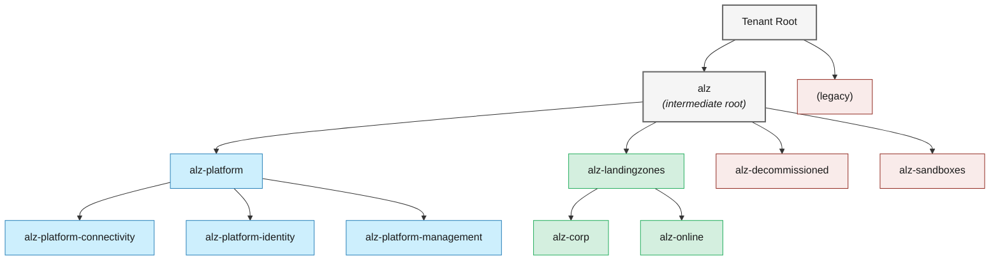

# 12 · Naming, tagging & metadata conventions

> **Decision:** what do you call things, and what metadata travels with
> them? The boring stuff that breaks everything if you skip it.

[← 11 Manageability](11-manageability.md) · [Index](../README.md) · [13 Documentation →](13-documentation.md)

Every process in a well-run Azure estate — cost reporting, security automation, decommissioning, disaster recovery — relies on one assumption: that a resource's name and tags are trustworthy, consistent, and machine-readable. This chapter argues that naming and tagging are not housekeeping but infrastructure, and that the only way to treat them as such is to encode them in code and enforce them with policy.

---

## How we got here

In the early days of every Azure tenant there's an artisanal naming
convention written by the first cloud architect on a whiteboard — and a
second one written by their replacement six months later. By 2018 the
average enterprise had three: the documented one, the one used for new
resources, and the one used by the legacy migration team. Microsoft's
**CAF naming guidance** (2019) and the canonical **resource abbreviation
list** finally gave the industry a shared vocabulary, and reusable
**naming modules** (the `Azure/naming` Terraform module, the
`nianton/azure-naming` Bicep module) made the convention executable
rather than aspirational.

> 📘 **Key terms**
>
> **CAF (Cloud Adoption Framework)** — Microsoft's comprehensive guidance for cloud strategy, governance, and implementation. Its naming and tagging recommendations are the de facto standard for Azure estates.
> **Resource abbreviations** — a CAF‑published list of short prefixes for each Azure resource type (e.g. `rg-` for resource groups, `st` for storage accounts, `kv-` for key vaults).
> **Modify effect** — an Azure Policy effect that automatically adds or corrects properties on resources (e.g. appending a tag inherited from the resource group) without denying the deployment.
> **Canonical values** — a fixed, enumerated set of allowed values for a tag or naming segment (e.g. `env` ∈ {`prod`, `nonprod`, `sandbox`}), enforced by policy to prevent free‑text inconsistency.
> **Data classification** — a tagging practice that labels resources by sensitivity level (e.g. `Public`, `Internal`, `Confidential`, `Restricted`) to drive security automation and access control.

Tagging followed a similar arc: a brief flirtation
with "free‑text whatever the engineer felt like" gave way to **Azure
Policy `modify` effects** that auto‑append RG tags, and to mandatory tag
sets enforced by `deny`. The boring takeaway: **what isn't enforced by
code or policy doesn't exist**. Training slides don't enforce; CI does.

## Why this gets a whole chapter

Naming and tagging are the **load‑bearing infrastructure of every other
process**: cost reporting, access control, automation, decommissioning,
disaster recovery — all rely on consistent metadata. A weak convention
costs you forever.

The opposite is also true: an over‑engineered convention nobody can remember
gets violated immediately. Aim for **rigorous but humane**.

With the case for rigour established, here is what rigour looks like in practice — starting with the naming convention itself.

---

## Naming convention

### Anatomy

```
<resource-abbr>-<workload>-<env>-<region-abbr>-<instance>
```

Examples:

```
vnet-hub-prod-swc-01
rg-platform-connectivity-prod-swc
sa-tflogs-prod-swc-001       (no dashes, lowercase, ≤ 24 chars)
kv-platform-prod-swc-01      (≤ 24 chars, globally unique)
nsg-app01-web-prod-swc-01
```

Rules:

* Lowercase only. Azure is mostly case‑insensitive, but tools, KQL, and
  bash scripts aren't.
* Use `-` separators except where Azure forbids them (storage, ACR, KV).
* **Region abbreviations** (3 letters): pick once and document. Examples:
  `swc` (Sweden Central), `weu` (West Europe), `nwe` (North Europe), `wus2`
  (West US 2). Don't invent new ones; consult your standards page.
* **Instance suffix** (`-01`, `-02`) — even for resources you expect to be
  singletons. The day you need a second one, your name doesn't fight you.
* **Avoid embedding subscription / tenant info in names.** Tags and the
  scope hierarchy already convey it.

### Canonical resource abbreviations

Use the [Microsoft CAF resource abbreviations list][caf-abbr] as a starting
point. Don't invent your own — they aren't worth the bus‑factor cost.

[caf-abbr]: https://learn.microsoft.com/azure/cloud-adoption-framework/ready/azure-best-practices/resource-abbreviations

### Length & character constraints

Some Azure resources have nasty limits — **plan for the worst**:

| Resource | Max length | Allowed |
|----------|-----------|---------|
| Storage account | 24 | a‑z, 0‑9 |
| Key Vault | 24 | a‑z, A‑Z, 0‑9, `-` |
| ACR | 50 | a‑z, A‑Z, 0‑9 |
| Function App | 60 | a‑z, A‑Z, 0‑9, `-` |
| VM (Windows) | 15 | a‑z, A‑Z, 0‑9, `-` |
| Resource Group | 90 | broad |

For names that don't fit your convention, define **shortened forms**
explicitly in your naming module — don't truncate ad‑hoc.

### Code it, don't print it

Build a **naming module** in `alz-modules`:

```hcl
module "naming" {
  source  = "Azure/naming/azurerm"
  version = "0.4.2"
  suffix  = ["${var.workload}", var.env, local.region_abbr]
}

resource "azurerm_storage_account" "logs" {
  name = module.naming.storage_account.name_unique
  ...
}
```

Or for Bicep, the [Azure naming Bicep module](https://github.com/nianton/azure-naming).
Either way, **never let humans type the name into a parameter file** —
typos become permanent.

A consistent naming convention tells you what a resource *is*. A consistent tagging convention tells you who it belongs to, what it costs, and how automation should treat it. The two are complementary, and both require the same discipline.

---

## Tagging convention

### Mandatory tags

Every resource (and every resource group) must carry these. Enforce via
Azure Policy `Append` (auto‑apply RG tags to resources) and `Audit`/`Deny`
for the rest.

| Tag key | Example | Notes |
|---------|---------|-------|
| `CostCenter` | `CC-12345` | Charging code; numeric ideally. |
| `Owner` | `team-app01@contoso.com` | Group address, not a person. |
| `Environment` | `prod`, `nonprod`, `sandbox` | Drives a lot of automation. |
| `Workload` | `app01`, `connectivity-hub` | The "what". |
| `BusinessUnit` | `corp`, `online` | The "for whom". |
| `DataClassification` | `public`, `internal`, `confidential`, `restricted` | Drives policy decisions. |
| `Criticality` | `1`, `2`, `3`, `4` | Tier for SLA / DR. |
| `ManagedBy` | `iac`, `manual` | Detect drift; expect `iac` everywhere. |
| `Repo` | `alz-platform` | The Git repo of authority. |
| `DeploymentId` | `<commit-sha>` or `<run-id>` | Trace a resource to a pipeline run. |

### Optional but useful

| Tag key | Example | Use |
|---------|---------|-----|
| `DeleteAt` | `2026-12-31` | For sandbox / time‑bounded resources; cleanup automation. |
| `Project` | `migration-2026` | Programme tracking. |
| `Compliance` | `pci`, `gdpr` | Regulatory scope. |

### Inheritance & enforcement

Tags do **not** inherit automatically from RG to resource (despite many
tutorials implying so). Implement:

* **Policy `modify` effect** to auto‑append RG tags to resources at creation.
  Use sparingly — too many `modify` policies make `terraform plan` noisy.
* **Module defaults** — every module accepts a `tags` map and merges with
  its own additions. Do **not** rely on `default_tags` in the AzureRM
  provider for required tags; module‑level merging is more explicit.

```hcl
locals {
  base_tags = {
    Environment        = var.env
    Workload           = var.workload
    Owner              = var.owner
    CostCenter         = var.cost_center
    DataClassification = var.data_classification
    BusinessUnit       = var.business_unit
    Criticality        = var.criticality
    ManagedBy          = "iac"
    Repo               = "alz-platform"
    DeploymentId       = var.deployment_id
  }

  tags = merge(local.base_tags, var.additional_tags)
}
```

### Tag reporting

Run a weekly Resource Graph query to find non‑compliant resources:

```kusto
Resources
| where tags !has "CostCenter" or tags !has "Owner" or tags !has "Environment"
| project name, type, subscriptionId, resourceGroup, tags
```

Send the count + worst offenders to a dashboard; gate the next quarterly
budget on improvement.

Resource-level naming and tagging address the workload layer. The same principles apply one level up, where management groups and subscriptions form the structural skeleton of the tenant — and where an inconsistent naming scheme will haunt your governance queries for years.

---

## Management group / subscription naming

These are top‑level too — bake them into the foundation:



Subscription names mirror the MG path:

```
sub-platform-connectivity-prod
sub-corp-app01-prod
sub-corp-app01-nonprod
sub-sandbox-jdoe
```

Document the tree in the foundation repo's `docs/management-groups.md`.

Management group and subscription names establish *what* things are and *whose* they are. Region strategy is a natural extension of the same discipline: capping the allowed set of deployment locations is one of the simpler, highest-leverage policy decisions you will make.

---

## Region strategy

Pick a small number of **primary regions** (typically 2 per geo for DR
pairing) and don't deploy outside them without an exception process.

* **Primary:** `swedencentral`
* **Paired:** `northeurope` (DR target for Sweden)
* **Approved exception:** `westeurope` (legacy)

Bake the allowed list into a policy:

```bicep
// policies/restrict-regions.bicep
param allowedLocations array = [
  'swedencentral'
  'northeurope'
  'westeurope'
]
```

The policy assignment is **`deny`** in landing zones; **`audit`** in
sandbox.

---

## Anti‑patterns

* ❌ **Inventing your own resource abbreviations.** Use Microsoft's CAF
  list; the bus factor is too high otherwise.
* ❌ **Free‑text tags** (`Owner: "John (he sits next to Sara)"`). Tags are
  data; treat them as such.
* ❌ **Required tags enforced only by training docs.** People forget.
  Enforce with policy.
* ❌ **Names that include the subscription ID** ("just in case"). The
  scope is already there.
* ❌ **`Environment` tag values that drift** (`Prod`, `prod`, `Production`).
  Pick canonical values and `Deny` anything else with policy.
* ❌ **Tagging at the resource level only**, ignoring RG. RG tags are the
  inheritance source for `modify` policies.
* ❌ **Naming module added "later".** Names are the hardest thing to
  refactor — costs days of pipeline work per resource type.

---

Naming and tagging may feel like administrative overhead until the day someone asks "which team owns this resource, and what does it cost them?" and the answer cannot be retrieved in under thirty seconds. Enforce the convention from day one — it is genuinely cheaper to build right than to rename a thousand resources later. The next chapter turns to the documentation that explains *why* all these decisions were made, so the engineer who joins two years from now understands the system rather than simply inheriting it.

## References

* Microsoft, *CAF — Naming and tagging*:
  <https://learn.microsoft.com/azure/cloud-adoption-framework/ready/azure-best-practices/naming-and-tagging>
* Microsoft, *Resource abbreviations*:
  <https://learn.microsoft.com/azure/cloud-adoption-framework/ready/azure-best-practices/resource-abbreviations>
* Microsoft, *Resource naming rules*:
  <https://learn.microsoft.com/azure/azure-resource-manager/management/resource-name-rules>
* `Azure/naming` Terraform module:
  <https://registry.terraform.io/modules/Azure/naming/azurerm/latest>
* `nianton/azure-naming` Bicep module:
  <https://github.com/nianton/azure-naming>

---

[← 11 Manageability](11-manageability.md) · [Index](../README.md) · [13 Documentation →](13-documentation.md)
