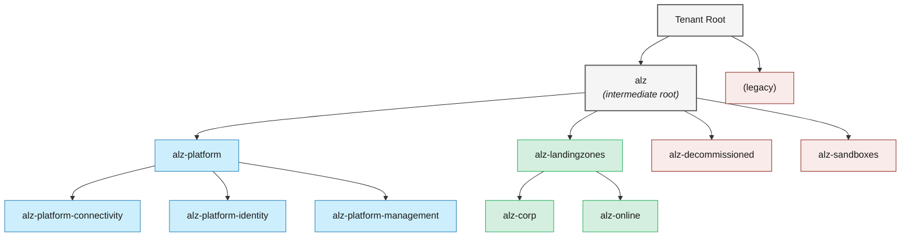

# 12 · Naming, tagging & metadata conventions

**In this chapter:**

- [How we got here](#how-we-got-here)
- [Decision framework](#decision-framework)
- [Why this gets a whole chapter](#why-this-gets-a-whole-chapter)
- [Naming convention](#naming-convention)
- [Tagging convention](#tagging-convention)
- [Management group / subscription naming](#management-group-subscription-naming)
- [Region strategy](#region-strategy)
- [Anti‑patterns](#antipatterns)
- [References](#references)


> **Decision:** what do you call things, and what metadata travels with
> them? The boring stuff that breaks everything if you skip it.

[← 11 Manageability](11-manageability.md) · [Index](../README.md) · [13 Documentation →](13-documentation.md)

Adopt one enforced convention: lowercase, dash‑separated resource names built from Microsoft Cloud Adoption Framework (CAF) abbreviations, plus a mandatory tag set that is applied by modules and enforced by Azure Policy. Treat names as the human-readable index you can scan during an incident, and treat tags as the machine-readable source of truth for cost, ownership, security, lifecycle, and automation. Define the pattern, abbreviations, allowed tag values, management-group names, subscription names, and region codes once in shared code and policy, because anything that only lives on a standards slide will drift. The historical reason for that discipline is simple: every estate has already tried the informal version, and almost every estate has paid for it later.

---

## How we got here

In the early days of every Azure tenant there's an artisanal naming
convention written by the first cloud architect on a whiteboard — and a
second one written by their replacement six months later. By 2018 the
average enterprise had three: the documented one, the one used for new
resources, and the one used by the legacy migration team. Microsoft's
**CAF naming guidance** (2019) and the canonical **resource abbreviation
list** finally gave the industry a shared vocabulary, and reusable
**naming modules** (the `Azure/naming` Terraform module, the
`nianton/azure-naming` Bicep module) made the convention executable
rather than aspirational. That history matters because naming is one of
the few Azure Landing Zone (ALZ) decisions where a casual exception becomes
visible in every portal view, cost export, and incident review for years.

> 📘 **Key terms**
>
> **CAF (Cloud Adoption Framework)** — Microsoft's comprehensive guidance for cloud strategy, governance, and implementation. Its naming and tagging recommendations are the de facto standard for Azure estates.
>
> **Resource abbreviations** — a CAF‑published list of short prefixes for each Azure resource type (e.g. `rg-` for resource groups, `st` for storage accounts, `kv-` for key vaults).
>
> **Modify effect** — an Azure Policy effect that automatically adds or corrects properties on resources (e.g. appending a tag inherited from the resource group) without denying the deployment.
>
> **Canonical values** — a fixed, enumerated set of allowed values for a tag or naming segment (e.g. `env` ∈ {`prod`, `nonprod`, `sandbox`}), enforced by policy to prevent free‑text inconsistency.
>
> **Data classification** — a tagging practice that labels resources by sensitivity level (e.g. `Public`, `Internal`, `Confidential`, `Restricted`) to drive security automation and access control.

Tagging followed a similar arc: a brief flirtation
with "free‑text whatever the engineer felt like" gave way to **Azure
Policy `modify` effects** that auto‑append resource group tags, and to mandatory tag
sets enforced by `deny`. The lesson is blunt because the failure mode is
so common: **what isn't enforced by code or policy doesn't exist**. Training
slides don't enforce; continuous integration (CI), modules, and policy do.
That enforcement lesson is the bridge from history to design: before you
choose syntax, you need to answer the questions that determine what code
and policy must protect.

---

## Decision framework

Because the history points to enforcement rather than persuasion, answer these questions before teams start deploying. The output should be both a standards page and executable code: a naming module, `_shared/abbreviations.tf` or `abbreviations.bicep`, canonical tag values, and Azure Policy assignments.

1. **What is the canonical naming pattern?** Choose the required components — workload, environment, region, resource type, and instance — and their order. This guide's examples use `<resource-abbr>-<workload>-<env>-<region-abbr>-<instance>` with `-` separators because Azure operators scan resource type first; if your organisation prefers workload-first (`<workload>-<env>-<region>-<resourceType>-<instance>`), make that the one allowed order and encode any resource-specific exceptions.
2. **Which abbreviations are allowed for resource types?** Start with Microsoft's official CAF abbreviation list, then lock any additions or shortened forms in `_shared/abbreviations.tf` or `abbreviations.bicep` so modules and reviews use the same vocabulary.
3. **What casing is allowed?** Default to lowercase everywhere Azure permits it. Reserve PascalCase only for values that humans read as display names or formal labels, such as management-group display names or tag values that intentionally follow a business taxonomy.
4. **Which tags are mandatory, and how are they enforced?** Use a small core set — workload, environment, owner, cost centre, criticality, data classification, and business unit — then enforce it with module defaults plus Azure Policy `Modify`/`DeployIfNotExists` for inheritance and `Audit`/`Deny` for missing or invalid values.
5. **How are management groups and subscriptions named?** Mirror the management-group path in subscription names so governance, cost, and incident queries can infer the hierarchy without a portal lookup.
6. **How is region encoded?** Pick full Azure location names for policy (`swedencentral`) and a documented short code for names (`swc`), then use that mapping consistently in every module and exception request.
7. **How are exceptions handled?** Require an expiring exemption tag, a reason, and approval from the relevant CODEOWNER; open-ended exceptions become the new convention.

With those answers fixed, the rest of the chapter shows the convention in practice, beginning with why metadata deserves this much attention in the first place.

---

## Why this gets a whole chapter

Those framework answers matter because naming and tagging are the **load‑bearing infrastructure of every other process**: cost reporting, access control, automation, decommissioning, disaster recovery, and incident response all rely on consistent metadata. If the convention is weak, you pay a permanent tax every time someone has to open the portal, join exports manually, or guess who owns a resource.

The counterpoint is just as important: an over‑engineered convention that nobody can remember will be violated immediately, which means your target is not maximal cleverness but a **rigorous but humane** pattern that humans can read and automation can enforce. That balance explains the debate below and leads directly into the naming pattern that follows it.

> ⚖️ **The debate — do you even need a naming convention?**
>
> A provocative but defensible position: name every resource with a
> random identifier (or let Terraform/Bicep generate one), and rely
> entirely on **tags** and **Azure Resource Graph (ARG) queries** for
> discoverability, cost reporting, and ownership. After all, the
> resource's metadata — subscription, resource group, type, tags — already
> tells you everything the name encodes, and unlike names, tags are
> mutable when your conventions change. Location in the name? The
> resource *has* a `location` property. Environment? That's a tag. Why
> duplicate it in a string with a 24‑character limit?
>
> **The case for meaningful names:** Humans still read names — in portal
> URLs, `az` CLI output, cost exports, alert emails, and (critically) in
> 2 a.m. incident logs where you need to recognise the resource *before*
> you have time to query its tags. A name like `kv-platform-prod-swc-01`
> is instantly parsed by a human; `kv-7f3a2c91` requires a lookup.
> Community experience on Reddit and in DevOps forums consistently
> reports that GUID‑named estates become unnavigable at scale, especially
> when tags are inconsistently applied — which, despite policy
> enforcement, happens more often than anyone admits.
>
> **The case for random/generated names:** Naming conventions create a
> false sense of order. They embed assumptions (region, environment) that
> become wrong when resources move or conventions evolve. They hit length
> limits on storage accounts and key vaults, producing ugly truncations.
> And they tempt engineers into *parsing* names programmatically instead
> of using proper metadata — a brittle pattern that breaks the moment the
> convention changes. Some teams (particularly those with mature
> automation and strict tag enforcement) report success with generated
> names + rich tags.
>
> **Where the industry stands (2026):** The overwhelming majority of
> Azure guidance (CAF, Well-Architected Framework (WAF), ALZ accelerators) recommends structured
> naming conventions. But the *strongest* argument for conventions is a
> *human factors* one, not a technical one: people debug faster when names
> mean something. If your estate is fully automated and humans rarely
> read raw resource names, the argument weakens. In practice, most teams
> adopt a convention *and* enforce tags — treating names as a
> human‑readable index and tags as the machine‑readable source of truth.

With that stance established, start by making the resource name predictable.

---

## Naming convention

With the human-factor argument settled, make resource names predictable by generating lowercase, dash‑separated strings from CAF resource abbreviations, workload, environment, region abbreviation, and instance number. The important constraint is not the exact order — although this guide uses resource type first — but that humans never type the finished name into a parameter file and every exception is encoded in the shared naming logic.

### Anatomy

```
<resource-abbr>-<workload>-<env>-<region-abbr>-<instance>
```

Examples:

```
vnet-hub-prod-swc-01
rg-platform-connectivity-prod-swc
sa-tflogs-prod-swc-001       (no dashes, lowercase, ≤ 24 chars)
kv-platform-prod-swc-01      (≤ 24 chars, globally unique)
nsg-app01-web-prod-swc-01
```

Rules:

* Lowercase only. Azure is mostly case‑insensitive, but tools, Kusto Query Language (KQL), and
  bash scripts aren't.
* Use `-` separators except where Azure forbids them, such as storage accounts, Azure Container Registry (ACR), and Key Vault.
* **Region abbreviations** (3 letters): pick once and document. Examples:
  `swc` (Sweden Central), `weu` (West Europe), `nwe` (North Europe), `wus2`
  (West US 2). Don't invent new ones; consult your standards page.
* **Instance suffix** (`-01`, `-02`) — even for resources you expect to be
  singletons. The day you need a second one, your name doesn't fight you.
* **Avoid embedding subscription / tenant info in names.** Tags and the
  scope hierarchy already convey it.

### Canonical resource abbreviations

Use the [Microsoft CAF resource abbreviations list][caf-abbr] as a starting
point. Don't invent your own abbreviations; they aren't worth the bus‑factor cost. Lock
the approved subset and any shortened forms in `_shared/abbreviations.tf` or
`abbreviations.bicep` so Terraform/Bicep code, reviews, and documentation all
resolve the same resource type to the same string. That small indirection is what keeps a resource type from becoming `kv` in one module, `keyvault` in another, and `vault` in a review checklist.

[caf-abbr]: https://learn.microsoft.com/azure/cloud-adoption-framework/ready/azure-best-practices/resource-abbreviations

### Length & character constraints

Some Azure resources have awkward limits, so **plan for the worst** rather than the most readable case:

| Resource | Max length | Allowed |
|----------|-----------|---------|
| Storage account | 24 | a‑z, 0‑9 |
| Key Vault | 24 | a‑z, A‑Z, 0‑9, `-` |
| ACR | 50 | a‑z, A‑Z, 0‑9 |
| Function App | 60 | a‑z, A‑Z, 0‑9, `-` |
| VM (Windows) | 15 | a‑z, A‑Z, 0‑9, `-` |
| Resource Group | 90 | broad |

When names don't fit your convention, define **shortened forms**
explicitly in your naming module rather than truncating ad hoc. That way the exception is repeatable, reviewable, and visible to every caller.

### Code it, don't print it

The convention only survives if you code it into a **naming module** in `alz-modules`, because a standards page cannot prevent a typo in a parameter file:

```hcl
module "naming" {
  source  = "Azure/naming/azurerm"
  version = "0.4.2"
  suffix  = ["${var.workload}", var.env, local.region_abbr]
}

resource "azurerm_storage_account" "logs" {
  name = module.naming.storage_account.name_unique
  ...
}
```

For Bicep, the [Azure naming Bicep module](https://github.com/nianton/azure-naming)
is one option, although this community module has not been actively maintained since 2023;
Bicep user‑defined functions or the
[Azure Naming Tool](https://github.com/mspnp/AzureNamingTool) may be safer
alternatives in a long-lived estate.
Whichever implementation you choose, **never let humans type the name into a parameter file**, because
typos become permanent and some resource types are painful to rename.

A consistent naming convention tells you what a resource *is*. A consistent tagging convention tells you who it belongs to, what it costs, and how automation should treat it. The two are complementary, and both require the same discipline.

---

## Tagging convention

The naming module gives you a readable resource index, but it cannot carry the operational facts that change over time; for that, enforce a small mandatory tag set at both resource group and resource level. Use module defaults for consistency, Azure Policy `Modify` or `DeployIfNotExists` where inheritance or remediation is safe, and `Audit` or `Deny` where missing or invalid values should block drift.

### Mandatory tags

Every resource and every resource group must carry the core operational set below. Start with workload, environment, owner, cost centre, criticality,
data classification, and business unit, then add traceability tags only when
they drive automation. Enforce the inherited values through Azure Policy `Modify` or `DeployIfNotExists`, and use `Audit` or `Deny` for the rest so missing or invalid metadata is visible before it becomes operational debt.

| Tag key | Example | Notes |
|---------|---------|-------|
| `CostCenter` | `CC-12345` | Charging code; numeric ideally. |
| `Owner` | `team-app01@contoso.com` | Group address, not a person. |
| `Environment` | `prod`, `nonprod`, `sandbox` | Drives a lot of automation. |
| `Workload` | `app01`, `connectivity-hub` | The "what". |
| `BusinessUnit` | `corp`, `online` | The "for whom". |
| `DataClassification` | `public`, `internal`, `confidential`, `restricted` | Drives policy decisions. |
| `Criticality` | `1`, `2`, `3`, `4` | Tier for SLA / DR. |
| `ManagedBy` | `iac`, `manual` | Detect drift; expect `iac` everywhere. |
| `Repo` | `alz-platform` | The Git repo of authority. |
| `DeploymentId` | `<commit-sha>` or `<run-id>` | Trace a resource to a pipeline run. |

### Optional but useful

| Tag key | Example | Use |
|---------|---------|-----|
| `DeleteAt` | `2026-12-31` | For sandbox / time‑bounded resources; cleanup automation. |
| `Project` | `migration-2026` | Programme tracking. |
| `Compliance` | `pci`, `gdpr` | Regulatory scope. |

### Inheritance & enforcement

Because the mandatory tags above are only useful when they appear everywhere, do not assume tag inheritance from resource group to resource; Azure does **not** do that automatically, despite many
tutorials implying so. Instead, combine policy and module behavior so the platform can fill inherited values while each module remains explicit about what it writes.

* **Policy `modify` effect** to auto‑append resource group tags to resources at creation,
  with `DeployIfNotExists` where remediation needs a managed identity or a
  child deployment. Use sparingly — too many `modify` policies make
  `terraform plan` noisy.
* **Module defaults** — every module accepts a `tags` map and merges with
  its own additions. Do **not** rely on `default_tags` in the AzureRM
  provider for required tags; module‑level merging is more explicit.

```hcl
locals {
  base_tags = {
    Environment        = var.env
    Workload           = var.workload
    Owner              = var.owner
    CostCenter         = var.cost_center
    DataClassification = var.data_classification
    BusinessUnit       = var.business_unit
    Criticality        = var.criticality
    ManagedBy          = "iac"
    Repo               = "alz-platform"
    DeploymentId       = var.deployment_id
  }

  tags = merge(local.base_tags, var.additional_tags)
}
```

### Tag reporting

Enforcement still needs feedback, so run a weekly Azure Resource Graph query to find non‑compliant resources:

```kusto
Resources
| where tags !has "CostCenter" or tags !has "Owner" or tags !has "Environment"
| project name, type, subscriptionId, resourceGroup, tags
```

Send the count and worst offenders to a dashboard, and use quarterly budget or ownership reviews to make the backlog visible rather than letting tag debt become background noise. Once that feedback loop is in place, resource-level naming and tagging address the workload layer; the same principles apply one level up, where management groups and subscriptions form the structural skeleton of the tenant — and where an inconsistent naming scheme will haunt your governance queries for years.

---

## Management group / subscription naming

At the structural layer, management-group and subscription names should mirror the ALZ hierarchy so ownership and governance scope are obvious from the string before you open the portal. This is the same principle as resource naming, but the blast radius is larger because these names appear in cost reports, policy assignments, and incident routing.

Because these objects are part of the foundation, bake the tree into foundation code rather than letting it emerge from manual portal operations:


```mermaid
flowchart TB
    Root["Tenant Root"]
    ALZ["alz<br/><i>(intermediate root)</i>"]
    Plat["alz-platform"]
    LZ["alz-landingzones"]
    Decom["alz-decommissioned"]
    Sand["alz-sandboxes"]
    Legacy["(legacy)"]

    PConn["alz-platform-connectivity"]
    PIdent["alz-platform-identity"]
    PMgmt["alz-platform-management"]

    LZCorp["alz-corp"]
    LZOnline["alz-online"]

    Root --> ALZ
    Root --> Legacy
    ALZ --> Plat
    ALZ --> LZ
    ALZ --> Decom
    ALZ --> Sand
    Plat --> PConn
    Plat --> PIdent
    Plat --> PMgmt
    LZ --> LZCorp
    LZ --> LZOnline

    classDef root  fill:#f5f5f5,stroke:#666,stroke-width:2px,color:#1a1a1a
    classDef inter fill:#e8f4fd,stroke:#2980b9,color:#1a1a1a
    classDef plat  fill:#cdeffd,stroke:#2980b9,color:#1a1a1a
    classDef lz    fill:#d4efdf,stroke:#27ae60,color:#1a1a1a
    classDef misc  fill:#f9ebea,stroke:#922b21,color:#1a1a1a
    class Root,ALZ root
    class Plat,PConn,PIdent,PMgmt plat
    class LZ,LZCorp,LZOnline lz
    class Decom,Sand,Legacy misc
```

Subscription names mirror the management group path, which keeps cost, governance, and incident queries aligned with the hierarchy:

```
sub-platform-connectivity-prod
sub-corp-app01-prod
sub-corp-app01-nonprod
sub-sandbox-jdoe
```

Document the tree in the foundation repo's `docs/management-groups.md`, and treat changes to it like changes to the management group hierarchy itself rather than cosmetic cleanup. That documented hierarchy establishes *what* things are and *whose* they are; region strategy is a natural extension of the same discipline, because capping the allowed set of deployment locations is one of the simpler, highest-leverage policy decisions you will make.

---

## Region strategy

Once the hierarchy is readable, constrain where resources can land by approving a small region set, using full Azure location names in policy, and using one documented short code in resource names. This keeps policy enforcement precise while preserving concise names.

Pick a small number of **primary regions** — typically two per geography for disaster recovery (DR)
pairing — and don't deploy outside them without an exception process.

* **Primary:** `swedencentral`
* **Paired:** `northeurope` (DR target for Sweden)
* **Approved exception:** `westeurope` (legacy)

Then bake the allowed list into a policy so the convention is enforced at deployment time:

```bicep
// policies/restrict-regions.bicep
param allowedLocations array = [
  'swedencentral'
  'northeurope'
  'westeurope'
]
```

Use **`deny`** for the policy assignment in landing zones and **`audit`** in
sandboxes, where experimentation needs more room. Once names, tags, scopes, and regions are encoded this way, the remaining failures are usually recognizable anti-patterns rather than hard design questions.

---

## Anti‑patterns

Every anti-pattern below creates metadata that humans or automation will eventually stop trusting, which is why the fix is always enforcement rather than another reminder in a standards deck. Read the list as a set of failure modes to block in code review, Azure Policy, or module design before they become the convention by accident.

* ❌ **Inventing your own resource abbreviations.** Use Microsoft's CAF
  list; the bus factor is too high otherwise.
* ❌ **Free‑text tags** (`Owner: "John (he sits next to Sara)"`). Tags are
  data; treat them as such.
* ❌ **Required tags enforced only by training docs.** People forget.
  Enforce with policy.
* ❌ **Names that include the subscription ID** ("just in case"). The
  scope is already there.
* ❌ **`Environment` tag values that drift** (`Prod`, `prod`, `Production`).
  Pick canonical values and `Deny` anything else with policy.
* ❌ **Tagging at the resource level only**, ignoring RG. RG tags are the
  inheritance source for `modify` policies.
* ❌ **Naming module added "later".** Names are the hardest thing to
  refactor — costs days of pipeline work per resource type.

---

Naming and tagging may feel like administrative overhead until the day someone asks "which team owns this resource, and what does it cost them?" and the answer cannot be retrieved in under thirty seconds. Enforce the convention from day one, because it is genuinely cheaper to build right than to rename a thousand resources later. The references below provide the authoritative source material for the abbreviations, naming rules, and tooling used here, and the next chapter turns to the documentation that explains *why* these decisions were made so the engineer who joins two years from now understands the system rather than simply inheriting it.

## References

* Microsoft, *CAF — Naming and tagging*:
  <https://learn.microsoft.com/azure/cloud-adoption-framework/ready/azure-best-practices/naming-and-tagging>
* Microsoft, *Resource abbreviations*:
  <https://learn.microsoft.com/azure/cloud-adoption-framework/ready/azure-best-practices/resource-abbreviations>
* Microsoft, *Resource naming rules*:
  <https://learn.microsoft.com/azure/azure-resource-manager/management/resource-name-rules>
* `Azure/naming` Terraform module:
  <https://registry.terraform.io/modules/Azure/naming/azurerm/latest>
* `nianton/azure-naming` Bicep module *(inactive since 2023)*:
  <https://github.com/nianton/azure-naming>
* Azure Naming Tool (actively maintained alternative):
  <https://github.com/mspnp/AzureNamingTool>

---

[← 11 Manageability](11-manageability.md) · [Index](../README.md) · [13 Documentation →](13-documentation.md)
