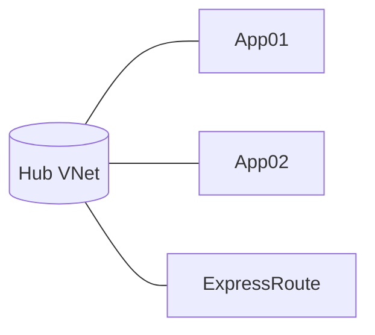

# 13 · Documentation & onboarding

> **Decision:** what gets written, where, and who keeps it current?
> Documentation that lives outside the repo decays; documentation in the
> repo doesn't write itself.

[← 12 Naming & tagging](12-naming-and-tagging.md) · [Index](../README.md) · [14 Anti‑patterns →](14-anti-patterns.md)

---

## How we got here

Pre‑2010, infrastructure documentation lived in Word documents on a
shared drive nobody had write access to. The wiki era (Confluence,
SharePoint, MediaWiki) was a step forward in *editability* but a step
backward in *trustworthiness* — there was no diff, no PR, no link to
the code, and the docs decayed silently. Two ideas fixed this. First,
**Architecture Decision Records** — a one‑page format proposed by
Michael Nygard in 2011 — gave teams a way to capture *why* a decision
was made, immutably and in version control. Second, the **Diátaxis
framework** (Daniele Procida, 2017–2021) explained *why* most
documentation is bad: it conflates tutorials, how‑tos, reference, and
explanation into one unreadable mess. Tooling caught up: **Mermaid**
landed in GitHub markdown in 2022, killing the binary‑diagram era; **D2**
and **Excalidraw** gave teams text‑based architecture diagrams; and
**`terraform-docs`** / **PSDocs** automated the reference layer. The modern
IaC repo's docs/ folder is a small, disciplined library — not a
dumping ground.

## The four kinds of documentation

Inspired by the [Diátaxis framework](https://diataxis.fr/) — every piece of
documentation should be exactly one of:

| Type | Purpose | Where in the repo |
|------|---------|-------------------|
| **Tutorials** | Hand‑hold a newcomer to first success | `docs/tutorials/` |
| **How‑to guides** | Achieve a specific outcome | `docs/runbooks/`, `docs/howto/` |
| **Reference** | Look up exact details | Auto‑generated from code |
| **Explanation** | Understand *why* | `docs/adr/`, this guide |

Mixing types in one document is the most common documentation failure.

---

## Top‑level `README.md`

The first thing every reader sees. Aim for **one screen**:

```markdown
# alz-platform

Infrastructure-as-Code for Contoso's Azure Landing Zone — platform layer.

## Quick start

git clone … && cd alz-platform
make bootstrap
make plan ENV=nonprod WORKLOAD=connectivity

## Where things live

- envs/        Per-environment compositions
- modules/     Local pattern modules (tier 2)
- policies/    Custom Azure Policy definitions
- docs/        Architecture, ADRs, runbooks
- .github/     Pipelines, CODEOWNERS

## Documentation

- [Architecture overview](docs/architecture.md)
- [Architecture Decision Records](docs/adr/)
- [Runbooks](docs/runbooks/)
- [Contributing](CONTRIBUTING.md)

## Owners

Platform engineering · #alz-platform · platform@contoso.com
```

Anything more goes behind a link. Long READMEs go unread.

---

## Architecture Decision Records (ADRs)

Every non‑trivial decision (this guide is full of them) should be captured
as a short, dated, immutable record.

`docs/adr/0001-monorepo-or-multirepo.md`:

```markdown
# 0001 · Repository topology — layered few-repo

- Status: Accepted
- Date: 2026-04-12
- Deciders: @jane.platform, @joe.architect
- Tags: topology, governance

## Context
We need to host IaC for a tenant containing ~30 landing zones across 4 BUs.
The platform team owns connectivity/identity/management, app teams own
their landing zones.

## Decision
Adopt three repositories: `alz-foundation`, `alz-platform`, and one
`alz-landingzones-<bu>` per BU. Modules live in a separate `alz-modules`
repo published to ACR.

## Consequences
+ Each repo has a coherent CODEOWNERS and approval policy.
+ Platform releases independent of workload releases.
- Cross-cutting changes require coordination via the modules repo.
- Need a pipeline-templates repo to keep CI consistent.

## Alternatives considered
- Monorepo: rejected for blast-radius and CODEOWNERS complexity at our scale.
- Pure multi-repo: rejected — discoverability cost too high without a
  developer portal.

## References
- docs/01-repository-topology.md
```

ADRs are **never edited**. If the decision changes, write a new ADR that
*supersedes* the old one and link them.

Tools:

* [`adr-tools`](https://github.com/npryce/adr-tools) — `adr new "Topology"`.
* [`log4brains`](https://github.com/thomvaill/log4brains) — renders ADRs as
  a static site.

---

## Diagrams as code

Binary `.drawio` / Visio files in Git are an anti‑pattern: undiffable,
unmergeable, immediately stale.

Use diagrams as code:

| Tool | Best for |
|------|----------|
| **Mermaid** | Sequence, flowcharts, class — renders natively in GitHub markdown. |
| **Excalidraw** | Sketch‑style architecture; export `.excalidraw` (JSON) + PNG. |
| **D2** | Architecture diagrams with great auto‑layout. |
| **PlantUML** | Sequence/component diagrams; long history. |
| **Draw.io with `.drawio.svg`** | If you must — the SVG variant is text and renders as PNG on GitHub. |

Keep both source (`*.mmd`, `*.d2`, `*.excalidraw`) and rendered PNG/SVG so
the README looks right without local tooling. CI re‑renders on PR.

Embed in markdown:

````markdown

````

---

## Auto‑generated reference

Reference docs **cannot** be hand‑written reliably. Generate them:

* **Module READMEs:** `terraform-docs` or `PSDocs.Azure` — see
  [10 code quality](10-code-quality.md).
* **Pipeline reference:** parse workflow YAML; produce a list of inputs,
  required secrets, and called workflows.
* **Policy reference:** generate a markdown table from your policy
  definitions JSON.
* **Naming convention:** generate a table of all resource abbreviations
  from your naming module.

CI runs the generators and fails the build if the generated output differs
from the committed copy. This is **the only way** reference docs stay
correct.

---

## CONTRIBUTING.md

Tells new contributors how to play nicely:

* How to set up the dev environment (link to README quick start).
* PR conventions (Conventional Commits, PR template).
* Required checks and how to run them locally.
* Review process (who, when, SLA).
* Where to ask questions (channel, office hours).

Keep it under 200 lines.

---

## CHANGELOG.md

Auto‑generated from Conventional Commits via `release-please`. The repo
itself doesn't need a hand‑written changelog if releases are tagged
consistently — the GitHub Releases page *is* your changelog.

For module repos this is non‑negotiable; consumers depend on it.

---

## Onboarding checklist

A new engineer joining the platform team gets a checklist issue
auto‑created from a template:

```markdown
## Onboarding · @newjoiner

- [ ] Access requested: Azure (Reader on all subs), GitHub team membership
- [ ] Devcontainer or local toolchain working: `make bootstrap`
- [ ] First successful sandbox plan: `make plan ENV=sandbox`
- [ ] Read: README, this guide (docs/), top 5 ADRs
- [ ] Pair on first PR (assigned: @buddy)
- [ ] Pager rotation onboarding (assigned: @oncall-lead)
- [ ] Shadow a deploy to prod (assigned: @release-eng)
```

The checklist itself is a documented artifact: improvements come from new
joiners filing PRs against the template.

---

## Architecture overview document

`docs/architecture.md` — the **single canonical map** of the estate:

* Diagram of management group hierarchy.
* Diagram of network topology.
* Diagram of identity model (Entra tenants, MIs, federated creds).
* List of subscriptions with owner and purpose.
* List of regions and their role.

Update on every significant change. CI verifies the diagram source files
exist; the human verifies they're current — quarterly review on the team's
calendar.

---

## "Why" lives in commit messages and ADRs, not in code comments

Code comments rot. Commit messages and ADRs are immutable. Prefer:

```hcl
# ❌ Comment that explains a workaround
resource "azurerm_role_assignment" "ra" {
  # Wait 30 seconds because role propagation lags - issue #1234
  ...
}
```

…over a comment, write the **commit message** that adds it explicitly:

```
fix(identity): wait 30s after role assignment

AzureRM #20871 — RBAC propagation can take up to 30 seconds. Without
this delay, the next module fails with AuthorizationFailed.

Removable when the upstream issue is closed.
```

Comments belong in code only when they explain *what* the code does in a
way the code cannot. *Why* belongs in commits and ADRs.

---

## Anti‑patterns

* ❌ **Wiki‑only documentation** (Confluence, SharePoint, Loop). Decays
  fast, can't be PR‑reviewed, can't be searched alongside code.
* ❌ **The "TODO: document this" comment.** Open an issue or write the
  doc — TODOs go unread.
* ❌ **Architecture diagrams in proprietary binary formats.** No diff, no
  merge, no render in PR.
* ❌ **CHANGELOG hand‑written and forever stale.** Generate it.
* ❌ **One giant `docs/all.md`.** Split. Use the index.
* ❌ **Documenting *implementation* instead of *design*.** Code is the
  authoritative implementation; docs explain *why* and *how to use*.

---

## References

* Diátaxis: <https://diataxis.fr/>
* MADR — Markdown ADR template: <https://adr.github.io/madr/>
* `adr-tools`: <https://github.com/npryce/adr-tools>
* GitHub markdown — Mermaid:
  <https://github.blog/developer-skills/github/include-diagrams-markdown-files-mermaid/>
* D2: <https://d2lang.com/>
* `terraform-docs`: <https://terraform-docs.io/>

---

[← 12 Naming & tagging](12-naming-and-tagging.md) · [Index](../README.md) · [14 Anti‑patterns →](14-anti-patterns.md)
