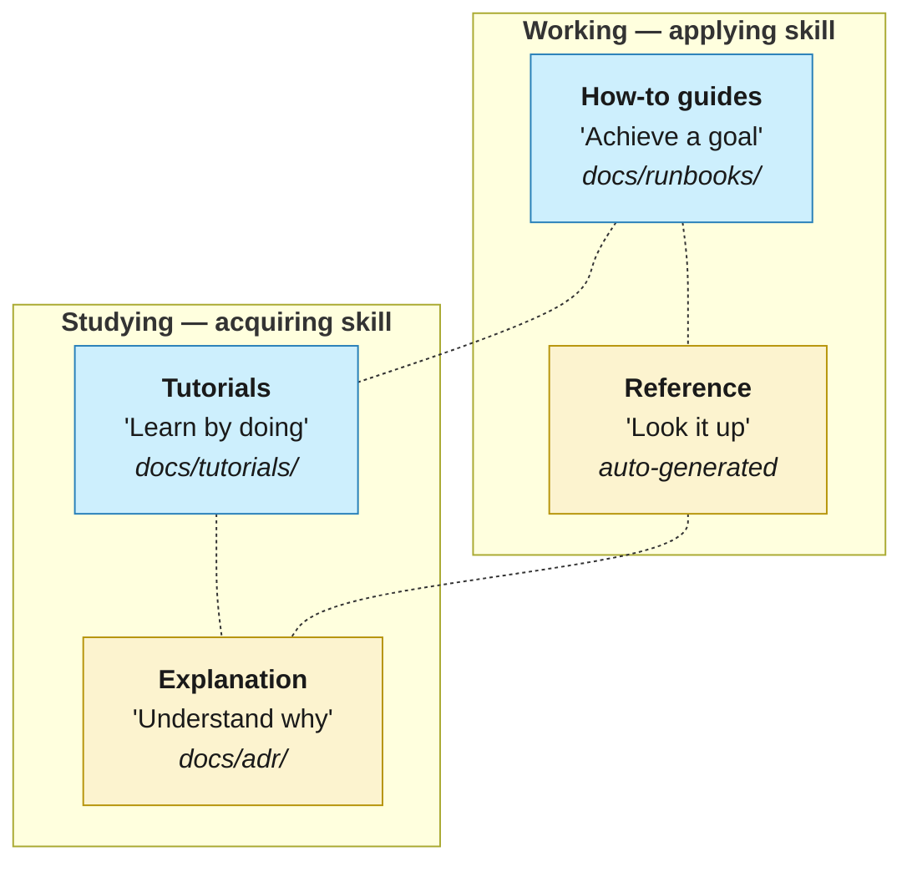
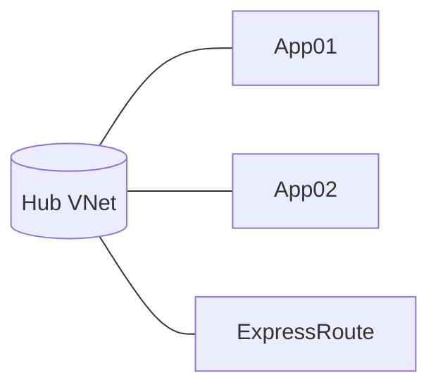

# 13 · Documentation & onboarding

**In this chapter:**

- [How we got here](#how-we-got-here)
- [Decision framework](#decision-framework)
- [The four kinds of documentation](#the-four-kinds-of-documentation)
- [Top‑level `README.md`](#toplevel-readmemd)
- [Architecture Decision Records (ADRs)](#architecture-decision-records-adrs)
- [Diagrams as code](#diagrams-as-code)
- [Auto‑generated reference](#autogenerated-reference)
- [CONTRIBUTING.md](#contributingmd)
- [CHANGELOG.md](#changelogmd)
- [Onboarding checklist](#onboarding-checklist)
- [Architecture overview document](#architecture-overview-document)
- ["Why" lives in commit messages and ADRs, not in code comments](#why-lives-in-commit-messages-and-adrs-not-in-code-comments)
- [Anti‑patterns](#antipatterns)
- [References](#references)


> **Decision:** what gets written, where, and who keeps it current?
> Documentation that lives outside the repo decays; documentation in the
> repo doesn't write itself.

[← 12 Naming & tagging](12-naming-and-tagging.md) · [Index](../README.md) · [14 Anti‑patterns →](14-anti-patterns.md)

Keep Azure Landing Zone (ALZ) Infrastructure as Code (IaC) documentation
small, repo-native, and purpose-specific: tutorials teach, how-tos guide,
reference is generated, and Architecture Decision Records (ADRs) preserve
why. Code tells you *what* the system does; documentation tells you *why* it
does it, *how* to change it safely, and *where* to start when everything is
on fire. Most IaC repos skimp on all three — and then wonder why onboarding
takes three months and runbooks get executed incorrectly under pressure.
This chapter sets out a disciplined, minimal approach to documentation that
lives in the repo, decays slowly, and actually gets used, beginning with how
repository documentation escaped from the shared-drive era in the first
place.

---

## How we got here

Pre‑2010, infrastructure documentation lived in Word documents on a
shared drive nobody had write access to. The wiki era (Confluence,
SharePoint, MediaWiki) was a step forward in *editability* but a step
backward in *trustworthiness* — there was no diff, no pull request (PR),
no link to the code, and the docs decayed silently. Two ideas fixed this.
First, **Architecture Decision Records** — a one‑page format proposed by
Michael Nygard in 2011 — gave teams a way to capture *why* a decision was
made, immutably and in version control. Second, the **Diátaxis framework**
(Daniele Procida, 2017–2021) explained *why* most documentation is bad: it
conflates tutorials, how‑tos, reference, and explanation into one
unreadable mess. Tooling caught up: **Mermaid** landed in GitHub markdown
in 2022, killing the binary‑diagram era; **D2** and **Excalidraw** gave
teams text‑based architecture diagrams; and **`terraform-docs`** / **PSDocs**
automated the reference layer. That history leaves you with a practical
design problem rather than a nostalgia lesson: the modern IaC repo's
`docs/` folder has to be a small, disciplined library, not a dumping
ground, and the decision framework below turns that principle into a set
of choices.

> 📘 **Key terms**
>
> **ADR (Architecture Decision Record)** — a short, immutable document capturing a single architectural decision: the context, the decision itself, and the consequences. Stored in `docs/adr/` and numbered sequentially.
>
> **Diátaxis** — a documentation framework by Daniele Procida that classifies all technical content into exactly four types (tutorials, how‑to guides, reference, explanation), arguing that mixing types in one document is the most common documentation failure.
>
> **Mermaid** — a text‑based diagramming language rendered natively by GitHub in markdown code blocks (` ```mermaid `). Supports flowcharts, sequence diagrams, state diagrams, and more.
>
> **D2** — a modern, text‑based diagram scripting language designed for software architecture diagrams, with auto‑layout and theming.
>
> **Excalidraw** — a virtual whiteboard tool that produces hand‑drawn‑style diagrams, storable as JSON and embeddable in repos.
>
> **PSDocs** — a PowerShell‑based documentation generator that produces markdown from Azure resource templates, analogous to `terraform-docs` for Bicep/ARM.

---

## Decision framework

Because the historical failure mode was unmanaged sprawl, decide the
documentation system by answering these questions in order. The goal is not
"more docs"; it is the smallest set of repo-native documents that explains
how to work safely, what the estate contains, and why the hard decisions
were made.

1. **Which of the four documentation kinds do you owe?**
   * Tutorials, how-tos, reference, and explanation are different jobs;
     write only the ones your audience actually needs.

2. **Are architectural decisions captured as ADRs?**
   * Yes for any decision worth defending in a year; no for trivia that code
     review can settle.

3. **How are diagrams produced?**
   * Prefer Mermaid, D2, Excalidraw JSON, or Draw.io with the XML committed;
     never accept binary-only diagrams as the source of truth.

4. **Is module reference documentation auto-generated?**
   * Use `terraform-docs`, `PSDocs.Azure`, or Bicep generation on a
     pre-commit hook or CI check so reference stays aligned with code.

5. **Is there an onboarding checklist a new joiner can complete in their
   first week?**
   * If not, the team is relying on tribal knowledge and ad hoc pairing.

6. **How are "why" decisions preserved?**
   * Put durable rationale in commit messages and ADRs, not in code comments
     that drift away from the decision context.

The detailed conventions below apply those answers to each document type.
Start with the four-kind taxonomy, because it determines whether the next
file you write should teach, guide, explain, or simply report facts.

---

## The four kinds of documentation

The first decision is to give every document exactly one Diátaxis job,
because mixed-purpose docs become unreadable, unowned, and eventually
untrusted. Inspired by the [Diátaxis framework](https://diataxis.fr/), every
piece of documentation should be exactly one of these four kinds:


```mermaid
flowchart TB
    subgraph Working["<b>Working — applying skill</b>"]
        HowTo["<b>How-to guides</b><br/>'Achieve a goal'<br/><i>docs/runbooks/</i>"]
        Ref["<b>Reference</b><br/>'Look it up'<br/><i>auto-generated</i>"]
    end
    subgraph Studying["<b>Studying — acquiring skill</b>"]
        Tut["<b>Tutorials</b><br/>'Learn by doing'<br/><i>docs/tutorials/</i>"]
        Expl["<b>Explanation</b><br/>'Understand why'<br/><i>docs/adr/</i>"]
    end

    HowTo -.- Ref
    Tut -.- Expl
    HowTo -.- Tut
    Ref -.- Expl

    classDef practical fill:#cdeffd,stroke:#2980b9,color:#1a1a1a
    classDef theory fill:#fcf3cf,stroke:#b7950b,color:#1a1a1a
    class HowTo,Tut practical
    class Ref,Expl theory
```

*Left column = practical steps · Right column = theoretical understanding*

| Type | Purpose | Where in the repo |
|------|---------|-------------------|
| **Tutorials** | Hand‑hold a newcomer to first success | `docs/tutorials/` |
| **How‑to guides** | Achieve a specific outcome | `docs/runbooks/`, `docs/howto/` |
| **Reference** | Look up exact details | Auto‑generated from code |
| **Explanation** | Understand *why* | `docs/adr/`, this guide |

The taxonomy matters because mixing types in one document is the most common
documentation failure: a tutorial that tries to be a reference becomes too
long to follow, while a reference that tries to explain every decision stops
being searchable. With that distinction established, apply it first to the
document every reader encounters before anything else.

---

## Top‑level `README.md`

Once you separate tutorials, how-tos, reference, and explanation, the
top-level README can stop trying to contain all of them and become what it
should have been all along: a one-screen map to the repo. It is the first
thing every reader sees, so aim for **one screen**:

```markdown
# alz-platform

Infrastructure-as-Code for Contoso's Azure Landing Zone — platform layer.

## Quick start

git clone … && cd alz-platform
make bootstrap
make plan ENV=nonprod WORKLOAD=connectivity

## Where things live

- envs/        Per-environment compositions
- modules/     Local pattern modules (tier 2)
- policies/    Custom Azure Policy definitions
- docs/        Architecture, ADRs, runbooks
- .github/     Pipelines, CODEOWNERS

## Documentation

- [Architecture overview](docs/architecture.md)
- [Architecture Decision Records](docs/adr/)
- [Runbooks](docs/runbooks/)
- [Contributing](CONTRIBUTING.md)

## Owners

Platform engineering · #alz-platform · platform@contoso.com
```

Anything more goes behind a link, because long READMEs go unread precisely
when a new contributor most needs a map. A good README is therefore a table
of contents for the rest of the documentation, and the most important item
it should point to is the ADR log — the record of *why* the system is built
the way it is, without which every architectural choice becomes oral
tradition that disappears when the original architect leaves.

---

## Architecture Decision Records (ADRs)

Because the README can only point to the reasoning, any architectural
decision worth defending in a year belongs in an ADR. Every non‑trivial
decision — and this guide is full of them — should be captured as a short,
dated, immutable record.

`docs/adr/0001-monorepo-or-multirepo.md`:

```markdown
# 0001 · Repository topology — layered few-repo

- Status: Accepted
- Date: 2026-04-12
- Deciders: @jane.platform, @joe.architect
- Tags: topology, governance

## Context
We need to host IaC for a tenant containing ~30 landing zones across 4 BUs.
The platform team owns connectivity/identity/management, app teams own
their landing zones.

## Decision
Adopt three repositories: `alz-foundation`, `alz-platform`, and one
`alz-landingzones-<bu>` per BU. Modules live in a separate `alz-modules`
repo published to ACR.

## Consequences
+ Each repo has a coherent CODEOWNERS and approval policy.
+ Platform releases independent of workload releases.
- Cross-cutting changes require coordination via the modules repo.
- Need a pipeline-templates repo to keep CI consistent.

## Alternatives considered
- Monorepo: rejected for blast-radius and CODEOWNERS complexity at our scale.
- Pure multi-repo: rejected — discoverability cost too high without a
  developer portal.

## References
- docs/01-repository-topology.md
```

ADRs are **never edited**; if the decision changes, write a new ADR that
*supersedes* the old one and link them, so the reader can see both the
original constraint and the later correction. Lightweight tools can help you
keep that discipline without turning ADRs into a parallel publishing system:

* [`adr-tools`](https://github.com/npryce/adr-tools) — `adr new "Topology"`.
* [`log4brains`](https://github.com/thomvaill/log4brains) — renders ADRs as
  a static site.

ADRs capture decisions in prose; some decisions — particularly around
network topology and identity flows — are better expressed visually. The
challenge is keeping those visuals version-controlled and diffable, rather
than letting them become the same undiffable artefacts as the Word documents
they replaced, which is why diagram source deserves the same treatment as
code.

---

## Diagrams as code

The same rule that makes ADRs trustworthy also applies to diagrams: the
source belongs in version-controlled text, and rendered images are generated
outputs. Binary `.drawio` / Visio files in Git are an anti‑pattern because
they are undiffable, unmergeable, and immediately stale, so use diagrams as
code instead:

| Tool | Best for |
|------|----------|
| **Mermaid** | Sequence, flowcharts, class — renders natively in GitHub markdown. |
| **Excalidraw** | Sketch‑style architecture; export `.excalidraw` (JSON) + PNG. |
| **D2** | Architecture diagrams with great auto‑layout. |
| **PlantUML** | Sequence/component diagrams; long history. |
| **Draw.io with `.drawio.svg`** | If you must — the SVG variant is text and renders as PNG on GitHub. |

Keep both source (`*.mmd`, `*.d2`, `*.excalidraw`) and rendered PNG/SVG so
the README looks right without local tooling, and let continuous integration
(CI) re‑render the diagram on every PR. In the common case, the diagram can
then sit directly in markdown:

````markdown

```mermaid
flowchart LR
  Hub[(Hub VNet)] --- Spoke1[App01]
  Hub --- Spoke2[App02]
  Hub --- ER[ExpressRoute]
```
````

Once diagrams and ADRs are versioned, the remaining documentation risk is
the material that changes every time code changes. That is where generated
reference documentation becomes non-negotiable.

---

## Auto‑generated reference

Reference docs cannot be hand-written reliably, because the exact details
they describe are the same details your modules, policies, and pipelines
change most often. Generate them and fail CI when they drift:

* **Module READMEs:** `terraform-docs` or `PSDocs.Azure` — see
  [10 code quality](10-code-quality.md).
* **Pipeline reference:** parse workflow YAML; produce a list of inputs,
  required secrets, and called workflows.
* **Policy reference:** generate a markdown table from your policy
  definitions JSON.
* **Naming convention:** generate a table of all resource abbreviations
  from your naming module.

CI runs the generators and fails the build if the generated output differs
from the committed copy; this is **the only way** reference docs stay
correct. Once that reference layer can be trusted, the next question is how
you help a contributor make a safe first change.

---

## CONTRIBUTING.md

If generated reference tells you what exists, `CONTRIBUTING.md` tells you
how to change it without relying on tribal knowledge. It should make the
first PR possible by explaining the working agreement in one short file:

* How to set up the dev environment (link to README quick start).
* PR conventions (Conventional Commits, PR template).
* Required checks and how to run them locally.
* Review process (who, when, service-level agreement (SLA)).
* Where to ask questions (channel, office hours).

Keep it under 200 lines, because a contribution guide that needs its own
onboarding path has already failed. Once contributors can make changes, the
people who consume those changes need an equally trustworthy release
history.

---

## CHANGELOG.md

Because consumers need a trustworthy release history, generate changelogs
from commits instead of maintaining them by hand. A repo that uses
Conventional Commits and tags releases consistently can let
`release-please` produce the changelog, and in that model the GitHub
Releases page *is* your changelog. For module repos this is
non‑negotiable, because consumers depend on it; for the platform team
itself, the same discipline prepares the next engineer to understand what
changed before they touch production.

---

## Onboarding checklist

Release history helps you understand what changed, but a new platform
engineer also needs an executable path through the repo in their first week.
Onboarding should therefore be a checklist issue, auto‑created from a
template, that the new joiner can complete while leaving improvements behind
for the next person:

```markdown
## Onboarding · @newjoiner

- [ ] Access requested: Azure (Reader on all subs), GitHub team membership
- [ ] Devcontainer or local toolchain working: `make bootstrap`
- [ ] First successful sandbox plan: `make plan ENV=sandbox`
- [ ] Read: README, this guide (docs/), top 5 ADRs
- [ ] Pair on first PR (assigned: @buddy)
- [ ] Pager rotation onboarding (assigned: @oncall-lead)
- [ ] Shadow a deploy to prod (assigned: @release-eng)
```

The checklist itself is a documented artifact, so improvements should come
from new joiners filing PRs against the template rather than from private
notes passed between buddies. After the checklist gets someone through the
first week, the architecture overview gives them the map they will keep
returning to.

---

## Architecture overview document

The onboarding checklist points you toward the system, but
`docs/architecture.md` should be the single canonical map of the estate, not
a slide deck that drifts separately from code. Keep it focused on the views
you actually need when making or reviewing a change:

* Diagram of management group hierarchy.
* Diagram of network topology.
* Diagram of identity model (Entra tenants, managed identities (MIs), federated creds).
* List of subscriptions with owner and purpose.
* List of regions and their role.

Update the overview on every significant change: CI can verify that the
diagram source files exist, while you verify that they are current during a
quarterly review on the team's calendar. The overview tells you what the
estate looks like now; the final documentation habit is to preserve why it
looks that way.

---

## "Why" lives in commit messages and ADRs, not in code comments

Because the architecture overview shows the current shape rather than the
reasoning behind it, long-lived rationale belongs in commit messages and
ADRs; code comments should explain only what the code cannot. Code comments
rot, while commit messages and ADRs are immutable, so prefer:

```hcl
# ❌ Comment that explains a workaround
resource "azurerm_role_assignment" "ra" {
  # Wait 30 seconds because role propagation lags - issue #1234
  ...
}
```

Instead of relying on that comment to survive every future refactor, write
the **commit message** that adds the workaround explicitly:

```
fix(identity): wait 30s after role assignment

AzureRM #20871 — RBAC propagation can take up to 30 seconds. Without
this delay, the next module fails with AuthorizationFailed.

Removable when the upstream issue is closed.
```

Comments belong in code only when they explain *what* the code does in a
way the code cannot; *why* belongs in commits and ADRs, where the rationale
can be reviewed and recovered later. That discipline is the capstone of a
documentation culture, and the anti-patterns below catalogue the ways that
culture most commonly collapses in practice.

---

## Anti‑patterns

Once the documentation system stops being repo-native, diffable, generated
where appropriate, and focused on intent rather than implementation, it
starts to fail in familiar ways. The specific symptoms vary by team, but
they usually reduce to one of the patterns below.

* ❌ **Wiki‑only documentation** (Confluence, SharePoint, Loop). Decays
  fast, can't be PR‑reviewed, can't be searched alongside code.
* ❌ **The "TODO: document this" comment.** Open an issue or write the
  doc — TODOs go unread.
* ❌ **Architecture diagrams in proprietary binary formats.** No diff, no
  merge, no render in PR.
* ❌ **CHANGELOG hand‑written and forever stale.** Generate it.
* ❌ **One giant `docs/all.md`.** Split. Use the index.
* ❌ **Documenting *implementation* instead of *design*.** Code is the
  authoritative implementation; docs explain *why* and *how to use*.

---

Documentation is not a deliverable that ships alongside the code — it is the medium through which the code communicates its intent to the engineers who will work with it for the next five years. The practices in this chapter — Diátaxis-informed structure, immutable ADRs, generated reference docs, version-controlled runbooks, and an onboarding checklist that improves with every new joiner — require no heroic effort. They require the same discipline applied to everything else in this guide: a clear convention, enforced consistently, with the repo as the single source of truth. That discipline is the thread running through all fourteen chapters; the next and final chapter draws it together in a consolidated checklist of everything that can go wrong — and how to check whether it already has.

## References

* Diátaxis: <https://diataxis.fr/>
* MADR — Markdown ADR template: <https://adr.github.io/madr/>
* `adr-tools`: <https://github.com/npryce/adr-tools>
* GitHub markdown — Mermaid:
  <https://github.blog/developer-skills/github/include-diagrams-markdown-files-mermaid/>
* D2: <https://d2lang.com/>
* `terraform-docs`: <https://terraform-docs.io/>

---

[← 12 Naming & tagging](12-naming-and-tagging.md) · [Index](../README.md) · [14 Anti‑patterns →](14-anti-patterns.md)
